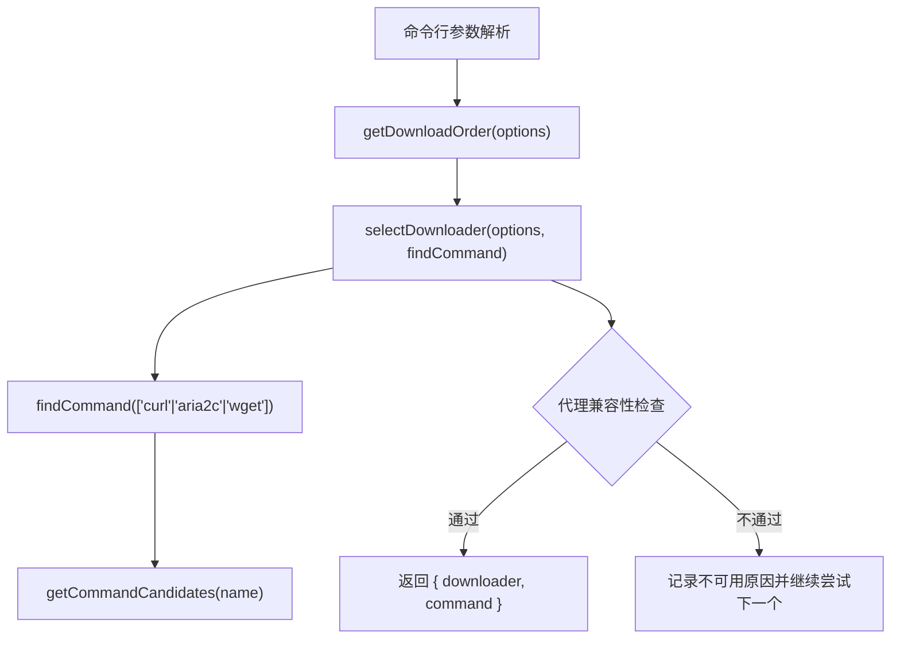
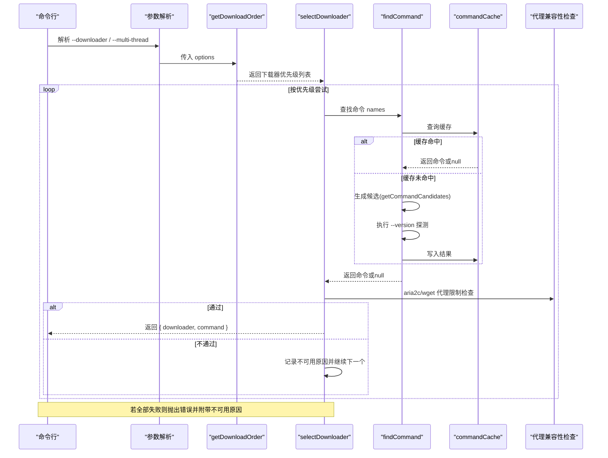
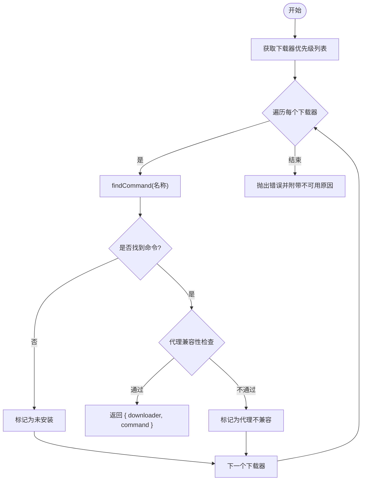
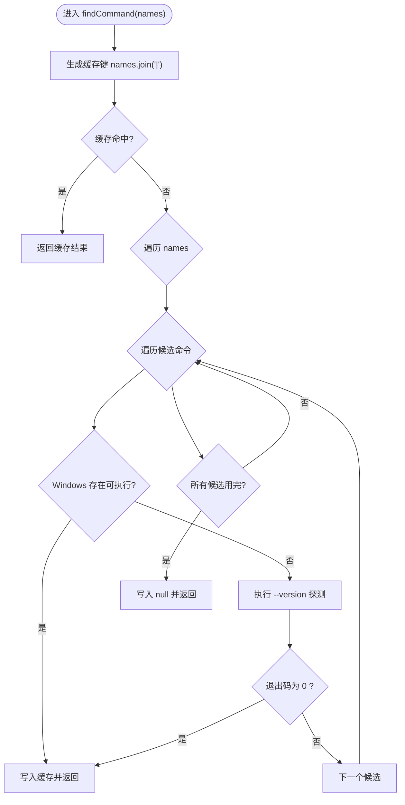
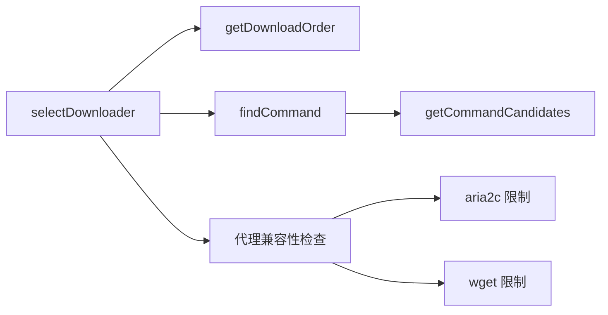

# 下载器选择机制

<cite>
**本文引用的文件**
- [index.js](file://yyb-apk-extractor/index.js)
- [README.md](file://yyb-apk-extractor/README.md)
- [index.test.js](file://yyb-apk-extractor/test/index.test.js)
</cite>

## 目录
1. [简介](#简介)
2. [项目结构](#项目结构)
3. [核心组件](#核心组件)
4. [架构总览](#架构总览)
5. [详细组件分析](#详细组件分析)
6. [依赖关系分析](#依赖关系分析)
7. [性能考量](#性能考量)
8. [故障排除指南](#故障排除指南)
9. [结论](#结论)
10. [附录](#附录)

## 简介
本文件系统化说明“下载器选择机制”的设计与实现，覆盖智能选择算法、优先级判断、代理兼容性检查、命令检测与缓存等关键能力。目标是帮助读者理解在 curl、aria2c、wget 三者之间如何自动或强制选择最合适的下载工具，并在不同环境与限制条件下稳定工作。

## 项目结构
下载器选择逻辑集中在主程序入口文件中，围绕以下关键点组织：
- 参数解析与默认值设置（包括 --downloader、--multi-thread）
- 下载顺序决策函数 getDownloadOrder()
- 下载器选择函数 selectDownloader()
- 命令查找 findCommand() 与 Windows 候选生成 getCommandCandidates()
- 代理兼容性与凭据安全处理
- 各下载器的参数构建与执行封装

图表来源
- [index.js:458-493](file://yyb-apk-extractor/index.js#L458-L493)
- [index.js:870-921](file://yyb-apk-extractor/index.js#L870-L921)

章节来源
- [index.js:1-200](file://yyb-apk-extractor/index.js#L1-L200)
- [index.js:458-493](file://yyb-apk-extractor/index.js#L458-L493)
- [index.js:870-921](file://yyb-apk-extractor/index.js#L870-L921)

## 核心组件
- 下载顺序决策：getDownloadOrder(options)
- 下载器选择：selectDownloader(options, findCommand)
- 命令检测与缓存：findCommand(names)、getCommandCandidates(name)
- 代理兼容与安全：isAria2cProxySupported(proxy)、hasProxyCredentials(proxyUrl)、splitProxyAuth(proxyUrl)
- 各下载器参数构建：buildCurlDownloadArgs、buildAria2cDownloadArgs、buildWgetDownloadArgs

章节来源
- [index.js:452-500](file://yyb-apk-extractor/index.js#L452-L500)
- [index.js:870-921](file://yyb-apk-extractor/index.js#L870-L921)
- [index.js:973-1073](file://yyb-apk-extractor/index.js#L973-L1073)

## 架构总览
下图展示了从参数到最终选择下载器的完整流程，包含代理兼容性校验与命令缓存命中路径。

图表来源
- [index.js:458-493](file://yyb-apk-extractor/index.js#L458-L493)
- [index.js:870-921](file://yyb-apk-extractor/index.js#L870-L921)

## 详细组件分析

### 智能下载器选择算法：getDownloadOrder()
- 输入：options.downloader、options.multiThread
- 决策规则：
  - 如果显式指定了 --downloader（非 auto），直接返回仅包含该工具的数组，即强制使用指定下载器。
  - 如果 multiThread 为 true，优先顺序为 aria2c -> curl -> wget，以利用多线程优势。
  - 否则（auto 且非多线程），默认顺序为 curl -> aria2c -> wget，便于先做重定向预检与通用性验证。
- 行为特点：
  - 支持 auto 模式下的自适应选择。
  - 支持 --multi-thread 标志切换优先级。
  - 支持 --downloader 强制指定单一工具。

章节来源
- [index.js:458-463](file://yyb-apk-extractor/index.js#L458-L463)
- [README.md:280-281](file://yyb-apk-extractor/README.md#L280-L281)
- [index.test.js:652-657](file://yyb-apk-extractor/test/index.test.js#L652-L657)

### 下载器选择流程：selectDownloader()
- 遍历 getDownloadOrder() 返回的优先级列表，依次调用 findCommand() 查找可用命令。
- 对每个候选下载器进行代理兼容性检查：
  - aria2c：仅支持 http/https 代理；socks5/socks5h 不被支持。
  - wget：不支持带凭据的代理（避免凭据泄露），也不支持 socks5/socks5h。
- 若所有候选均不可用：
  - 若用户强制指定了 --downloader，则报错提示无法使用该工具。
  - 否则报错提示未找到可用的下载工具，并附带不可用原因列表。

图表来源
- [index.js:465-493](file://yyb-apk-extractor/index.js#L465-L493)

章节来源
- [index.js:465-493](file://yyb-apk-extractor/index.js#L465-L493)
- [index.test.js:658-672](file://yyb-apk-extractor/test/index.test.js#L658-L672)

### 命令查找与缓存：findCommand() 与 getCommandCandidates()
- findCommand(names)：
  - 使用 Map 作为命令缓存，键为名称拼接字符串，避免重复检测。
  - 对每个名称生成候选命令（Windows 下考虑 PATH/PATHEXT）。
  - 在 Windows 上优先检查已存在的可执行文件候选。
  - 在非 Windows 或无直接可执行时，通过 spawnSync 执行 --version 探测可用性，超时保护避免阻塞。
  - 将检测结果写入缓存，后续相同请求直接命中。
- getCommandCandidates(name)：
  - 非 Windows 或已含路径/扩展名时，直接返回 [name]。
  - Windows 下根据 PATH 和 PATHEXT 生成多种候选（如 name.exe、name.cmd 等），并去重。

图表来源
- [index.js:870-921](file://yyb-apk-extractor/index.js#L870-L921)

章节来源
- [index.js:870-921](file://yyb-apk-extractor/index.js#L870-L921)
- [index.test.js:689-747](file://yyb-apk-extractor/test/index.test.js#L689-L747)

### 代理兼容性与安全处理
- aria2c 代理限制：
  - isAria2cProxySupported(proxy) 仅允许 http/https 协议；socks5/socks5h 会被拒绝。
  - 当检测到 aria2c 且代理不符合要求时，selectDownloader() 会将其标记为不可用并继续尝试其他下载器。
- wget 代理限制与安全：
  - hasProxyCredentials(proxyUrl) 检测代理 URL 中是否包含用户名/密码。
  - 若 wget 遇到带凭据的代理，将被拒绝以避免凭据泄露。
  - wget 同样不支持 socks5/socks5h 代理。
- 凭据分离与脱敏：
  - splitProxyAuth(proxyUrl) 将代理 URL 拆分为无凭据 URL 与凭据对象，确保仅在必要的配置输入中传递凭据。
  - 子进程环境变量与输出会进行脱敏处理，避免日志泄露敏感信息。

章节来源
- [index.js:452-500](file://yyb-apk-extractor/index.js#L452-L500)
- [index.js:523-560](file://yyb-apk-extractor/index.js#L523-L560)
- [index.test.js:1080-1088](file://yyb-apk-extractor/test/index.test.js#L1080-L1088)

### 各下载器的适用场景与限制
- curl：
  - 通用性强，支持 http/https/socks5/socks5h 代理。
  - 适合下载前重定向预检与跨平台兼容。
  - 默认优先级最高（非多线程模式）。
- aria2c：
  - 多线程优势明显，适合大文件或慢速网络环境。
  - 仅支持 http/https 代理；socks5/socks5h 不被支持。
  - 开启 --multi-thread 后优先级最高。
- wget：
  - 作为兜底工具，兼容性较好但功能受限。
  - 不支持带凭据的代理与 socks5/socks5h。
  - 在 curl 与 aria2c 不可用时被选用。

章节来源
- [README.md:283-289](file://yyb-apk-extractor/README.md#L283-L289)
- [index.js:973-1073](file://yyb-apk-extractor/index.js#L973-L1073)

### 不同环境下的选择示例
- 默认环境（无代理、非多线程）：
  - 顺序：curl -> aria2c -> wget。
  - 若 curl 可用，优先选择 curl。
- 多线程模式（--multi-thread）：
  - 顺序：aria2c -> curl -> wget。
  - 若 aria2c 可用，优先选择 aria2c 以获得多连接下载。
- 强制指定（--downloader=wget）：
  - 仅尝试 wget；若不可用或代理不兼容，直接报错。
- 代理为 socks5h：
  - aria2c 被拒绝；wget 也被拒绝；curl 成为首选。
- 代理为 http 并带凭据：
  - aria2c 可通过配置输入承载凭据；wget 被拒绝；curl 可通过配置输入承载凭据。

章节来源
- [index.js:458-493](file://yyb-apk-extractor/index.js#L458-L493)
- [index.test.js:652-672](file://yyb-apk-extractor/test/index.test.js#L652-L672)

## 依赖关系分析
- 模块耦合：
  - selectDownloader() 依赖 getDownloadOrder() 与 findCommand()。
  - findCommand() 依赖 getCommandCandidates() 与系统命令探测。
  - 代理相关函数被 selectDownloader() 用于兼容性判断。
- 外部依赖：
  - 通过 child_process.spawnSync 执行外部命令。
  - 依赖操作系统 PATH/PATHEXT（Windows）与环境变量。
- 潜在循环依赖：
  - 当前实现为单向依赖，未发现循环引用。

图表来源
- [index.js:458-493](file://yyb-apk-extractor/index.js#L458-L493)
- [index.js:870-921](file://yyb-apk-extractor/index.js#L870-L921)

章节来源
- [index.js:458-493](file://yyb-apk-extractor/index.js#L458-L493)
- [index.js:870-921](file://yyb-apk-extractor/index.js#L870-L921)

## 性能考量
- 命令缓存：
  - 使用 Map 缓存命令检测结果，避免重复 fork 与版本探测，显著降低开销。
- 超时保护：
  - 命令探测设置超时，防止卡死。
- 子进程缓冲限制：
  - 限制子进程输出缓冲大小，避免内存占用过高。
- 多线程下载：
  - aria2c 的多连接可降低大文件下载时间，但需 CDN 支持分片。

[本节提供一般性指导，无需特定文件分析]

## 故障排除指南
- 现象：选择 aria2c 时报“不支持 socks5/socks5h 代理”
  - 原因：aria2c 仅支持 http/https 代理。
  - 解决：改用 curl 或更换为 http/https 代理。
- 现象：选择 wget 时报“不支持安全传递代理凭据”
  - 原因：wget 不接受带凭据的代理以避免泄露。
  - 解决：改用 curl 或 aria2c，或将凭据放入工具配置输入。
- 现象：所有下载器不可用
  - 原因：系统中未安装 curl/aria2c/wget，或 PATH 未正确配置。
  - 解决：安装所需工具并确保可执行文件在 PATH 中；或使用 doctor 检查环境。
- 现象：多线程模式下未使用 aria2c
  - 原因：aria2c 未安装或被代理限制拒绝。
  - 解决：安装 aria2c 或切换到非多线程模式。

章节来源
- [index.js:465-493](file://yyb-apk-extractor/index.js#L465-L493)
- [index.js:923-951](file://yyb-apk-extractor/index.js#L923-L951)
- [index.test.js:658-672](file://yyb-apk-extractor/test/index.test.js#L658-L672)

## 结论
下载器选择机制通过清晰的优先级策略、严格的代理兼容性检查与高效的命令缓存，实现了在不同环境与限制条件下的稳健选择。curl 作为通用首选，aria2c 提供多线程加速，wget 作为兜底保障。结合参数控制与安全检查，可在复杂网络环境中可靠地选择并执行下载任务。

[本节总结整体发现，无需特定文件分析]

## 附录
- 常用命令参考：
  - 查看环境：node index.js doctor
  - 多线程下载：node index.js com.example.app --download-dir=./downloads --multi-thread --connections=8
  - 指定下载器：node index.js com.example.app --downloader=aria2c --connections=8
- 代理建议：
  - 推荐使用 http:// 或 socks5h://；避免 socks5://（本地 DNS 易失败）。

章节来源
- [README.md:280-289](file://yyb-apk-extractor/README.md#L280-L289)
- [index.js:1-200](file://yyb-apk-extractor/index.js#L1-L200)