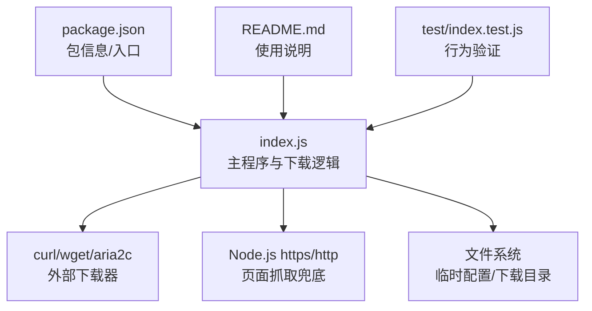
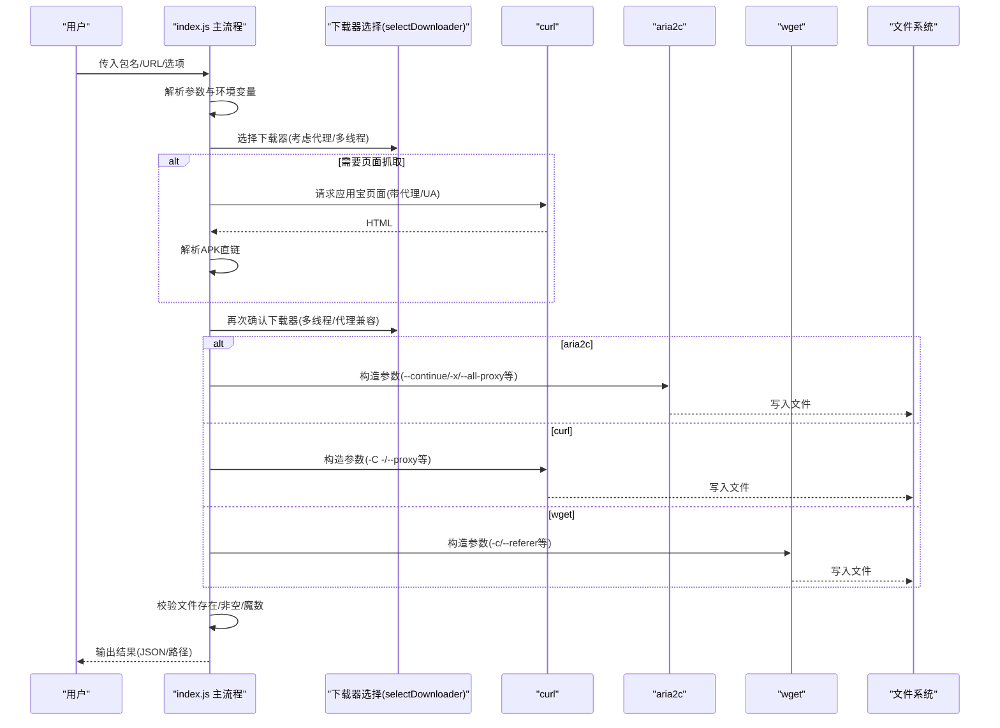
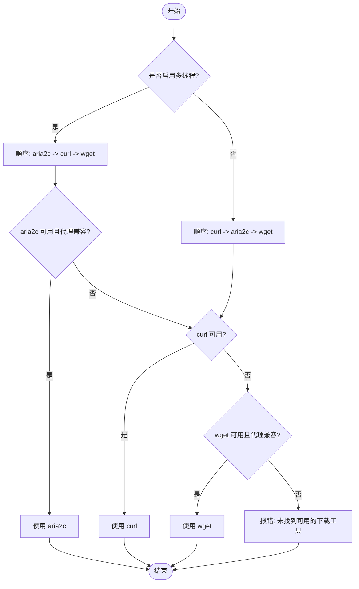
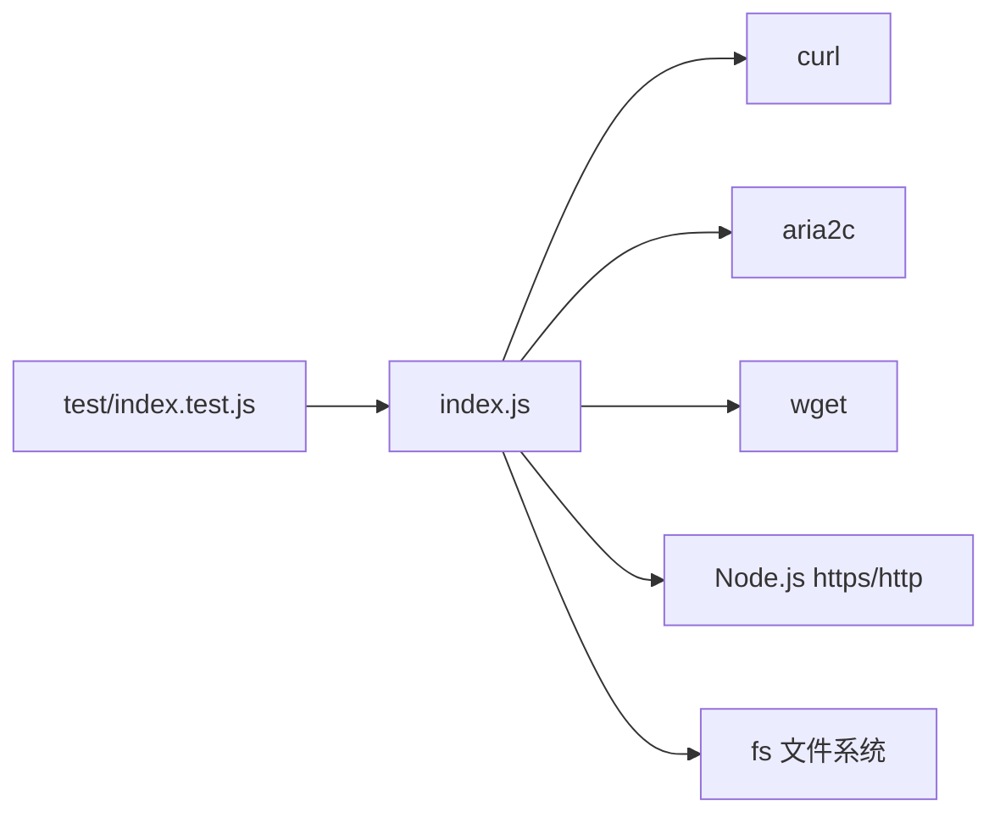

# 下载系统

<cite>
**本文引用的文件**
- [index.js](file://yyb-apk-extractor/index.js)
- [package.json](file://yyb-apk-extractor/package.json)
- [README.md](file://yyb-apk-extractor/README.md)
- [index.test.js](file://yyb-apk-extractor/test/index.test.js)
</cite>

## 目录
1. [简介](#简介)
2. [项目结构](#项目结构)
3. [核心组件](#核心组件)
4. [架构总览](#架构总览)
5. [详细组件分析](#详细组件分析)
6. [依赖关系分析](#依赖关系分析)
7. [性能与优化](#性能与优化)
8. [故障排查指南](#故障排查指南)
9. [结论](#结论)
10. [附录：不同网络环境配置示例](#附录：不同网络环境配置示例)

## 简介
本下载系统是一个面向应用宝 APK 直链提取与下载的命令行工具。它通过解析页面获取 APK 下载地址，并智能选择 curl、aria2c、wget 作为底层下载器；支持代理（HTTP、HTTPS、SOCKS5、SOCKS5h）、断点续传、多线程下载、超时控制、下载完整性校验等能力，适用于脚本化集成、CI 与日常命令行使用。

## 项目结构
- 入口与主逻辑：index.js
- 元信息与命令注册：package.json
- 用户文档与用法说明：README.md
- 单元测试：test/index.test.js

图表来源
- [index.js:2165-2229](file://yyb-apk-extractor/index.js#L2165-L2229)
- [package.json:1-47](file://yyb-apk-extractor/package.json#L1-L47)

章节来源
- [index.js:2165-2229](file://yyb-apk-extractor/index.js#L2165-L2229)
- [package.json:1-47](file://yyb-apk-extractor/package.json#L1-L47)

## 核心组件
- 参数与环境解析：解析 --proxy、--downloader、--multi-thread、--connections、--timeout、--download-dir、--insecure、--verbose 等选项，以及环境变量代理优先级。
- 下载器选择：根据可用性与代理兼容性自动选择 curl、aria2c、wget。
- 页面抓取与链接解析：优先使用 curl 访问应用宝页面，失败时回退到 Node.js 内置模块；从 HTML 中解析 APK 直链。
- 下载执行：调用选定的下载器进行下载，支持断点续传、多连接、代理、超时、重定向预检。
- 完整性校验：下载后检查文件存在性、非空、ZIP/APK 头部魔数。
- 交互模式与搜索：提供交互式向导与应用搜索功能。

章节来源
- [index.js:209-338](file://yyb-apk-extractor/index.js#L209-L338)
- [index.js:458-493](file://yyb-apk-extractor/index.js#L458-L493)
- [index.js:1520-1576](file://yyb-apk-extractor/index.js#L1520-L1576)
- [index.js:1634-1767](file://yyb-apk-extractor/index.js#L1634-L1767)
- [index.js:1412-1438](file://yyb-apk-extractor/index.js#L1412-L1438)

## 架构总览

图表来源
- [index.js:458-493](file://yyb-apk-extractor/index.js#L458-L493)
- [index.js:1634-1767](file://yyb-apk-extractor/index.js#L1634-L1767)
- [index.js:1412-1438](file://yyb-apk-extractor/index.js#L1412-L1438)

## 详细组件分析

### 智能下载器选择机制
- 优先级策略：
  - 默认模式：curl -> aria2c -> wget
  - 多线程模式(--multi-thread)：aria2c -> curl -> wget
  - 显式指定 --downloader=工具：仅尝试该工具
- 可用性检测：通过 PATH 查找命令并执行 --version 探测是否可用
- 代理兼容性：
  - aria2c：仅支持 http/https 代理；socks5/socks5h 不被接受
  - wget：不支持带凭据的代理传递，也不稳定支持 socks5/socks5h
  - curl：对各类代理协议支持最完整，推荐用于页面抓取与下载
- 选择失败：若所有候选不可用或不符合条件，抛出错误提示

图表来源
- [index.js:458-493](file://yyb-apk-extractor/index.js#L458-L493)
- [index.js:870-921](file://yyb-apk-extractor/index.js#L870-L921)

章节来源
- [index.js:458-493](file://yyb-apk-extractor/index.js#L458-L493)
- [index.js:870-921](file://yyb-apk-extractor/index.js#L870-L921)
- [index.test.js:655-672](file://yyb-apk-extractor/test/index.test.js#L655-L672)

### 多线程下载配置与使用
- 启用方式：--multi-thread
- 连接数控制：--connections=N（范围 1-16，默认 16）
- 实现要点：
  - aria2c 参数包含 -x/-s 设置连接数，--continue=true 开启断点续传
  - 非 verbose 模式下降低日志噪音
  - 代理认证通过临时配置文件安全传递，避免明文出现在命令行
- 适用场景：大体积 APK、慢速网络、CDN 支持分片时效果更佳

章节来源
- [index.js:973-1015](file://yyb-apk-extractor/index.js#L973-L1015)
- [index.js:1717-1741](file://yyb-apk-extractor/index.js#L1717-L1741)
- [README.md:186-191](file://yyb-apk-extractor/README.md#L186-L191)

### 断点续传与网络恢复机制
- curl：使用 -C - 实现断点续传；配合 --connect-timeout、--speed-time、--speed-limit 在慢速/波动网络下保持健壮性
- aria2c：--continue=true 支持断点续传；--lowest-speed-limit 防止极低速导致误判失败
- wget：-c 支持断点续传
- 重定向预检：下载前通过 curl GET + Range 0-0 探测真实 CDN 地址，避免无效重定向导致的失败

章节来源
- [index.js:1017-1051](file://yyb-apk-extractor/index.js#L1017-L1051)
- [index.js:1440-1518](file://yyb-apk-extractor/index.js#L1440-L1518)
- [index.js:1634-1767](file://yyb-apk-extractor/index.js#L1634-L1767)

### 代理支持的完整列表
- 支持协议：HTTP、HTTPS、SOCKS5、SOCKS5h
- 优先级读取环境变量：HTTPS_PROXY / https_proxy / HTTP_PROXY / http_proxy / ALL_PROXY / all_proxy
- 工具差异：
  - curl：全协议支持，推荐用于页面抓取与下载
  - aria2c：仅支持 http/https 代理；socks5/socks5h 会被拒绝
  - wget：不接受带凭据的代理，且 SOCKS 支持不稳定，会被拒绝
- 安全处理：代理凭据在子进程参数与环境变量中被剥离，日志与错误信息脱敏

章节来源
- [index.js:217-235](file://yyb-apk-extractor/index.js#L217-L235)
- [index.js:495-521](file://yyb-apk-extractor/index.js#L495-L521)
- [index.js:523-580](file://yyb-apk-extractor/index.js#L523-L580)
- [index.js:653-679](file://yyb-apk-extractor/index.js#L653-L679)
- [README.md:121-143](file://yyb-apk-extractor/README.md#L121-L143)

### 大文件下载优化建议与性能调优参数
- 使用 aria2c 多线程：--multi-thread --connections=8（或更高，上限 16）
- 合理设置超时：--timeout=10s 或更长，确保慢速网络不中断
- 利用断点续传：curl -C - 与 aria2c --continue=true
- 减少日志开销：非 verbose 模式降低 I/O
- 注意 CDN 分片支持：多连接是否生效取决于服务端对分片的支持情况

章节来源
- [index.js:973-1015](file://yyb-apk-extractor/index.js#L973-L1015)
- [index.js:1017-1051](file://yyb-apk-extractor/index.js#L1017-L1051)
- [README.md:291-301](file://yyb-apk-extractor/README.md#L291-L301)

### 下载验证机制
- 文件存在性检查：下载完成后判断文件是否存在
- 非空验证：文件大小为 0 视为失败
- ZIP/APK 头部魔数校验：读取前 4 字节，期望魔数为 504b0304（ZIP/APK），否则删除文件并报错
- 重定向预检：下载前通过 curl 探测真实地址，避免无效重定向

章节来源
- [index.js:1412-1438](file://yyb-apk-extractor/index.js#L1412-L1438)
- [index.js:1440-1518](file://yyb-apk-extractor/index.js#L1440-L1518)

### 下载失败的常见原因与解决方案
- 未安装所需下载器：安装 curl/aria2c/wget，或使用 --downloader 指定可用工具
- 代理协议不兼容：
  - aria2c 不支持 socks5/socks5h，改用 http/https 代理或切换 curl
  - wget 不支持带凭据的代理与 SOCKS，建议使用 curl
- 网络超时：增大 --timeout，或在慢速网络下增加连接数
- 重定向异常：检查目标域名白名单与 CDN 调度，必要时移除代理或更换代理类型
- 证书问题：测试环境可使用 --insecure 跳过证书校验（生产环境不建议）

章节来源
- [index.js:458-493](file://yyb-apk-extractor/index.js#L458-L493)
- [index.js:1634-1767](file://yyb-apk-extractor/index.js#L1634-L1767)
- [README.md:277-289](file://yyb-apk-extractor/README.md#L277-L289)

## 依赖关系分析
- 外部依赖：无 npm 依赖，依赖系统命令 curl/aria2c/wget
- 内部模块：index.js 内聚了参数解析、网络请求、下载器调用、文件校验、交互模式等
- 测试覆盖：test/index.test.js 覆盖下载器选择、参数构造、代理脱敏等行为

图表来源
- [index.js:2165-2229](file://yyb-apk-extractor/index.js#L2165-L2229)
- [index.test.js:655-852](file://yyb-apk-extractor/test/index.test.js#L655-L852)

章节来源
- [package.json:1-47](file://yyb-apk-extractor/package.json#L1-L47)
- [index.test.js:655-852](file://yyb-apk-extractor/test/index.test.js#L655-L852)

## 性能与优化
- 多线程下载：aria2c -x/-s 提升并发，适合大文件与良好带宽
- 断点续传：减少重复传输，提高网络波动下的成功率
- 超时与速度限制：--connect-timeout、--speed-time、--speed-limit 保证稳定性
- 日志与 I/O：非 verbose 模式减少输出，提升吞吐
- CDN 分片：多连接效果取决于服务端是否支持分片

[本节为通用指导，不直接分析具体文件]

## 故障排查指南
- 环境检查：运行 doctor 查看 curl/aria2c/wget 状态与提示
- 代理问题：
  - 确认代理协议与工具兼容性
  - 使用环境变量或 --proxy 设置代理，必要时忽略环境变量 --no-proxy
- 下载失败：
  - 检查退出码与 stderr 输出（已脱敏）
  - 增大超时或降低连接数
  - 切换下载器（--downloader=curl/aria2c/wget）
- 完整性校验失败：
  - 检查魔数与文件大小
  - 清理损坏文件并重试

章节来源
- [index.js:923-966](file://yyb-apk-extractor/index.js#L923-L966)
- [index.js:1668-1705](file://yyb-apk-extractor/index.js#L1668-L1705)
- [index.js:1412-1438](file://yyb-apk-extractor/index.js#L1412-L1438)

## 结论
本下载系统通过智能选择 curl、aria2c、wget，结合断点续传、多线程、代理支持与完整性校验，提供了稳定高效的 APK 下载能力。其设计兼顾安全性与可移植性，适用于多种网络环境与自动化场景。

[本节为总结，不直接分析具体文件]

## 附录：不同网络环境配置示例
- 无代理直连：
  - node index.js com.example.app --download-dir=./downloads
- HTTP 代理：
  - node index.js com.example.app --proxy=http://127.0.0.1:7890
- SOCKS5h 代理（远程 DNS）：
  - node index.js com.example.app --proxy=socks5h://127.0.0.1:7890
- 多线程大文件下载：
  - node index.js com.example.app --download-dir=./downloads --multi-thread --connections=8
- 忽略环境变量代理：
  - node index.js com.example.app --no-proxy

章节来源
- [README.md:186-191](file://yyb-apk-extractor/README.md#L186-L191)
- [README.md:262-275](file://yyb-apk-extractor/README.md#L262-L275)
- [index.js:217-235](file://yyb-apk-extractor/index.js#L217-L235)