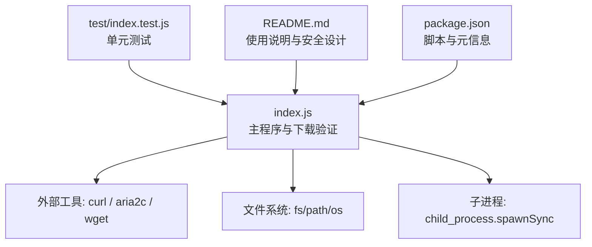
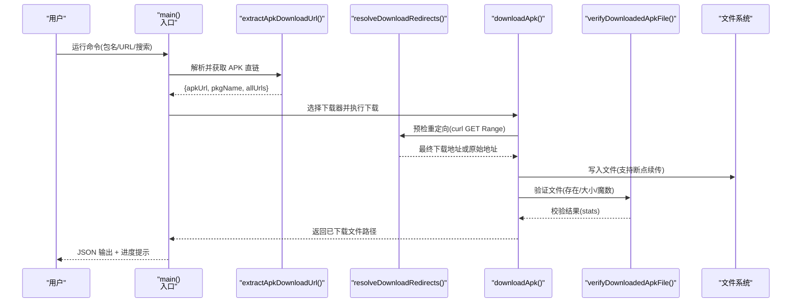
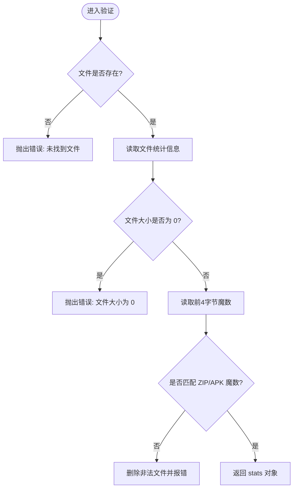
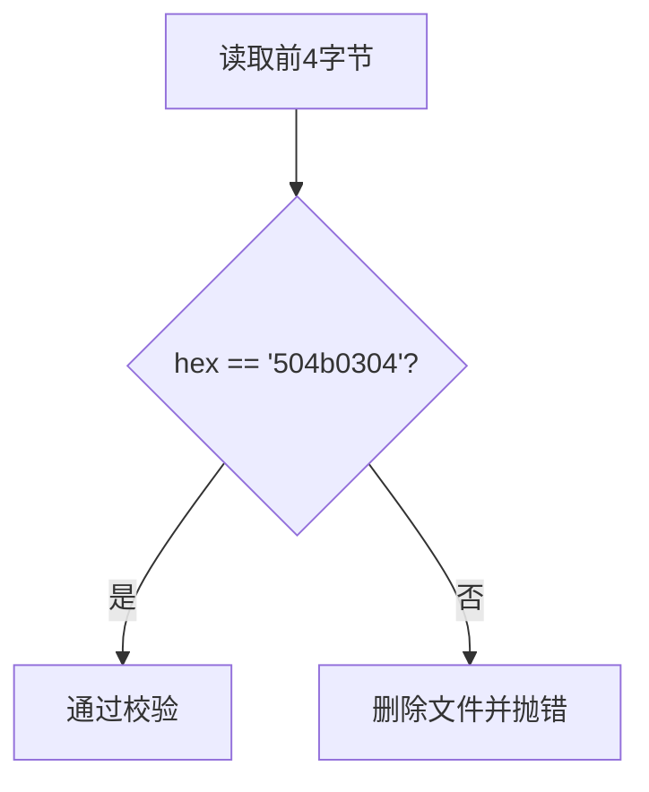
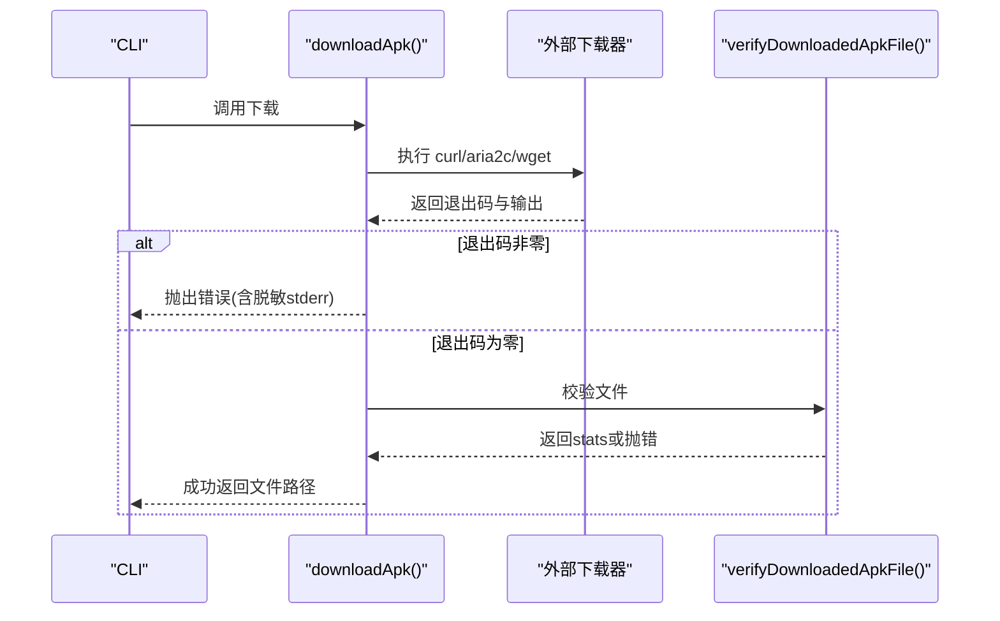
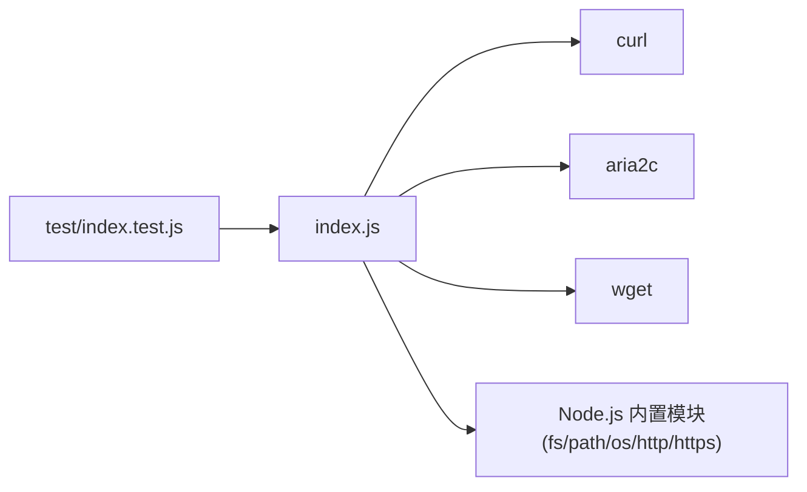

# 下载验证

<cite>
**本文引用的文件**
- [index.js](file://yyb-apk-extractor/index.js)
- [README.md](file://yyb-apk-extractor/README.md)
- [package.json](file://yyb-apk-extractor/package.json)
- [index.test.js](file://yyb-apk-extractor/test/index.test.js)
</cite>

## 目录
1. [简介](#简介)
2. [项目结构](#项目结构)
3. [核心组件](#核心组件)
4. [架构总览](#架构总览)
5. [详细组件分析](#详细组件分析)
6. [依赖关系分析](#依赖关系分析)
7. [性能与可靠性](#性能与可靠性)
8. [故障排查指南](#故障排查指南)
9. [结论](#结论)
10. [附录：配置与自定义规则](#附录：配置与自定义规则)

## 简介
本文件聚焦“下载验证机制”，围绕以下目标展开：
- 文件存在性检查：如何确认下载文件成功创建、文件大小校验。
- 非空验证：检查下载文件是否为空，以及最小文件大小限制策略。
- APK 头部魔数校验：基于 ZIP/APK 的魔数标识进行完整性检查。
- 下载过程状态监控：进度展示、错误检测、重试机制。
- 不同文件格式的验证策略：APK、ZIP 及其他压缩格式的识别与处理。
- 下载失败常见原因：网络中断、权限问题、磁盘空间不足等。
- 配置选项与自定义验证规则方法。
- 验证失败的恢复策略与用户提示机制。

该工具通过外部下载器（curl/aria2c/wget）完成下载，并在完成后执行本地校验，确保落盘文件的正确性与可用性。

## 项目结构
本项目为纯命令行 Node.js 工具，核心逻辑集中在单一入口文件中，测试用例覆盖关键路径与边界条件。

图表来源
- [index.js:1-120](file://yyb-apk-extractor/index.js#L1-L120)
- [index.js:1634-1767](file://yyb-apk-extractor/index.js#L1634-L1767)
- [index.js:1412-1438](file://yyb-apk-extractor/index.js#L1412-L1438)
- [index.js:1440-1518](file://yyb-apk-extractor/index.js#L1440-L1518)
- [index.js:833-859](file://yyb-apk-extractor/index.js#L833-L859)
- [index.test.js:1-120](file://yyb-apk-extractor/test/index.test.js#L1-L120)
- [README.md:303-314](file://yyb-apk-extractor/README.md#L303-L314)

章节来源
- [index.js:1-120](file://yyb-apk-extractor/index.js#L1-L120)
- [README.md:303-314](file://yyb-apk-extractor/README.md#L303-L314)
- [package.json:15-20](file://yyb-apk-extractor/package.json#L15-L20)

## 核心组件
- 下载器选择与执行：根据环境与参数选择 curl/aria2c/wget，并构建命令参数。
- 重定向预检：在下载前使用 curl 探测真实下载地址，避免无效请求。
- 文件写入与清理：安全文件名生成、目录创建、临时配置文件自动清理。
- 下载后验证：文件存在性、大小、魔数校验；失败时自动清理。
- 重试与超时：同步/异步重试封装，超时控制与断流检测。
- 交互与输出：进度提示、JSON 结果输出、日志脱敏与终端安全净化。

章节来源
- [index.js:458-493](file://yyb-apk-extractor/index.js#L458-L493)
- [index.js:1017-1073](file://yyb-apk-extractor/index.js#L1017-L1073)
- [index.js:1440-1518](file://yyb-apk-extractor/index.js#L1440-L1518)
- [index.js:1387-1438](file://yyb-apk-extractor/index.js#L1387-L1438)
- [index.js:833-859](file://yyb-apk-extractor/index.js#L833-L859)

## 架构总览
下图展示了从输入到下载完成的完整流程，包括重定向预检、下载器执行、文件验证与异常处理。

图表来源
- [index.js:1520-1576](file://yyb-apk-extractor/index.js#L1520-L1576)
- [index.js:1634-1767](file://yyb-apk-extractor/index.js#L1634-L1767)
- [index.js:1440-1518](file://yyb-apk-extractor/index.js#L1440-L1518)
- [index.js:1412-1438](file://yyb-apk-extractor/index.js#L1412-L1438)

## 详细组件分析

### 文件存在性检查与大小校验
- 存在性检查：下载完成后立即检查目标路径是否存在，不存在则抛出明确错误。
- 大小校验：读取文件统计信息，若大小为 0 视为失败，抛出错误并提示。
- 最小文件大小限制：当前实现未内置最小字节阈值；可通过扩展 verifyDownloadedApkFile 增加最小大小判断。

图表来源
- [index.js:1412-1438](file://yyb-apk-extractor/index.js#L1412-L1438)

章节来源
- [index.js:1412-1438](file://yyb-apk-extractor/index.js#L1412-L1438)

### 非空验证与最小文件大小限制
- 非空验证：通过 size === 0 判断为空文件，直接拒绝并提示。
- 最小大小限制：当前未强制最小值；建议在 verifyDownloadedApkFile 中增加可选的最小大小参数，例如 minBytes，用于严格场景。

章节来源
- [index.js:1412-1438](file://yyb-apk-extractor/index.js#L1412-L1438)

### APK 头部魔数校验与完整性检查
- 魔数标识：读取文件前 4 字节，期望值为 ZIP/APK 的魔数 504b0304。
- 完整性检查：魔数不匹配即认为文件损坏或被篡改，自动删除该文件并抛出错误。
- 其他压缩格式：当前仅校验 ZIP/APK 魔数；如需支持其他压缩格式，可扩展魔数表与类型判定逻辑。

图表来源
- [index.js:1421-1436](file://yyb-apk-extractor/index.js#L1421-L1436)

章节来源
- [index.js:1421-1436](file://yyb-apk-extractor/index.js#L1421-L1436)

### 下载过程的状态监控
- 进度跟踪：默认模式下以简洁方式显示文件名与大小；verbose 模式可输出详细日志。
- 错误检测：下载器退出码非零时抛出错误，包含 stderr 脱敏后的提示信息。
- 重试机制：提供同步与异步重试封装，支持多次重试与间隔等待；下载入口对整体流程也进行了有限重试。

图表来源
- [index.js:1668-1705](file://yyb-apk-extractor/index.js#L1668-L1705)
- [index.js:1760-1767](file://yyb-apk-extractor/index.js#L1760-L1767)
- [index.js:833-859](file://yyb-apk-extractor/index.js#L833-L859)

章节来源
- [index.js:1668-1705](file://yyb-apk-extractor/index.js#L1668-L1705)
- [index.js:1760-1767](file://yyb-apk-extractor/index.js#L1760-L1767)
- [index.js:833-859](file://yyb-apk-extractor/index.js#L833-L859)

### 不同文件格式的验证策略
- APK：按 ZIP 魔数校验，符合 Android 应用包规范。
- ZIP：同样适用魔数校验，适用于通用压缩包。
- 其他压缩格式：当前未内置；可在验证函数中扩展魔数表与类型分支，例如 gzip、tar.gz 等。

章节来源
- [index.js:1421-1436](file://yyb-apk-extractor/index.js#L1421-L1436)

### 下载失败的常见原因分析
- 网络中断：下载器返回非零退出码或连接超时；可通过重试与断点续传缓解。
- 权限问题：无法写入目标目录或文件；需检查目录权限与磁盘写权限。
- 磁盘空间不足：写入失败或文件大小异常；建议在执行下载前检查可用空间。
- 重定向异常：预检阶段被拒绝或缺少 Location；会降级使用原始地址或抛错。
- 代理凭据泄露防护：日志与错误信息中自动隐藏凭据，避免敏感信息外泄。

章节来源
- [index.js:1440-1518](file://yyb-apk-extractor/index.js#L1440-L1518)
- [index.js:1668-1705](file://yyb-apk-extractor/index.js#L1668-L1705)
- [index.js:775-782](file://yyb-apk-extractor/index.js#L775-L782)

## 依赖关系分析
- 外部依赖：curl、aria2c、wget，优先顺序由参数与环境决定。
- 系统模块：fs、path、os、child_process、http/https。
- 测试依赖：单元测试覆盖参数解析、下载器选择、代理凭据脱敏、交互输入解析及模拟下载链路。

图表来源
- [index.js:458-493](file://yyb-apk-extractor/index.js#L458-L493)
- [index.js:870-921](file://yyb-apk-extractor/index.js#L870-L921)
- [index.test.js:1-120](file://yyb-apk-extractor/test/index.test.js#L1-L120)

章节来源
- [index.js:458-493](file://yyb-apk-extractor/index.js#L458-L493)
- [index.js:870-921](file://yyb-apk-extractor/index.js#L870-L921)
- [index.test.js:1-120](file://yyb-apk-extractor/test/index.test.js#L1-L120)

## 性能与可靠性
- 大文件与慢速下载：默认超时用于连接建立与断流检测，不限制总时长；支持断点续传与多连接下载。
- 重定向预检：使用 GET Range 0-0 快速探测真实地址，避免全量传输。
- 重试机制：同步/异步重试封装，降低瞬时网络抖动影响。
- 资源清理：临时配置文件在进程退出或信号处理时自动清理，避免残留。

章节来源
- [README.md:291-301](file://yyb-apk-extractor/README.md#L291-L301)
- [index.js:1440-1518](file://yyb-apk-extractor/index.js#L1440-L1518)
- [index.js:833-859](file://yyb-apk-extractor/index.js#L833-L859)
- [index.js:623-651](file://yyb-apk-extractor/index.js#L623-L651)

## 故障排查指南
- 下载器不可用：检查 curl/aria2c/wget 是否安装；doctor 模式可查看工具状态。
- 代理配置错误：确保协议与主机端口有效；认证代理需使用支持的下载器。
- 重定向失败：查看预检阶段的 HTTP 状态码与 Location；必要时降级使用原始地址。
- 文件验证失败：确认魔数匹配与非空；如失败会自动清理文件并提示。
- 权限与空间：检查目标目录权限与磁盘剩余空间。

章节来源
- [index.js:923-951](file://yyb-apk-extractor/index.js#L923-L951)
- [index.js:1440-1518](file://yyb-apk-extractor/index.js#L1440-L1518)
- [index.js:1412-1438](file://yyb-apk-extractor/index.js#L1412-L1438)

## 结论
该工具的下载验证机制以“外部下载器 + 本地校验”为核心，通过重定向预检、文件存在性与大小检查、ZIP/APK 魔数校验，确保下载结果的完整性与可用性。结合重试、超时与断点续传，提升了在网络波动与大文件场景下的可靠性。同时，严格的 URL 白名单、代理凭据脱敏与终端输出净化，保障了安全性与可维护性。

## 附录：配置与自定义规则
- 配置选项
  - --proxy：设置代理，支持 http/https/socks5/socks5h。
  - --downloader：指定下载器 auto/curl/aria2c/wget。
  - --multi-thread：优先使用 aria2c 多连接下载。
  - --connections：aria2c 连接数，范围 1-16。
  - --timeout：网络超时时间，支持毫秒或带单位时长。
  - --insecure：跳过 HTTPS 证书校验（仅限测试环境）。
  - --download-dir：指定下载目录。
  - --verbose/-v：显示详细调试日志。
  - --no-color：禁用 ANSI 颜色输出。
- 自定义验证规则
  - 扩展 verifyDownloadedApkFile：可增加最小文件大小、更多魔数类型、哈希校验等。
  - 扩展重定向预检：可调整允许的域名与路径模式，增强 SSRF 防护。
  - 扩展下载器选择：可根据网络环境动态调整优先级与回退策略。

章节来源
- [README.md:119-135](file://yyb-apk-extractor/README.md#L119-L135)
- [index.js:1412-1438](file://yyb-apk-extractor/index.js#L1412-L1438)
- [index.js:1440-1518](file://yyb-apk-extractor/index.js#L1440-L1518)
- [index.js:458-493](file://yyb-apk-extractor/index.js#L458-L493)