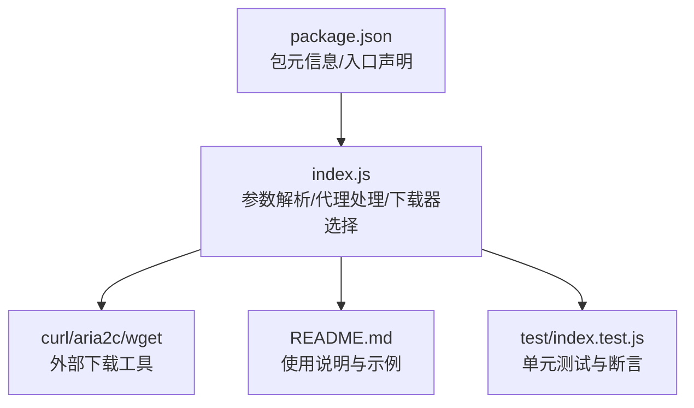
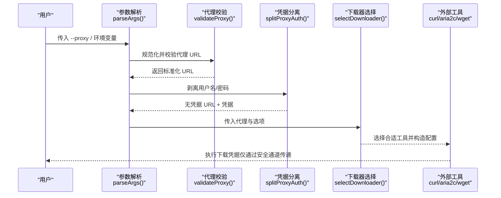
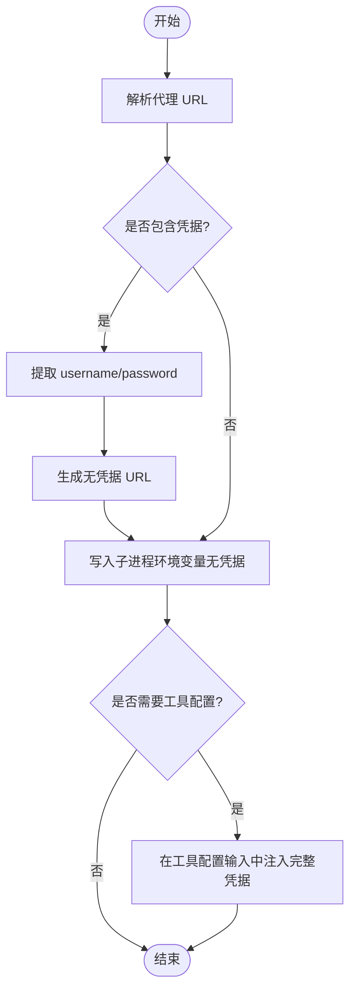
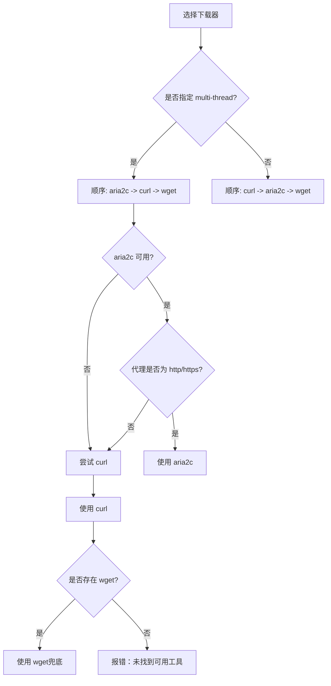
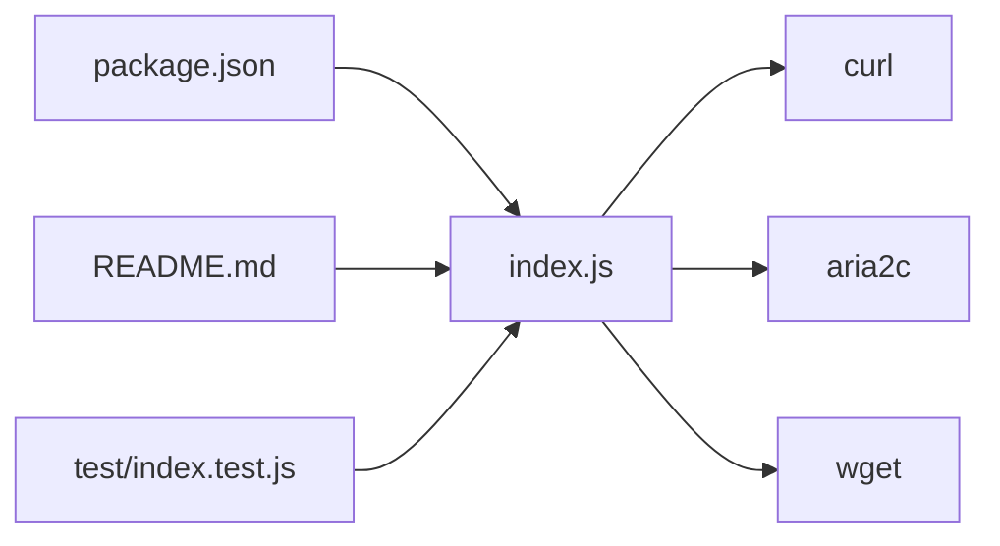

# 代理配置

<cite>
**本文引用的文件**
- [index.js](file://yyb-apk-extractor/index.js)
- [README.md](file://yyb-apk-extractor/README.md)
- [package.json](file://yyb-apk-extractor/package.json)
- [index.test.js](file://yyb-apk-extractor/test/index.test.js)
</cite>

## 目录
1. [简介](#简介)
2. [项目结构](#项目结构)
3. [核心组件](#核心组件)
4. [架构总览](#架构总览)
5. [详细组件分析](#详细组件分析)
6. [依赖关系分析](#依赖关系分析)
7. [性能与兼容性](#性能与兼容性)
8. [故障诊断指南](#故障诊断指南)
9. [结论](#结论)
10. [附录：常见工具配置示例](#附录常见工具配置示例)

## 简介
本章节面向使用 yyb-apk-extractor 的用户，系统化说明代理配置方法、支持的协议差异、环境变量优先级、URL 格式规范、凭据安全处理、不同下载器的代理支持差异，以及常见问题的诊断思路。内容均基于仓库源码与测试用例实现。

## 项目结构
本项目为纯 Node.js 命令行工具，核心逻辑集中在单一入口脚本中，并通过 README 提供使用说明，测试覆盖关键行为（包括代理校验、凭据脱敏、下载器选择等）。

图表来源
- [index.js:1-800](file://yyb-apk-extractor/index.js#L1-L800)
- [README.md:1-353](file://yyb-apk-extractor/README.md#L1-L353)
- [package.json:1-47](file://yyb-apk-extractor/package.json#L1-L47)
- [index.test.js:954-1196](file://yyb-apk-extractor/test/index.test.js#L954-L1196)

章节来源
- [index.js:1-800](file://yyb-apk-extractor/index.js#L1-L800)
- [README.md:1-353](file://yyb-apk-extractor/README.md#L1-L353)
- [package.json:1-47](file://yyb-apk-extractor/package.json#L1-L47)

## 核心组件
- 参数与环境解析：解析 --proxy、--no-proxy、--downloader、--multi-thread、--connections、--timeout 等选项；读取 HTTPS_PROXY/HTTP_PROXY/ALL_PROXY 及其小写变体作为默认代理。
- 代理 URL 规范化与校验：自动补全协议、限制协议白名单、强制包含主机与端口、拒绝路径/查询/片段。
- 凭据分离与安全传递：splitProxyAuth() 将用户名密码从 URL 剥离，避免在子进程环境变量和日志中泄露；仅在必要处通过工具配置输入注入凭据。
- 下载器选择策略：根据可用性与代理能力选择 curl/aria2c/wget；对 aria2c 的 socks5/socks5h 不支持、wget 的安全限制进行规避。
- 输出净化：maskUrl()/maskProxySecrets() 对错误输出、verbose 日志中的代理凭据进行脱敏。

章节来源
- [index.js:209-338](file://yyb-apk-extractor/index.js#L209-L338)
- [index.js:495-521](file://yyb-apk-extractor/index.js#L495-L521)
- [index.js:523-583](file://yyb-apk-extractor/index.js#L523-L583)
- [index.js:452-493](file://yyb-apk-extractor/index.js#L452-L493)
- [index.js:756-782](file://yyb-apk-extractor/index.js#L756-L782)

## 架构总览
下图展示了从用户输入到最终下载请求的代理相关流程，包括参数解析、环境变量合并、下载器选择与凭据安全注入。

图表来源
- [index.js:209-338](file://yyb-apk-extractor/index.js#L209-L338)
- [index.js:495-521](file://yyb-apk-extractor/index.js#L495-L521)
- [index.js:523-583](file://yyb-apk-extractor/index.js#L523-L583)
- [index.js:452-493](file://yyb-apk-extractor/index.js#L452-L493)

## 详细组件分析

### 支持的代理协议与适用场景
- HTTP/HTTPS：最稳定，适合 Clash/V2Ray 混合端口；推荐优先使用。
- SOCKS5h：SOCKS5 且由代理服务器解析 DNS，适用于本地 DNS 受限或需要远程解析的场景。
- SOCKS5：本地解析 DNS，在受限网络中容易失败，建议避免。

章节来源
- [index.js:35-41](file://yyb-apk-extractor/index.js#L35-L41)
- [index.js:154-155](file://yyb-apk-extractor/index.js#L154-L155)
- [README.md:262-276](file://yyb-apk-extractor/README.md#L262-L276)

### 代理配置方法与优先级
- 命令行参数：--proxy=地址（支持 http/https/socks5/socks5h；省略协议时按 HTTP 处理）。
- 环境变量：HTTPS_PROXY/https_proxy/HTTP_PROXY/http_proxy/ALL_PROXY/all_proxy，按代码中读取顺序作为默认代理。
- 显式忽略：--no-proxy 会忽略环境变量代理。

优先级规则（从高到低）：
1) --proxy 显式设置
2) 环境变量（按代码读取顺序）
3) 无代理

章节来源
- [index.js:217-235](file://yyb-apk-extractor/index.js#L217-L235)
- [index.js:245-250](file://yyb-apk-extractor/index.js#L245-L250)
- [index.js:333-335](file://yyb-apk-extractor/index.js#L333-L335)
- [README.md:137-143](file://yyb-apk-extractor/README.md#L137-L143)

### 代理 URL 格式规范
- 必须包含主机与端口。
- 仅允许协议：http、https、socks5、socks5h。
- 不允许路径、查询串或片段。
- 可包含用户名与密码用于认证。
- 省略协议时自动补全为 http。

章节来源
- [index.js:495-521](file://yyb-apk-extractor/index.js#L495-L521)
- [index.test.js:954-965](file://yyb-apk-extractor/test/index.test.js#L954-L965)

### 代理凭据的安全处理（splitProxyAuth）
- splitProxyAuth() 将代理 URL 拆分为“无凭据 URL”和“用户名/密码”，避免在子进程环境变量中暴露敏感信息。
- 子进程环境构建时，统一写入无凭据 URL；仅在必要的工具配置输入中注入完整凭据。
- 所有工具输出与 verbose 日志通过 maskProxySecrets() 进行脱敏，确保错误信息不泄露凭据。

图表来源
- [index.js:523-583](file://yyb-apk-extractor/index.js#L523-L583)
- [index.js:653-679](file://yyb-apk-extractor/index.js#L653-L679)
- [index.js:775-782](file://yyb-apk-extractor/index.js#L775-L782)
- [index.test.js:980-1015](file://yyb-apk-extractor/test/index.test.js#L980-L1015)

章节来源
- [index.js:523-583](file://yyb-apk-extractor/index.js#L523-L583)
- [index.js:653-679](file://yyb-apk-extractor/index.js#L653-L679)
- [index.test.js:980-1015](file://yyb-apk-extractor/test/index.test.js#L980-L1015)

### 不同下载器的代理支持差异
- curl：推荐工具，支持 http/https/socks5/socks5h 代理，页面提取阶段首选。
- aria2c：支持 http/https 代理；不支持 socks5/socks5h（会被识别为不受支持格式）。
- wget：仅作为兜底；当存在代理凭据或 socks5/socks5h 代理时会被拒绝，以避免凭据泄露或不一致行为。

图表来源
- [index.js:458-493](file://yyb-apk-extractor/index.js#L458-L493)
- [README.md:277-289](file://yyb-apk-extractor/README.md#L277-L289)

章节来源
- [index.js:452-493](file://yyb-apk-extractor/index.js#L452-L493)
- [README.md:277-289](file://yyb-apk-extractor/README.md#L277-L289)

## 依赖关系分析
- 入口脚本 index.js 负责参数解析、代理处理、下载器选择与外部命令调用。
- README.md 提供使用说明与示例，便于用户快速上手。
- package.json 定义包元信息与入口点。
- 测试用例 index.test.js 覆盖代理校验、凭据脱敏、下载器选择等关键路径。

图表来源
- [package.json:1-47](file://yyb-apk-extractor/package.json#L1-L47)
- [index.js:1-800](file://yyb-apk-extractor/index.js#L1-L800)
- [README.md:1-353](file://yyb-apk-extractor/README.md#L1-L353)
- [index.test.js:954-1196](file://yyb-apk-extractor/test/index.test.js#L954-L1196)

章节来源
- [package.json:1-47](file://yyb-apk-extractor/package.json#L1-L47)
- [index.js:1-800](file://yyb-apk-extractor/index.js#L1-L800)
- [README.md:1-353](file://yyb-apk-extractor/README.md#L1-L353)
- [index.test.js:954-1196](file://yyb-apk-extractor/test/index.test.js#L954-L1196)

## 性能与兼容性
- 超时控制：默认 30000ms，fetch 阶段限制请求总时长；下载阶段仅作为连接建立与断流检测时间，不限制大文件总下载时间。
- 多连接下载：启用 --multi-thread 时优先使用 aria2c，提升大文件下载效率（需本机安装 aria2c）。
- 平台兼容：Windows/macOS/Linux 均支持；Windows 终端建议使用 Windows Terminal 或 PowerShell，并保持 UTF-8 输出。

章节来源
- [index.js:340-384](file://yyb-apk-extractor/index.js#L340-L384)
- [README.md:291-301](file://yyb-apk-extractor/README.md#L291-L301)
- [README.md:67-93](file://yyb-apk-extractor/README.md#L67-L93)

## 故障诊断指南
- 无法解析代理 URL：检查是否包含主机与端口、是否使用了受支持的协议、是否误加了路径/查询/片段。
- aria2c 不可用或被跳过：若使用 socks5/socks5h 代理，aria2c 不被支持，将回退到 curl；如需多线程请改用 http/https 代理。
- wget 被拒绝：当存在代理凭据或使用 socks5/socks5h 代理时，wget 会被拒绝以避免安全问题；请改用 curl 或 aria2c（http/https）。
- 凭据泄露风险：确认未在日志或环境变量中直接暴露密码；工具输出已做脱敏，但应避免在命令行历史中明文记录凭据。
- DNS 解析失败：在受限网络中避免使用 socks5://（本地解析 DNS），改用 socks5h://（远程解析 DNS）。
- 超时与慢速下载：适当调整 --timeout；大文件下载不限制总时长，但连接/断流检测受超时影响。

章节来源
- [index.js:495-521](file://yyb-apk-extractor/index.js#L495-L521)
- [index.js:452-493](file://yyb-apk-extractor/index.js#L452-L493)
- [index.js:775-782](file://yyb-apk-extractor/index.js#L775-L782)
- [index.test.js:966-1015](file://yyb-apk-extractor/test/index.test.js#L966-L1015)
- [index.test.js:1142-1158](file://yyb-apk-extractor/test/index.test.js#L1142-L1158)

## 结论
本工具提供了完善的代理配置能力：支持多种协议、严格校验 URL、安全传递凭据、智能选择下载器，并提供详尽的错误输出脱敏与诊断提示。推荐在受限网络中使用 http:// 或 socks5h:// 代理，并根据需求选择 curl 或 aria2c 以获得最佳稳定性与性能。

## 附录：常见工具配置示例
以下为常见代理工具的典型监听地址与端口，供参考（具体以实际部署为准）：
- Clash：通常监听 HTTP 端口（如 7890）与 SOCKS 端口（如 7891），推荐使用 HTTP 模式或 socks5h。
- V2Ray：可配置 HTTP 出站或 SOCKS 出站，推荐使用 http:// 或 socks5h://。
- Shadowsocks：可通过客户端提供 SOCKS5/HTTP 代理，推荐使用 socks5h://。

注意：以上示例仅为常见实践，实际端口与协议请以你的代理服务端配置为准。

章节来源
- [index.js:35-41](file://yyb-apk-extractor/index.js#L35-L41)
- [index.js:154-155](file://yyb-apk-extractor/index.js#L154-L155)
- [README.md:262-276](file://yyb-apk-extractor/README.md#L262-L276)