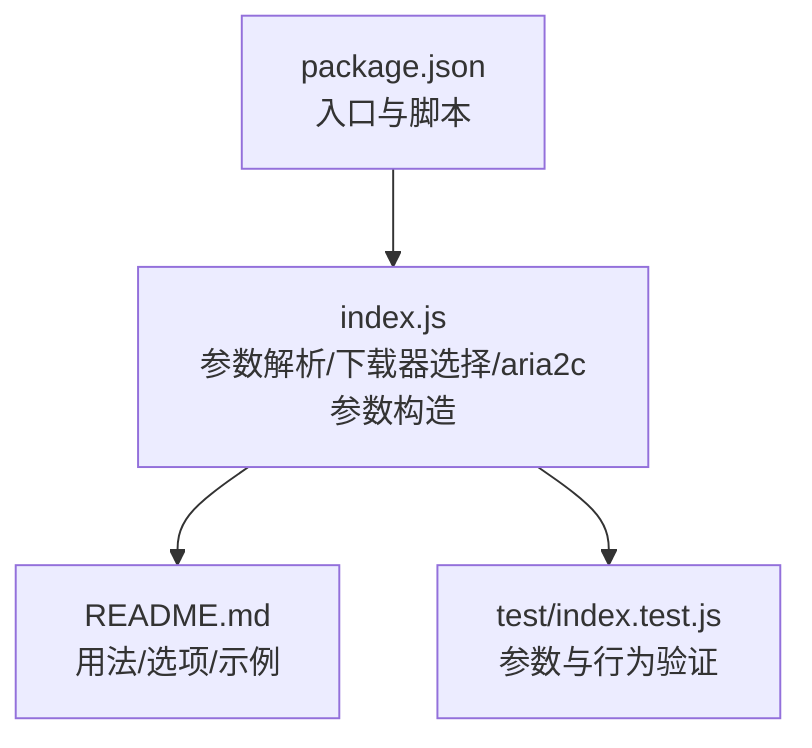
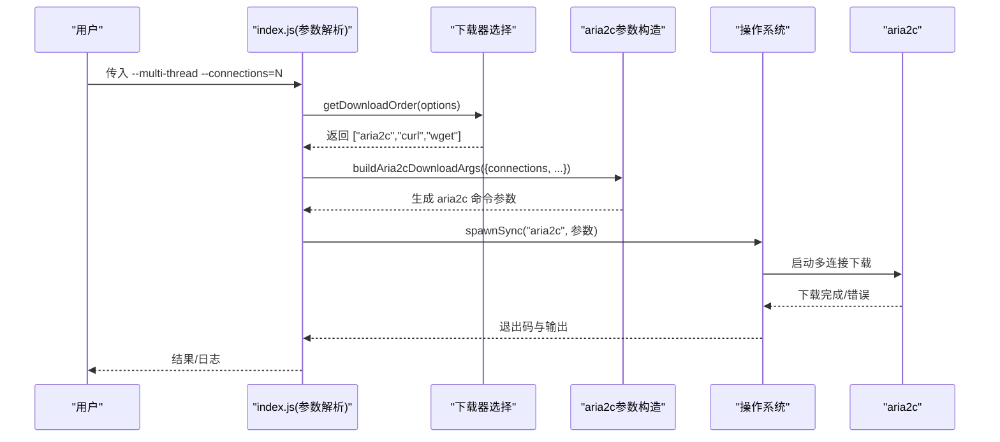
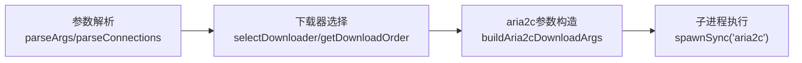

# 多线程下载

<cite>
**本文引用的文件**
- [index.js](file://yyb-apk-extractor/index.js)
- [README.md](file://yyb-apk-extractor/README.md)
- [package.json](file://yyb-apk-extractor/package.json)
- [test/index.test.js](file://yyb-apk-extractor/test/index.test.js)
</cite>

## 目录
1. [简介](#简介)
2. [项目结构](#项目结构)
3. [核心组件](#核心组件)
4. [架构总览](#架构总览)
5. [详细组件分析](#详细组件分析)
6. [依赖关系分析](#依赖关系分析)
7. [性能考量](#性能考量)
8. [故障排查指南](#故障排查指南)
9. [结论](#结论)
10. [附录](#附录)

## 简介
本章节面向使用 yyb-apk-extractor 的用户，系统化说明“多线程下载”能力：--multi-thread 参数如何启用 aria2c 多连接下载、--connections 参数的默认值与取值范围、性能调优建议、优势与限制、不同文件大小下的连接数策略、性能测试方法与最佳实践，以及断点续传在多线程环境下的工作原理与注意事项。

## 项目结构
本项目为纯 Node.js 命令行工具，核心逻辑集中在 index.js；README 提供使用说明与参数文档；package.json 定义入口与脚本；test 目录包含对参数解析、下载器选择与 aria2c 参数构造的单元测试。

图表来源
- [index.js:1-800](file://yyb-apk-extractor/index.js#L1-L800)
- [README.md:120-135](file://yyb-apk-extractor/README.md#L120-L135)
- [test/index.test.js:573-588](file://yyb-apk-extractor/test/index.test.js#L573-L588)

章节来源
- [index.js:1-800](file://yyb-apk-extractor/index.js#L1-L800)
- [README.md:120-135](file://yyb-apk-extractor/README.md#L120-L135)
- [package.json:1-47](file://yyb-apk-extractor/package.json#L1-L47)

## 核心组件
- 参数解析与校验
  - --multi-thread：启用后优先选择 aria2c 进行多连接下载。
  - --connections：aria2c 的连接数，默认 16，取值范围 1-16。
  - --downloader：指定下载工具（auto/curl/aria2c/wget），默认 auto。
- 下载器选择
  - 自动模式：未启用多线程时优先 curl，其次 aria2c，最后 wget；启用多线程时优先 aria2c，其次 curl，最后 wget。
  - 代理兼容性：aria2c 仅支持 http/https 代理，不支持 socks5/socks5h；wget 对认证代理和 SOCKS 有限制。
- aria2c 参数构造
  - 通过 -x/-s 设置连接数，启用断点续传与覆盖写入，设置超时、最低速度阈值、输出文件名与目录、请求头、代理等。
  - 非 verbose 模式下关闭汇总间隔并降低控制台日志级别。

章节来源
- [index.js:209-338](file://yyb-apk-extractor/index.js#L209-L338)
- [index.js:370-384](file://yyb-apk-extractor/index.js#L370-L384)
- [index.js:458-493](file://yyb-apk-extractor/index.js#L458-L493)
- [index.js:973-1015](file://yyb-apk-extractor/index.js#L973-L1015)
- [README.md:120-135](file://yyb-apk-extractor/README.md#L120-L135)

## 架构总览
下图展示了从命令行参数到最终调用 aria2c 的多线程下载流程，包括参数解析、下载器选择、参数构造与子进程执行。

图表来源
- [index.js:209-338](file://yyb-apk-extractor/index.js#L209-L338)
- [index.js:458-493](file://yyb-apk-extractor/index.js#L458-L493)
- [index.js:973-1015](file://yyb-apk-extractor/index.js#L973-L1015)

## 详细组件分析

### --multi-thread 的工作原理
- 作用：在自动模式下优先选择 aria2c 进行多连接下载。
- 实现要点：
  - 参数解析阶段将 multiThread 标记置为 true。
  - 下载顺序根据 multiThread 切换为 ["aria2c","curl","wget"]。
  - 若 aria2c 不可用或代理不兼容，会回退到 curl/wget。
- 适用场景：需要利用 aria2c 的分片并发能力提升大文件下载速度。

章节来源
- [index.js:209-338](file://yyb-apk-extractor/index.js#L209-L338)
- [index.js:458-493](file://yyb-apk-extractor/index.js#L458-L493)
- [README.md:277-287](file://yyb-apk-extractor/README.md#L277-L287)

### --connections 配置与调优
- 默认值：16。
- 取值范围：1-16。
- 映射到 aria2c：-x 与 -s 均设置为该值，表示最大连接数与每个任务的最大连接数。
- 调优建议：
  - 小文件：连接数不宜过大，避免建立连接的开销超过收益。
  - 大文件：可适当增加连接数以充分利用带宽，但需结合网络质量与服务器并发限制。
  - 网络波动较大时：适度降低连接数可减少重连与冲突。
  - 代理链路复杂时：减少连接数有助于降低握手与鉴权开销。
- 注意：是否真正分片取决于服务端对当前资源的分片支持。

章节来源
- [index.js:370-384](file://yyb-apk-extractor/index.js#L370-L384)
- [index.js:973-1015](file://yyb-apk-extractor/index.js#L973-L1015)
- [README.md:291-301](file://yyb-apk-extractor/README.md#L291-L301)

### 多线程下载的优势
- 提高大文件下载速度：通过多个并行连接同时拉取数据片段。
- 充分利用网络带宽：在高带宽低延迟环境下，并发可更好地填满管道。
- 减少下载时间：在网络稳定且服务端支持分片时，整体耗时显著下降。

章节来源
- [README.md:291-301](file://yyb-apk-extractor/README.md#L291-L301)

### 多线程下载的限制
- 需要安装 aria2c：未安装时将回退到其他下载器，无法获得多连接效果。
- 服务器并发要求：目标资源必须支持分片或多连接；否则可能无效甚至触发限流。
- 网络环境适配性：高延迟、弱网或代理链路过长时，过多连接可能适得其反。
- 代理兼容性：aria2c 仅支持 http/https 代理，不支持 socks5/socks5h。

章节来源
- [index.js:452-493](file://yyb-apk-extractor/index.js#L452-L493)
- [README.md:283-289](file://yyb-apk-extractor/README.md#L283-L289)

### 不同文件大小下的连接数优化建议
- 小文件（例如几十 MB 以内）：建议使用较低连接数（如 2-4），减少连接开销。
- 中等文件（几十到几百 MB）：可尝试 4-8 连接，平衡吞吐与稳定性。
- 大文件（数百 MB 以上）：可逐步提升到 8-16，观察实际吞吐与错误率再微调。
- 通用原则：以实际测速为准，逐步调整并记录结果。

章节来源
- [index.js:370-384](file://yyb-apk-extractor/index.js#L370-L384)
- [README.md:291-301](file://yyb-apk-extractor/README.md#L291-L301)

### 性能测试方法与最佳实践
- 基准方法：
  - 固定同一文件与网络环境，分别以不同 --connections 值运行多次，统计平均耗时与吞吐。
  - 对比单连接（--connections=1）与多线程的差异，评估收益。
- 观测指标：
  - 平均下载速率、总耗时、失败重试次数、CPU/内存占用。
- 最佳实践：
  - 先在小样本上快速试错，确定较优连接数后再批量执行。
  - 开启 --verbose 仅在调试时使用，生产环境关闭以减少 I/O 开销。
  - 合理设置 --timeout，避免误杀慢速连接。
  - 确保 aria2c 已正确安装并可被系统 PATH 找到。

章节来源
- [index.js:209-338](file://yyb-apk-extractor/index.js#L209-L338)
- [index.js:973-1015](file://yyb-apk-extractor/index.js#L973-L1015)
- [README.md:291-301](file://yyb-apk-extractor/README.md#L291-L301)

### 断点续传在多线程环境下的工作原理与注意事项
- 工作原理：
  - aria2c 启用断点续传（--continue=true），可在中断后继续下载。
  - 允许覆盖写入（--allow-overwrite=true），便于恢复时合并分片。
  - 设置最低速度阈值（--lowest-speed-limit=1024），避免长时间无进展。
- 注意事项：
  - 断点续传的有效性依赖于服务端对 Range 请求的支持。
  - 频繁切换网络或代理可能导致临时状态不一致，必要时清理残留分片后重试。
  - 在弱网或高丢包环境中，适当降低连接数可提高续传成功率。

章节来源
- [index.js:973-1015](file://yyb-apk-extractor/index.js#L973-L1015)
- [README.md:291-301](file://yyb-apk-extractor/README.md#L291-L301)

## 依赖关系分析
- 外部依赖：
  - aria2c：用于多线程下载，需安装并在 PATH 中可用。
  - curl/wget：作为回退下载器，增强可用性。
- 内部耦合：
  - 参数解析模块影响下载器选择与 aria2c 参数构造。
  - 下载器选择模块依赖代理兼容性与工具可用性检测。
  - aria2c 参数构造模块将连接数、超时、代理、证书校验等选项映射为命令行参数。

图表来源
- [index.js:209-338](file://yyb-apk-extractor/index.js#L209-L338)
- [index.js:458-493](file://yyb-apk-extractor/index.js#L458-L493)
- [index.js:973-1015](file://yyb-apk-extractor/index.js#L973-L1015)

章节来源
- [index.js:209-338](file://yyb-apk-extractor/index.js#L209-L338)
- [index.js:458-493](file://yyb-apk-extractor/index.js#L458-L493)
- [index.js:973-1015](file://yyb-apk-extractor/index.js#L973-L1015)

## 性能考量
- 连接数并非越大越好：需结合网络质量、服务端限制与代理复杂度综合评估。
- 超时设置：--timeout 控制连接建立与断流检测时长，不限制大文件总下载时间。
- 日志与 I/O：非 verbose 模式可降低控制台输出开销，提升整体吞吐。
- 代理路径：复杂代理链会增加握手与鉴权成本，应谨慎设置连接数。

章节来源
- [index.js:382-384](file://yyb-apk-extractor/index.js#L382-L384)
- [index.js:973-1015](file://yyb-apk-extractor/index.js#L973-L1015)
- [README.md:291-301](file://yyb-apk-extractor/README.md#L291-L301)

## 故障排查指南
- 未安装 aria2c：
  - 现象：无法启用多线程下载，回退到 curl/wget。
  - 处理：安装 aria2c 并确保 PATH 正确。
- 代理不兼容：
  - 现象：aria2c 不支持 socks5/socks5h，导致无法使用该下载器。
  - 处理：改用 http/https 代理或回退到 curl/wget。
- 连接数异常：
  - 现象：--connections 超出范围或被拒绝。
  - 处理：调整为 1-16 之间的整数。
- 下载失败或中断：
  - 现象：网络波动导致部分分片失败。
  - 处理：启用断点续传，适当降低连接数，检查服务端是否支持 Range。
- 证书校验问题：
  - 现象：HTTPS 证书校验失败。
  - 处理：仅在测试环境使用 --insecure，生产环境修复证书链。

章节来源
- [index.js:452-493](file://yyb-apk-extractor/index.js#L452-L493)
- [index.js:370-384](file://yyb-apk-extractor/index.js#L370-L384)
- [index.js:973-1015](file://yyb-apk-extractor/index.js#L973-L1015)
- [README.md:283-289](file://yyb-apk-extractor/README.md#L283-L289)

## 结论
--multi-thread 通过优先选择 aria2c 启用多连接下载，显著提升大文件下载效率；--connections 默认 16，取值范围 1-16，应根据文件大小、网络与服务端情况调优。多线程下载具备明显优势，但也受限于 aria2c 安装、代理兼容性与服务端分片支持。建议在真实环境中进行性能测试，结合断点续传与合理的超时设置，形成稳定的下载策略。

## 附录
- 常用命令示例：
  - 使用多线程下载：node index.js <包名或URL> --download-dir=./downloads --multi-thread --connections=8
  - 指定下载器：node index.js <包名或URL> --download-dir=./downloads --downloader=aria2c --connections=8
- 环境变量：
  - 支持 HTTPS_PROXY/HTTP_PROXY/ALL_PROXY 等代理环境变量，按优先级读取。

章节来源
- [README.md:180-191](file://yyb-apk-extractor/README.md#L180-L191)
- [README.md:137-143](file://yyb-apk-extractor/README.md#L137-L143)