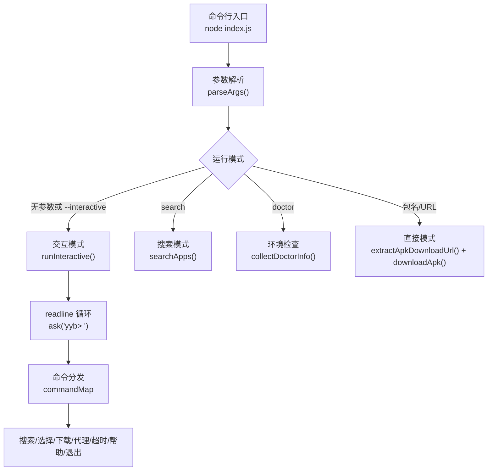
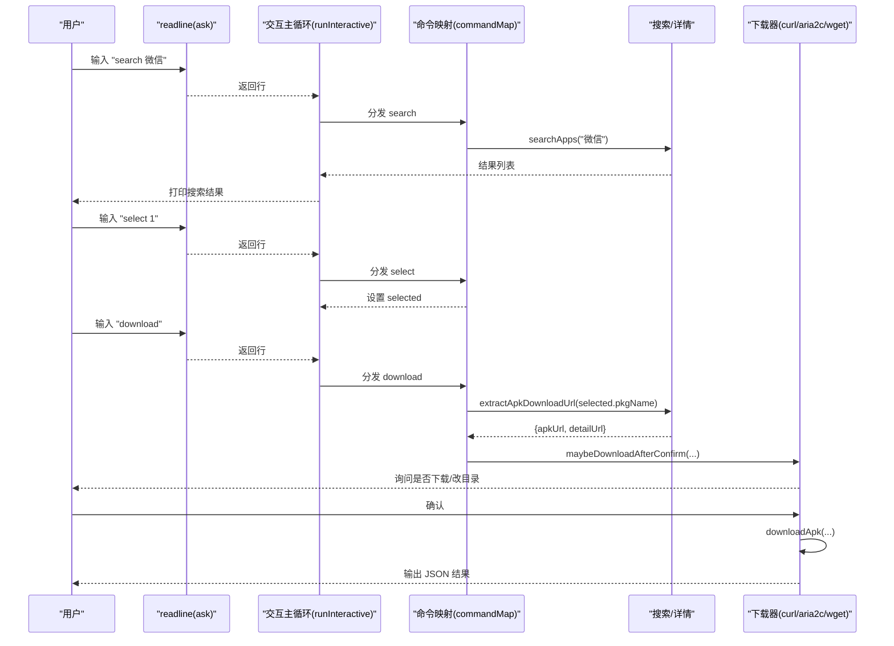
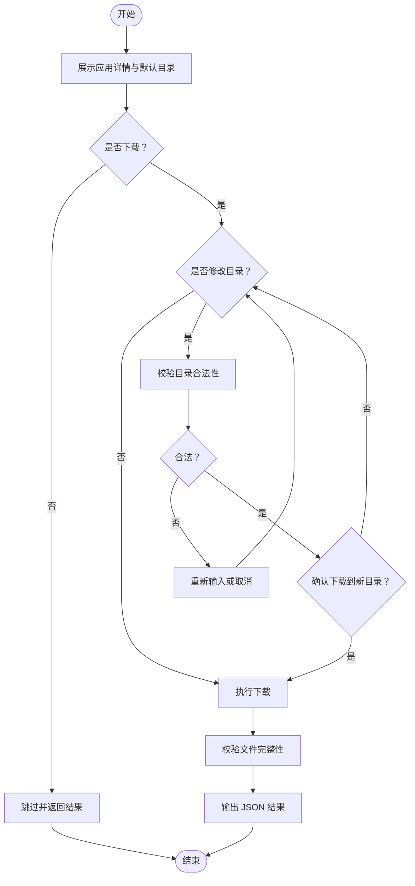
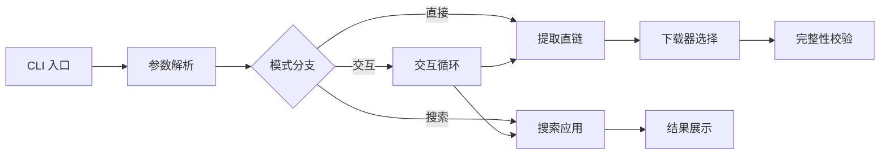

# 交互模式

<cite>
**本文引用的文件**
- [index.js](file://yyb-apk-extractor/index.js)
- [package.json](file://yyb-apk-extractor/package.json)
- [README.md](file://yyb-apk-extractor/README.md)
- [test/index.test.js](file://yyb-apk-extractor/test/index.test.js)
</cite>

## 目录
1. [简介](#简介)
2. [项目结构](#项目结构)
3. [核心组件](#核心组件)
4. [架构总览](#架构总览)
5. [详细组件分析](#详细组件分析)
6. [依赖关系分析](#依赖关系分析)
7. [性能与体验优化](#性能与体验优化)
8. [故障排查指南](#故障排查指南)
9. [结论](#结论)
10. [附录：交互流程示例](#附录交互流程示例)

## 简介
本文件聚焦“交互模式”的完整功能说明，覆盖设计理念、实现机制、用户输入处理、命令解析、菜单导航、搜索与下载配置、界面提示与颜色输出等。文档同时提供从启动到完成下载的完整交互流程示例，并对比与其他模式的差异，给出不同技能水平用户的使用指导与技巧。

## 项目结构
该工具为单入口 Node.js CLI 程序，核心逻辑集中在 index.js；package.json 声明可执行入口与脚本；README 提供使用说明与能力概览；测试用例覆盖参数解析、readline 封装等行为。



图表来源
- [index.js:2086-2163](file://yyb-apk-extractor/index.js#L2086-L2163)
- [index.js:2165-2208](file://yyb-apk-extractor/index.js#L2165-L2208)

章节来源
- [package.json:1-47](file://yyb-apk-extractor/package.json#L1-L47)
- [README.md:1-353](file://yyb-apk-extractor/README.md#L1-L353)

## 核心组件
- 参数解析与模式路由：根据命令行参数决定进入交互、搜索、环境检查或直接模式。
- 交互式向导：基于 readline 的循环读取、命令分发、状态管理（搜索结果、当前选中项、是否忙碌）。
- 搜索与详情：调用应用宝搜索页与详情页，解析 Next.js SSR 数据，提取应用信息。
- 下载链路：自动选择 curl/aria2c/wget，支持代理、断点续传、重定向预检、完整性校验。
- 终端输出：彩色提示、进度显示、错误脱敏、JSON 结果输出到 stdout，交互提示与日志写入 stderr。

章节来源
- [index.js:209-338](file://yyb-apk-extractor/index.js#L209-L338)
- [index.js:1769-1833](file://yyb-apk-extractor/index.js#L1769-L1833)
- [index.js:1882-1942](file://yyb-apk-extractor/index.js#L1882-L1942)
- [index.js:1634-1767](file://yyb-apk-extractor/index.js#L1634-L1767)

## 架构总览
交互模式是“命令驱动”的 TTY 会话：每次读取一行输入，解析命令与参数，调用对应处理器；处理器可能触发网络请求、下载与确认流程，期间通过 ask 进行二次交互（如确认下载、修改目录）。所有错误统一捕获并友好提示。



图表来源
- [index.js:2086-2163](file://yyb-apk-extractor/index.js#L2086-L2163)
- [index.js:1882-1942](file://yyb-apk-extractor/index.js#L1882-L1942)
- [index.js:1634-1767](file://yyb-apk-extractor/index.js#L1634-L1767)

## 详细组件分析

### 用户输入处理与命令解析
- 输入封装：createReadline 提供 ask(prompt, options)，支持单次禁用超时、关闭事件处理、最大输入长度限制。
- 主循环：runInteractive 持续读取 'yyb> ' 提示后的行，trim 后按空白分割出命令与参数。
- 命令映射：commandMap 将命令名（含别名）映射到处理器函数；未知命令时尝试识别为“包名或 URL”，走 get 流程。
- 状态管理：state.results（搜索结果）、state.selected（当前选中项）、state.busy（任务进行中）、state.exiting（退出标志）。

章节来源
- [index.js:1769-1814](file://yyb-apk-extractor/index.js#L1769-L1814)
- [index.js:2086-2163](file://yyb-apk-extractor/index.js#L2086-L2163)

### 菜单导航与交互命令
- 搜索：search/s <关键词> 调用 searchApps，打印前几条摘要，并提示可用 select/download。
- 列表：list/ls 展示上一次搜索结果。
- 选择：select/sel <序号> 校验序号范围并设置 selected。
- 下载：download/d [<序号>] 若传入序号则先选择；否则需已选中；随后提取 APK 链接并进入确认流程。
- 直接获取：get/g <包名或URL> 或直接在提示符下粘贴包名/URL，解析后进入确认流程。
- 代理：proxy/p <地址> 设置或清空代理；空地址表示清除。
- 超时：timeout/t [时长] 查看或设置超时（支持 ms/s/m）。
- 环境：doctor/env 显示本机 Node.js 与下载工具可用性。
- 帮助：help/h/? 显示交互帮助。
- 退出：exit/quit/q 退出交互。

章节来源
- [index.js:1816-1833](file://yyb-apk-extractor/index.js#L1816-L1833)
- [index.js:1882-1942](file://yyb-apk-extractor/index.js#L1882-L1942)
- [index.js:2062-2084](file://yyb-apk-extractor/index.js#L2062-L2084)

### 搜索功能与结果展示
- 关键词校验：长度、字符集限制，避免注入与非法请求。
- 搜索请求：访问 sj.qq.com/search?q=...，解析 __NEXT_DATA__ 中的 dynamicCardResponse，提取应用条目。
- 去重：按 pkgName 去重，保证结果唯一。
- 展示：打印前 5 条摘要，其余以“还有 N 条”提示；每条包含名称、包名、版本、开发者、大小等信息。

章节来源
- [index.js:1301-1381](file://yyb-apk-extractor/index.js#L1301-L1381)
- [index.js:1578-1606](file://yyb-apk-extractor/index.js#L1578-L1606)
- [index.js:1835-1866](file://yyb-apk-extractor/index.js#L1835-L1866)

### 下载配置与确认流程
- 下载器选择：优先 curl，其次 aria2c（多线程），最后 wget；根据代理兼容性、凭据安全等动态选择。
- 重定向预检：对非 aria2c 路径，使用 curl 探测真实下载地址，防止无效直链。
- 文件名净化：过滤控制字符、Windows 保留名、超长截断，确保跨平台落盘安全。
- 完整性校验：下载完成后检查文件存在、非空、ZIP/APK 魔数匹配。
- 确认交互：展示应用详情（名称、包名、版本、开发者、大小、评分、简介、图标、详情页、APK、默认目录），询问是否下载、是否修改目录、取消等。



图表来源
- [index.js:1944-2046](file://yyb-apk-extractor/index.js#L1944-L2046)
- [index.js:1634-1767](file://yyb-apk-extractor/index.js#L1634-L1767)

章节来源
- [index.js:1634-1767](file://yyb-apk-extractor/index.js#L1634-L1767)
- [index.js:1944-2046](file://yyb-apk-extractor/index.js#L1944-L2046)

### 用户界面元素
- 提示信息：彩色标题、命令帮助、搜索结果摘要、下载进度与成功提示。
- 错误提示：统一以 [error] 前缀输出，消息经过终端安全净化，隐藏敏感信息。
- 进度显示：下载阶段在非 verbose 模式下仅显示文件名与最终大小；verbose 模式输出工具原始日志。
- 颜色输出：根据 TTY 与 NO_COLOR/--no-color 决定是否启用 ANSI 颜色。

章节来源
- [index.js:85-127](file://yyb-apk-extractor/index.js#L85-L127)
- [index.js:1816-1833](file://yyb-apk-extractor/index.js#L1816-L1833)
- [index.js:1658-1664](file://yyb-apk-extractor/index.js#L1658-L1664)
- [index.js:2210-2228](file://yyb-apk-extractor/index.js#L2210-L2228)

### 与其他模式的对比
- 直接模式：适合脚本化与 CI，成功输出 JSON，便于管道处理；无需交互。
- 搜索模式：一次性搜索并输出 JSON，适合自动化筛选。
- 交互模式：适合人工探索、反复调整参数（代理、超时、目录）、逐步确认下载；具备更好的容错与引导。

章节来源
- [README.md:95-118](file://yyb-apk-extractor/README.md#L95-L118)
- [index.js:2165-2208](file://yyb-apk-extractor/index.js#L2165-L2208)

## 依赖关系分析
- 运行时依赖：Node.js >= 16.3.0；外部工具 curl/aria2c/wget（至少一个）。
- 模块依赖：仅使用 Node 内置模块（fs、http、https、os、path、child_process、readline）。
- 外部服务：应用宝移动端页面与搜索接口（sj.qq.com/a.app.qq.com），严格域名白名单与重定向校验。



图表来源
- [index.js:209-338](file://yyb-apk-extractor/index.js#L209-L338)
- [index.js:1634-1767](file://yyb-apk-extractor/index.js#L1634-L1767)

章节来源
- [package.json:1-47](file://yyb-apk-extractor/package.json#L1-L47)
- [README.md:67-93](file://yyb-apk-extractor/README.md#L67-L93)

## 性能与体验优化
- 命令缓存：findCommand 缓存 PATH 中工具检测结果，减少重复 fork。
- 重试机制：网络请求与下载失败自动重试，提升稳定性。
- 超时策略：fetch 阶段限制总时长；下载阶段作为连接/断流检测时间，不限制大文件总时长。
- 多连接下载：aria2c 多线程加速大文件下载（需安装 aria2c）。
- 终端安全：过滤 ANSI 与控制字符，避免终端注入；代理凭据在日志与输出中脱敏。
- 资源清理：临时配置文件在进程退出或信号时自动清理，避免泄露。

章节来源
- [index.js:870-921](file://yyb-apk-extractor/index.js#L870-L921)
- [index.js:833-859](file://yyb-apk-extractor/index.js#L833-L859)
- [index.js:623-651](file://yyb-apk-extractor/index.js#L623-L651)
- [index.js:775-790](file://yyb-apk-extractor/index.js#L775-L790)

## 故障排查指南
- 无法进入交互模式：非 TTY 环境会拒绝；需在真实终端运行或使用显式参数。
- 搜索失败：检查关键词合法性与网络连通；必要时切换代理或降低并发。
- 下载失败：确认 curl/aria2c/wget 可用性；检查代理协议与凭据；开启 --verbose 查看工具输出。
- 文件不完整：工具会自动校验 ZIP/APK 魔数；失败时会删除无效文件并报错。
- 权限问题：下载目录需可写；避免根目录与路径遍历。

章节来源
- [index.js:2086-2089](file://yyb-apk-extractor/index.js#L2086-L2089)
- [index.js:1301-1311](file://yyb-apk-extractor/index.js#L1301-L1311)
- [index.js:1412-1438](file://yyb-apk-extractor/index.js#L1412-L1438)
- [index.js:386-399](file://yyb-apk-extractor/index.js#L386-L399)

## 结论
交互模式通过清晰的命令体系、稳健的状态管理与完善的确认流程，为用户提供友好的探索与下载体验。它在保持脚本化能力的同时，增强了人类操作的可控性与容错性，适用于需要灵活调整参数、反复确认的场景。

## 附录：交互流程示例
以下示例展示从启动到完成下载的完整过程（实际输出因环境与网络而异）：

```text
$ node index.js

yyb> search 微信

搜索结果: 微信 (N 条)
- 微信 | com.tencent.mm | v8.x | 深圳市腾讯计算机系统有限公司 | 261 MB
... 还有 N-5 条

yyb> select 1
已选中: 微信 (com.tencent.mm)

yyb> download
正在提取 APK 链接，请稍候...
正在解析应用信息，请稍候...
应用详情
  名称: 微信
  包名: com.tencent.mm
  版本: 8.x
  开发者: 深圳市腾讯计算机系统有限公司
  大小: 261 MB
  评分: 4.3
  简介: ...
  详情页: https://sj.qq.com/appdetail/com.tencent.mm
  APK: http(s)://...
  下载目录: ./downloads
下载到 ./downloads? [Enter=确认下载, 输入新目录=改目录后再确认, n/q=取消]: 
[download] com.tencent.mm.apk
[ok] com.tencent.mm.apk (261 MB)
{
  "pkgName": "com.tencent.mm",
  "detailUrl": "https://sj.qq.com/appdetail/com.tencent.mm",
  "apkUrl": "...",
  "allUrls": ["...", "..."],
  "appInfo": {...},
  "downloadedFile": "./downloads/com.tencent.mm.apk"
}
```

章节来源
- [README.md:224-259](file://yyb-apk-extractor/README.md#L224-L259)
- [index.js:1882-1942](file://yyb-apk-extractor/index.js#L1882-L1942)
- [index.js:2008-2046](file://yyb-apk-extractor/index.js#L2008-L2046)