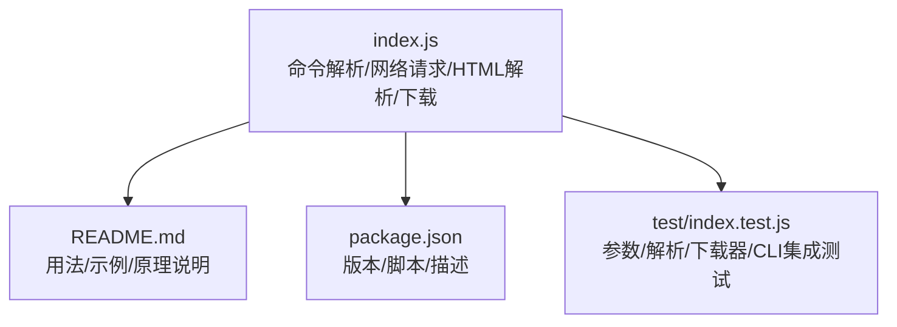
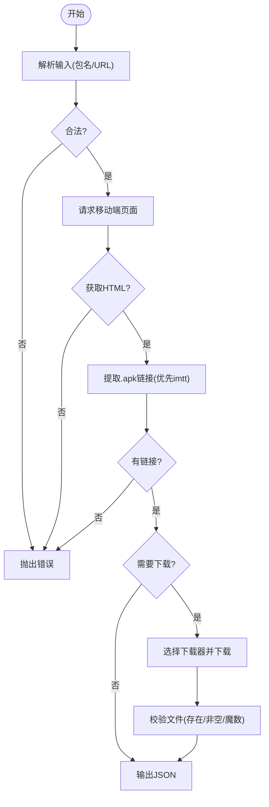
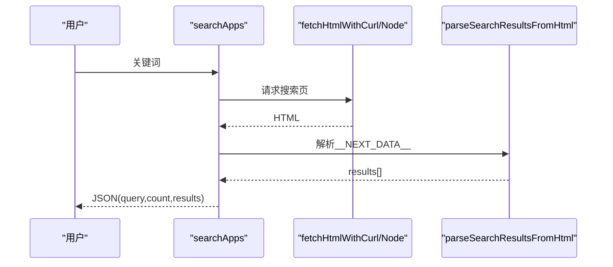
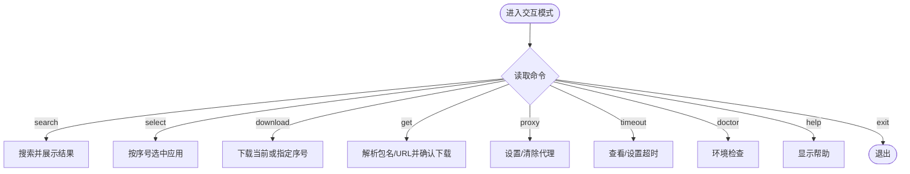
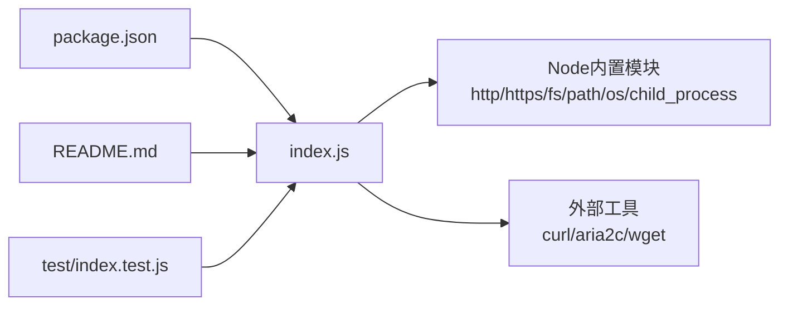

# 功能详解

<cite>
**本文引用的文件**
- [yyb-apk-extractor/README.md](file://yyb-apk-extractor/README.md)
- [yyb-apk-extractor/index.js](file://yyb-apk-extractor/index.js)
- [yyb-apk-extractor/package.json](file://yyb-apk-extractor/package.json)
- [yyb-apk-extractor/test/index.test.js](file://yyb-apk-extractor/test/index.test.js)
</cite>

## 目录
1. [简介](#简介)
2. [项目结构](#项目结构)
3. [核心组件](#核心组件)
4. [架构总览](#架构总览)
5. [详细组件分析](#详细组件分析)
6. [依赖关系分析](#依赖关系分析)
7. [性能考量](#性能考量)
8. [故障排查指南](#故障排查指南)
9. [结论](#结论)
10. [附录：使用示例与最佳实践](#附录使用示例与最佳实践)

## 简介
本工具是一个纯命令行应用，用于从腾讯应用宝官网提取 Android APK 直链。它支持三种工作模式：直接模式（输入包名或详情页 URL）、搜索模式（关键词搜索应用）、交互模式（交互式向导）。同时提供环境检查能力，便于在脚本、CI 和日常命令行中使用。成功输出保持 JSON，便于接入 jq、自动化任务和其他工具。

## 项目结构
- 入口与主逻辑：index.js
- 文档与使用说明：README.md
- 包元数据与脚本：package.json
- 测试用例：test/index.test.js



图表来源
- [yyb-apk-extractor/index.js:1-80](file://yyb-apk-extractor/index.js#L1-L80)
- [yyb-apk-extractor/package.json:1-47](file://yyb-apk-extractor/package.json#L1-L47)

章节来源
- [yyb-apk-extractor/README.md:1-120](file://yyb-apk-extractor/README.md#L1-L120)
- [yyb-apk-extractor/package.json:1-47](file://yyb-apk-extractor/package.json#L1-L47)

## 核心组件
- 参数与环境解析：解析命令行选项、环境变量代理、超时、下载器等
- 网络请求层：优先 curl，回退 Node.js https/http；统一重定向处理与安全校验
- HTML 解析层：应用宝移动端页面 APK 链接提取；Next.js SSR __NEXT_DATA__ 解析
- 下载器选择与执行：curl / aria2c / wget 自动选择与参数构建；断点续传与多连接
- 交互模式：readline 驱动的命令循环，支持 search/select/download/get/proxy/timeout/doctor/help
- 安全与健壮性：URL/域名白名单、SSRF 防护、凭据脱敏、终端输出净化、临时文件清理

章节来源
- [yyb-apk-extractor/index.js:209-338](file://yyb-apk-extractor/index.js#L209-L338)
- [yyb-apk-extractor/index.js:1112-1280](file://yyb-apk-extractor/index.js#L1112-L1280)
- [yyb-apk-extractor/index.js:1282-1385](file://yyb-apk-extractor/index.js#L1282-L1385)
- [yyb-apk-extractor/index.js:1634-1767](file://yyb-apk-extractor/index.js#L1634-L1767)
- [yyb-apk-extractor/index.js:1769-2163](file://yyb-apk-extractor/index.js#L1769-L2163)

## 架构总览
整体流程分为“输入解析 -> 网络获取 -> HTML 解析 -> 结果输出/下载”四段，并在多处加入安全校验与错误恢复。

```mermaid
sequenceDiagram
participant U as "用户"
participant CLI as "命令解析<br/>parseArgs/main"
participant NET as "网络请求<br/>fetchHtmlWithCurl/fetchHtmlWithNode"
participant PARSER as "HTML解析<br/>APK链接/Next.js数据"
participant DL as "下载器<br/>curl/aria2c/wget"
participant FS as "文件系统"
U->>CLI : 运行命令(包名/URL/search/doctor/交互)
CLI->>NET : 根据模式发起请求
NET-->>CLI : HTML文本(含重定向/错误)
CLI->>PARSER : 解析APK链接或Next.js数据
PARSER-->>CLI : 结构化结果(JSON)
alt 需要下载
CLI->>DL : 选择并执行下载
DL->>FS : 写入APK文件
FS-->>DL : 完成/失败
DL-->>CLI : 路径/状态
end
CLI-->>U : stdout输出JSON; stderr输出进度/调试
```

图表来源
- [yyb-apk-extractor/index.js:2165-2208](file://yyb-apk-extractor/index.js#L2165-L2208)
- [yyb-apk-extractor/index.js:1520-1606](file://yyb-apk-extractor/index.js#L1520-L1606)
- [yyb-apk-extractor/index.js:1634-1767](file://yyb-apk-extractor/index.js#L1634-L1767)

## 详细组件分析

### 直接模式（包名提取 APK 直链）
- 输入格式
  - Android 包名：形如 com.example.app
  - 应用宝详情页 URL：https://sj.qq.com/appdetail/<包名> 或 a.app.qq.com/simple.jsp?pkgname=...
- 处理流程
  1) 校验输入为合法包名或 URL；规范化 URL
  2) 构造移动端 simple.jsp 地址并请求 HTML
  3) 从 HTML 中匹配 .apk 链接，优先返回 imtt 官方 CDN 链接
  4) 若指定下载目录，则自动下载并校验文件完整性
- 输出结果
  - JSON：包含 pkgName、detailUrl、apkUrl、allUrls；若下载成功追加 downloadedFile
- 关键实现要点
  - 安全校验：仅允许 http/https，目标域名限制在 qq.com/myapp.com/qpic.cn/qlogo.cn 等
  - 重定向预检：通过 curl GET Range 探测真实下载地址，避免 HEAD 被拒绝
  - 下载器选择：auto/curl/aria2c/wget，支持多线程与断点续传
  - 完整性校验：验证 ZIP/APK 魔数，非空且存在



图表来源
- [yyb-apk-extractor/index.js:1520-1576](file://yyb-apk-extractor/index.js#L1520-L1576)
- [yyb-apk-extractor/index.js:1282-1299](file://yyb-apk-extractor/index.js#L1282-L1299)
- [yyb-apk-extractor/index.js:1634-1767](file://yyb-apk-extractor/index.js#L1634-L1767)
- [yyb-apk-extractor/index.js:1440-1518](file://yyb-apk-extractor/index.js#L1440-L1518)

章节来源
- [yyb-apk-extractor/index.js:401-450](file://yyb-apk-extractor/index.js#L401-L450)
- [yyb-apk-extractor/index.js:1520-1576](file://yyb-apk-extractor/index.js#L1520-L1576)
- [yyb-apk-extractor/index.js:1282-1299](file://yyb-apk-extractor/index.js#L1282-L1299)
- [yyb-apk-extractor/index.js:1634-1767](file://yyb-apk-extractor/index.js#L1634-L1767)

### 搜索模式（关键词搜索应用）
- 输入格式
  - 关键词：中英文、数字及常用标点；长度限制；非法字符拒绝
- 处理流程
  1) 校验关键词并编码
  2) 请求 sj.qq.com/search?q=...
  3) 从 Next.js SSR 的 __NEXT_DATA__ 中解析 dynamicCardResponse.data.components[].data.itemData
  4) 去重并按包名保留首次出现顺序
- 输出结果
  - JSON：query、count、results[]（包含 pkgName、appId、name、developer、version、icon、apkSize、rating、intro、detailUrl、rawDownloadUrl）
- 关键实现要点
  - 严格域名白名单：仅允许 sj.qq.com
  - 容错解析：跳过畸形条目，接口异常时抛错
  - 终端安全：名称/开发者/简介等网络数据过滤 ANSI 与控制字符



图表来源
- [yyb-apk-extractor/index.js:1578-1606](file://yyb-apk-extractor/index.js#L1578-L1606)
- [yyb-apk-extractor/index.js:1313-1385](file://yyb-apk-extractor/index.js#L1313-L1385)

章节来源
- [yyb-apk-extractor/index.js:1301-1385](file://yyb-apk-extractor/index.js#L1301-L1385)
- [yyb-apk-extractor/test/index.test.js:274-423](file://yyb-apk-extractor/test/index.test.js#L274-L423)

### 交互模式（交互式向导界面）
- 触发方式
  - 无参数运行（需 TTY），或显式 --interactive
- 支持命令
  - search/s、list/ls、select/sel <序号>、download/d [序号]、get/g <包名或URL>、proxy/p <地址>、timeout/t [时长]、doctor/env、help/h/?、exit/quit/q
- 处理流程
  1) readline 读取用户输入，长度限制与超时控制
  2) 命令分发到对应处理器
  3) 搜索后展示列表，支持 select 选中，download 直接下载或确认下载
  4) get 可直接粘贴包名或详情页 URL，解析后询问是否下载
  5) 下载前展示应用详情摘要，支持自定义目录二次确认
- 输出结果
  - 成功时 stdout 输出 JSON；stderr 输出交互提示、进度与调试信息
- 关键实现要点
  - 状态管理：results、selected、busy、exiting
  - 输入净化：ANSI 控制序列过滤
  - 错误处理：未知命令、无效序号、目录非法等友好提示



图表来源
- [yyb-apk-extractor/index.js:1769-2163](file://yyb-apk-extractor/index.js#L1769-L2163)

章节来源
- [yyb-apk-extractor/index.js:1769-2163](file://yyb-apk-extractor/index.js#L1769-L2163)
- [yyb-apk-extractor/test/index.test.js:624-684](file://yyb-apk-extractor/test/index.test.js#L624-L684)

### 环境检查功能（doctor）
- 作用
  - 检测 Node.js 版本、平台、可用下载工具（curl/aria2c/wget）并给出提示
- 输出
  - stdout 输出 JSON；TTY 下 stderr 输出人类可读摘要
- 关键点
  - 工具可用性通过 which/where 或 PATH 候选检测
  - 未检测到必要工具时给出安装建议

章节来源
- [yyb-apk-extractor/index.js:923-966](file://yyb-apk-extractor/index.js#L923-L966)
- [yyb-apk-extractor/test/index.test.js:673-684](file://yyb-apk-extractor/test/index.test.js#L673-L684)

### HTML 解析过程
- 直接模式
  - 正则匹配 .apk 链接，过滤非 http/https 与非腾讯域名
  - 优先返回 imtt 官方 CDN 链接
- 搜索模式
  - 解析 __NEXT_DATA__ JSON，定位 dynamicCardResponse.data.components[].data.itemData
  - 对 itemData 逐项校验并转换为结构化对象
  - 按包名去重，保留首次出现顺序

章节来源
- [yyb-apk-extractor/index.js:1282-1299](file://yyb-apk-extractor/index.js#L1282-L1299)
- [yyb-apk-extractor/index.js:1313-1385](file://yyb-apk-extractor/index.js#L1313-L1385)
- [yyb-apk-extractor/test/index.test.js:274-423](file://yyb-apk-extractor/test/index.test.js#L274-L423)

### Next.js SSR 数据解析
- 定位 script id="__NEXT_DATA__" 中的 JSON
- 读取 props.pageProps.dynamicCardResponse
- 校验 ret 字段，异常时抛错
- 遍历 components 与 itemData 提取应用条目

章节来源
- [yyb-apk-extractor/index.js:1313-1331](file://yyb-apk-extractor/index.js#L1313-L1331)
- [yyb-apk-extractor/index.js:1351-1385](file://yyb-apk-extractor/index.js#L1351-L1385)

### APK 链接提取算法
- 正则匹配所有 .apk 结尾的 URL
- 过滤非 http/https 协议
- 校验域名白名单（qq.com/myapp.com/qpic.cn/qlogo.cn）
- 优先选择包含 imtt 的官方 CDN 链接
- 下载前通过 curl GET Range 预检重定向，确保可下载

章节来源
- [yyb-apk-extractor/index.js:1282-1299](file://yyb-apk-extractor/index.js#L1282-L1299)
- [yyb-apk-extractor/index.js:1440-1518](file://yyb-apk-extractor/index.js#L1440-L1518)

## 依赖关系分析
- 外部依赖
  - 无 npm 依赖；依赖系统工具 curl/aria2c/wget（可选）
- 内部模块关系
  - index.js 自包含全部逻辑，导出大量函数供测试使用
  - package.json 定义 bin 入口与脚本
  - README.md 提供用法与原理说明
  - test/index.test.js 覆盖参数解析、HTML 解析、下载器选择、CLI 行为等



图表来源
- [yyb-apk-extractor/package.json:1-47](file://yyb-apk-extractor/package.json#L1-L47)
- [yyb-apk-extractor/index.js:44-83](file://yyb-apk-extractor/index.js#L44-L83)

章节来源
- [yyb-apk-extractor/package.json:1-47](file://yyb-apk-extractor/package.json#L1-L47)
- [yyb-apk-extractor/index.js:44-83](file://yyb-apk-extractor/index.js#L44-L83)

## 性能考量
- 网络请求
  - 优先 curl，具备更完整的代理支持与更快的启动速度
  - 自动重试机制（同步/异步）提升稳定性
- 下载优化
  - curl：断点续传、速度限制与超时保护
  - aria2c：多连接下载，适合大体积 APK
  - wget：兜底方案
- 内存与缓冲
  - HTML 响应体上限限制，防止过大响应占用内存
  - 子进程输出缓冲限制，避免阻塞
- 终端输出
  - 非 TTY 或 NO_COLOR/--no-color 时禁用颜色，保证管道输出干净

[本节为通用指导，不直接分析具体文件]

## 故障排查指南
- 常见错误与处理
  - 非法包名/URL：提前校验并抛出明确错误
  - 搜索关键词非法：长度/字符集校验，拒绝危险字符
  - 代理配置错误：协议/主机/端口校验，凭据脱敏，不支持的代理组合报错
  - 下载失败：工具退出码与 stderr 脱敏输出，必要时降级或回退
  - 非 TTY 交互：提前拒绝并提示使用显式参数
- 诊断手段
  - 使用 doctor 检查环境与工具可用性
  - 启用 --verbose 查看详细日志
  - 使用 --no-color 确保管道输出稳定
- 安全相关
  - 所有外部命令通过 spawnSync 数组调用，避免 shell 拼接
  - 终端输出净化，防止 ANSI 注入
  - 下载文件名净化，防止路径穿越与 Windows 保留名冲突

章节来源
- [yyb-apk-extractor/index.js:209-338](file://yyb-apk-extractor/index.js#L209-L338)
- [yyb-apk-extractor/index.js:742-821](file://yyb-apk-extractor/index.js#L742-L821)
- [yyb-apk-extractor/index.js:1634-1767](file://yyb-apk-extractor/index.js#L1634-L1767)
- [yyb-apk-extractor/test/index.test.js:749-782](file://yyb-apk-extractor/test/index.test.js#L749-L782)

## 结论
该工具以最小依赖实现了从应用宝提取 APK 直链的核心能力，并通过搜索模式、交互模式与环境检查提升了易用性与可维护性。其安全设计（域名白名单、SSRF 防护、凭据脱敏、终端净化）与健壮性（重试、降级、完整性校验）使其适用于脚本与 CI 场景。对于初学者，可从直接模式入手；高级用户可利用搜索与交互模式进行批量操作与自动化集成。

[本节为总结，不直接分析具体文件]

## 附录：使用示例与最佳实践
- 快速开始
  - 环境检查：node index.js doctor
  - 搜索应用：node index.js search 微信
  - 提取直链：node index.js com.tencent.mm
  - 解析 URL 并下载：node index.js https://sj.qq.com/appdetail/com.tencent.mm
  - 交互模式：node index.js 或 node index.js --interactive
- 代理与下载
  - HTTP 代理：--proxy=http://127.0.0.1:7890
  - SOCKS5h 代理：--proxy=socks5h://127.0.0.1:7890
  - 多连接下载：--multi-thread --connections=8
- 最佳实践
  - 在 CI 中避免交互模式，始终传入包名/URL 或 search/doctor
  - 使用 --no-color 确保管道输出稳定
  - 大文件下载优先 aria2c，注意 CDN 分片支持
  - 下载完成后校验文件完整性（工具已内置）
  - 避免使用 socks5://，推荐 socks5h:// 让代理端解析 DNS

章节来源
- [yyb-apk-extractor/README.md:12-118](file://yyb-apk-extractor/README.md#L12-L118)
- [yyb-apk-extractor/README.md:145-259](file://yyb-apk-extractor/README.md#L145-L259)
- [yyb-apk-extractor/README.md:260-315](file://yyb-apk-extractor/README.md#L260-L315)
- [yyb-apk-extractor/index.js:2165-2208](file://yyb-apk-extractor/index.js#L2165-L2208)