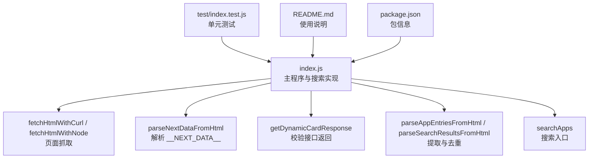
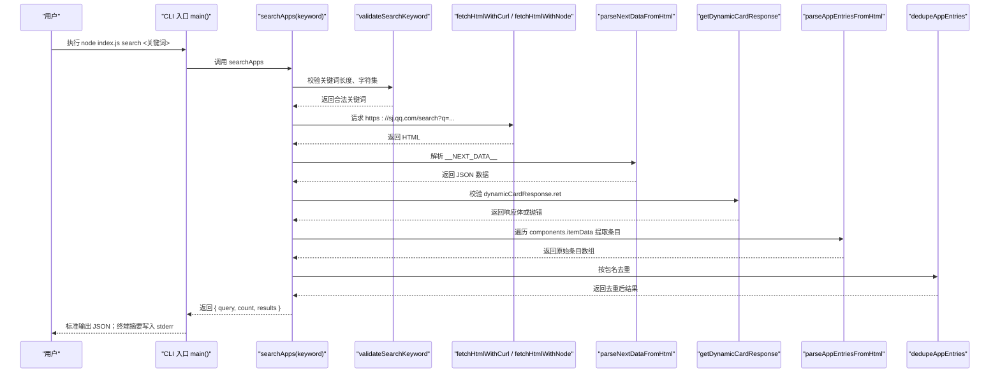
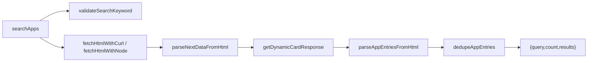

# 搜索模式

<cite>
**本文引用的文件**
- [index.js](file://yyb-apk-extractor/index.js)
- [README.md](file://yyb-apk-extractor/README.md)
- [package.json](file://yyb-apk-extractor/package.json)
- [test/index.test.js](file://yyb-apk-extractor/test/index.test.js)
</cite>

## 目录
1. [简介](#简介)
2. [项目结构](#项目结构)
3. [核心组件](#核心组件)
4. [架构总览](#架构总览)
5. [详细组件分析](#详细组件分析)
6. [依赖关系分析](#依赖关系分析)
7. [性能与优化](#性能与优化)
8. [故障排查指南](#故障排查指南)
9. [结论](#结论)
10. [附录：使用示例与最佳实践](#附录使用示例与最佳实践)

## 简介
本文件聚焦“搜索模式”的完整功能说明，覆盖关键词搜索应用的实现原理、Next.js SSR 数据获取、搜索结果解析、搜索语法与限制、结果字段含义、排序与过滤、分页机制、性能优化、缓存策略、错误处理以及不同场景下的最佳实践。该工具通过命令行调用应用宝官网搜索页，解析 Next.js 服务端渲染输出的 __NEXT_DATA__ JSON，提取应用列表并输出结构化结果，便于脚本化集成与自动化流程。

## 项目结构
本项目为纯 Node.js CLI 工具，核心逻辑集中在单一入口文件 index.js；测试用例位于 test/index.test.js；README.md 提供使用说明与能力概览；package.json 定义包元信息与脚本命令。

图表来源
- [index.js:1578-1605](file://yyb-apk-extractor/index.js#L1578-L1605)
- [index.js:1313-1331](file://yyb-apk-extractor/index.js#L1313-L1331)
- [index.js:1351-1385](file://yyb-apk-extractor/index.js#L1351-L1385)
- [test/index.test.js:274-383](file://yyb-apk-extractor/test/index.test.js#L274-L383)

章节来源
- [index.js:1-800](file://yyb-apk-extractor/index.js#L1-L800)
- [index.js:1578-1605](file://yyb-apk-extractor/index.js#L1578-L1605)
- [README.md:44-55](file://yyb-apk-extractor/README.md#L44-L55)
- [package.json:1-47](file://yyb-apk-extractor/package.json#L1-L47)

## 核心组件
- 搜索入口 searchApps：构建搜索 URL、请求页面、解析 Next.js SSR 数据、返回统一结果对象。
- 关键词校验 validateSearchKeyword：长度限制、字符集白名单、空值检查。
- Next.js 数据解析：
  - parseNextDataFromHtml：从 HTML 中提取 __NEXT_DATA__ 脚本块并解析 JSON。
  - getDynamicCardResponse：校验 dynamicCardResponse.ret 是否为成功状态。
  - parseAppEntriesFromHtml：遍历 components 中的 itemData，映射为标准化应用条目。
  - dedupeAppEntries：按包名去重，保留首次出现顺序。
- 结果封装：searchApps 返回 { query, count, results }，count 为去重后的唯一应用数量。

章节来源
- [index.js:1301-1311](file://yyb-apk-extractor/index.js#L1301-L1311)
- [index.js:1313-1331](file://yyb-apk-extractor/index.js#L1313-L1331)
- [index.js:1351-1385](file://yyb-apk-extractor/index.js#L1351-L1385)
- [index.js:1578-1605](file://yyb-apk-extractor/index.js#L1578-L1605)

## 架构总览
搜索模式的整体流程如下：

图表来源
- [index.js:2165-2179](file://yyb-apk-extractor/index.js#L2165-L2179)
- [index.js:1578-1605](file://yyb-apk-extractor/index.js#L1578-L1605)
- [index.js:1313-1331](file://yyb-apk-extractor/index.js#L1313-L1331)
- [index.js:1351-1385](file://yyb-apk-extractor/index.js#L1351-L1385)

## 详细组件分析

### 搜索请求构建与网络层
- 搜索 URL：https://sj.qq.com/search?q=<encodeURIComponent(关键词)>
- 域名白名单：仅允许 sj.qq.com，防止 SSRF。
- 网络请求优先使用 curl（支持代理），失败时回退到 Node.js 内置模块；支持重试。
- 超时控制：timeoutSeconds 将毫秒转换为秒级参数传递给外部工具；fetch 阶段有最大响应体大小限制。

章节来源
- [index.js:1578-1605](file://yyb-apk-extractor/index.js#L1578-L1605)
- [index.js:1112-1178](file://yyb-apk-extractor/index.js#L1112-L1178)
- [index.js:1205-1280](file://yyb-apk-extractor/index.js#L1205-L1280)

### Next.js SSR 数据获取与解析
- 解析 __NEXT_DATA__：正则匹配 script id="__NEXT_DATA__" 内容并 JSON.parse。
- 校验接口返回：dynamicCardResponse.ret 必须为 0，否则抛出异常。
- 提取条目：遍历 data.components[].data.itemData[]，映射为标准字段。
- 安全净化：对名称、开发者、简介等网络字符串进行终端输出净化，过滤 ANSI 与控制字符。

章节来源
- [index.js:1313-1331](file://yyb-apk-extractor/index.js#L1313-L1331)
- [index.js:1333-1349](file://yyb-apk-extractor/index.js#L1333-L1349)
- [index.js:1351-1366](file://yyb-apk-extractor/index.js#L1351-L1366)
- [index.js:784-790](file://yyb-apk-extractor/index.js#L784-L790)

### 搜索结果解析与去重
- 解析函数 parseAppEntriesFromHtml：从 Next.js 数据中抽取应用条目。
- 去重函数 dedupeAppEntries：基于 pkgName 去重，保持首次出现顺序。
- 最终结果：searchApps 返回 { query, count, results }，count 为去重后的数量。

章节来源
- [index.js:1351-1385](file://yyb-apk-extractor/index.js#L1351-L1385)
- [index.js:1578-1605](file://yyb-apk-extractor/index.js#L1578-L1605)

### 搜索语法支持与关键词限制
- 支持中文（CJK 常用汉字区）、英文、数字、空格及常见程序/应用名标点。
- 长度限制：trim 后不超过 MAX_KEYWORD_LEN（100）。
- 非法字符拒绝：包含危险字符（如 shell 注入符号）将被拒绝。
- 编码：关键词使用 encodeURIComponent 编码后拼接至搜索 URL。

章节来源
- [index.js:1301-1311](file://yyb-apk-extractor/index.js#L1301-L1311)
- [index.js:22-24](file://yyb-apk-extractor/index.js#L22-L24)
- [test/index.test.js:119-147](file://yyb-apk-extractor/test/index.test.js#L119-L147)

### 搜索结果格式与应用信息字段
搜索结果每个条目包含以下字段：
- pkgName：Android 包名（用于唯一标识与详情页链接）
- appId：应用 ID（可选）
- name：应用名称（已做终端输出净化）
- developer：开发者信息（已做终端输出净化）
- version：版本号
- icon：图标 URL（仅允许腾讯相关域名）
- apkSize：APK 大小（字节）
- rating：评分
- intro：简介（已做终端输出净化）
- detailUrl：应用宝详情页链接
- rawDownloadUrl：原始下载链接（经安全校验）

章节来源
- [index.js:1333-1349](file://yyb-apk-extractor/index.js#L1333-L1349)
- [index.js:801-821](file://yyb-apk-extractor/index.js#L801-L821)

### 排序规则、分页机制与结果过滤
- 排序规则：当前实现未对搜索结果进行显式排序，返回顺序遵循应用宝页面提供的顺序。
- 分页机制：当前实现一次性解析页面返回的全部应用条目，无分页参数或游标处理。
- 结果过滤：
  - 包名校验：仅保留符合 Android 包名规则的条目。
  - 去重：按 pkgName 去重，保留首次出现。
  - 域名安全：icon、download_url 等 URL 需通过 safeTencentUrl 校验，非腾讯域名会被过滤。

章节来源
- [index.js:1351-1385](file://yyb-apk-extractor/index.js#L1351-L1385)
- [index.js:801-821](file://yyb-apk-extractor/index.js#L801-L821)

### 错误处理与健壮性
- 关键词为空或超长：抛出明确错误。
- 非法字符：拒绝包含危险字符的关键词。
- 页面解析失败：未能找到 __NEXT_DATA__ 或 JSON 解析失败会抛错。
- 接口异常：dynamicCardResponse.ret 不为 0 时抛错，提示接口返回异常。
- 网络异常：curl 执行失败或 HTTP 状态码异常会抛错；支持重试与回退。
- 终端安全：网络数据在终端输出前进行净化，避免 ANSI 与控制字符注入。

章节来源
- [index.js:1301-1331](file://yyb-apk-extractor/index.js#L1301-L1331)
- [index.js:1112-1178](file://yyb-apk-extractor/index.js#L1112-L1178)
- [index.js:1205-1280](file://yyb-apk-extractor/index.js#L1205-L1280)
- [index.js:784-790](file://yyb-apk-extractor/index.js#L784-L790)

## 依赖关系分析
搜索模式依赖以下关键能力：
- 外部工具：curl（首选，支持代理与重定向预检），aria2c/wget（下载阶段使用）。
- Node.js 内置模块：http/https（作为回退请求方式）。
- 正则与 JSON：用于解析 __NEXT_DATA__ 与数据结构。
- 安全校验：URL 域名白名单、包名校验、终端输出净化。

图表来源
- [index.js:1578-1605](file://yyb-apk-extractor/index.js#L1578-L1605)
- [index.js:1313-1331](file://yyb-apk-extractor/index.js#L1313-L1331)
- [index.js:1351-1385](file://yyb-apk-extractor/index.js#L1351-L1385)

章节来源
- [index.js:1578-1605](file://yyb-apk-extractor/index.js#L1578-L1605)
- [index.js:1313-1331](file://yyb-apk-extractor/index.js#L1313-L1331)
- [index.js:1351-1385](file://yyb-apk-extractor/index.js#L1351-L1385)

## 性能与优化
- 请求优化：
  - 优先使用 curl 获取页面，支持代理与重定向；失败自动回退到 Node.js 内置模块。
  - 设置最大响应体大小限制，避免大页面导致内存占用过高。
  - 超时控制：fetch 阶段限制请求总时长；下载阶段不限制大文件总时间，仅连接/断流检测。
- 解析优化：
  - 遍历 components 时支持 limit 参数，可提前终止以节省资源（当前搜索未使用）。
  - 去重使用 Set 记录 pkgName，时间复杂度 O(n)。
- 缓存策略：
  - 当前实现未引入本地缓存；每次搜索均发起网络请求。
  - 可通过上层调用方自行缓存搜索结果（基于关键词与时间戳）。
- 并发与重试：
  - 网络请求支持重试（retrySync/retryAsync），提高稳定性。
  - 下载阶段支持多连接（aria2c），但搜索阶段不涉及下载。

章节来源
- [index.js:1112-1178](file://yyb-apk-extractor/index.js#L1112-L1178)
- [index.js:1205-1280](file://yyb-apk-extractor/index.js#L1205-L1280)
- [index.js:1351-1366](file://yyb-apk-extractor/index.js#L1351-L1366)
- [index.js:833-859](file://yyb-apk-extractor/index.js#L833-L859)

## 故障排查指南
- 关键词错误：
  - 空关键词或超长：检查输入是否 trim 后仍为空或超过 100 字符。
  - 非法字符：确保不包含 shell 注入符号或其他危险字符。
- 网络问题：
  - curl 不可用或未安装：安装 curl 或使用 --no-proxy 在无代理网络下运行。
  - 代理配置错误：检查代理协议与主机端口；避免 socks5://（推荐 http:// 或 socks5h://）。
- 页面解析失败：
  - 未找到 __NEXT_DATA__：可能应用宝页面结构变更或网络返回异常。
  - JSON 解析失败：检查返回内容是否为有效 JSON。
- 接口异常：
  - dynamicCardResponse.ret 不为 0：查看 msg 字段了解具体错误原因。
- 终端显示异常：
  - 中文乱码或 ANSI 控制符：确保终端编码为 UTF-8；工具已对输出进行净化。

章节来源
- [index.js:1301-1331](file://yyb-apk-extractor/index.js#L1301-L1331)
- [index.js:1112-1178](file://yyb-apk-extractor/index.js#L1112-L1178)
- [index.js:1205-1280](file://yyb-apk-extractor/index.js#L1205-L1280)
- [README.md:93-94](file://yyb-apk-extractor/README.md#L93-L94)

## 结论
搜索模式通过严格的关键词校验、安全的网络请求、稳健的 Next.js SSR 数据解析与去重机制，提供了稳定可靠的搜索能力。其设计注重安全性（SSRF 防护、域名白名单、终端净化）、健壮性（重试、回退、错误提示）与易用性（JSON 输出、终端摘要）。对于大规模或高频搜索场景，建议在上层引入缓存与限流策略；对于需要排序或分页的场景，可在现有结果基础上进行二次处理。

## 附录：使用示例与最佳实践

### 搜索示例
- 中文关键词搜索：
  - 命令：node index.js search 微信
  - 说明：支持中文、数字、空格及常见标点；关键词长度不超过 100。
- 英文关键词搜索：
  - 命令：node index.js search WeChat
  - 说明：英文大小写均可；特殊字符需符合白名单。
- 特殊字符处理：
  - 支持如 #、%、@、*、() 等常见程序名符号；危险字符（如 ;、&、|）将被拒绝。
- 输出格式：
  - 标准输出 JSON：{ query, count, results[] }
  - 终端摘要：stderr 输出简要结果列表，便于快速浏览。

章节来源
- [README.md:193-222](file://yyb-apk-extractor/README.md#L193-L222)
- [index.js:1578-1605](file://yyb-apk-extractor/index.js#L1578-L1605)
- [test/index.test.js:274-383](file://yyb-apk-extractor/test/index.test.js#L274-L383)

### 最佳实践建议
- 高效搜索：
  - 使用精确关键词（如包名或应用名）减少无关结果。
  - 避免过长或包含危险字符的关键词。
- 脚本化集成：
  - 读取 stdout JSON 进行后续处理；stderr 用于调试与日志。
  - 结合 jq 等工具过滤与格式化结果。
- 代理与网络：
  - 推荐使用 http:// 或 socks5h:// 代理；避免 socks5://。
  - 在非 TTY 环境下显式传入包名、URL 或 search 命令。
- 性能优化：
  - 上层缓存搜索结果（基于关键词与时间戳）。
  - 对频繁搜索的关键词进行去重与复用。
- 错误处理：
  - 捕获并记录网络与解析异常；根据错误类型采取重试或降级策略。
  - 在 CI 环境中禁用颜色输出（NO_COLOR=1 或 --no-color）。

章节来源
- [README.md:117-135](file://yyb-apk-extractor/README.md#L117-L135)
- [README.md:260-301](file://yyb-apk-extractor/README.md#L260-L301)
- [index.js:2165-2179](file://yyb-apk-extractor/index.js#L2165-L2179)