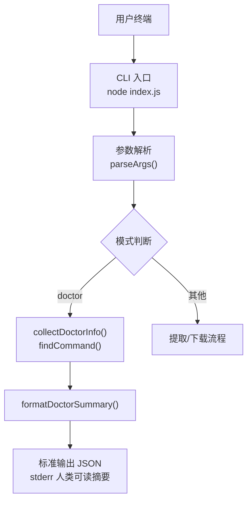
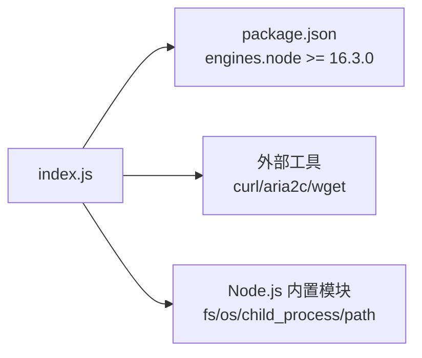

# 环境检查

<cite>
**本文引用的文件**
- [index.js](file://yyb-apk-extractor/index.js)
- [package.json](file://yyb-apk-extractor/package.json)
- [test/index.test.js](file://yyb-apk-extractor/test/index.test.js)
</cite>

## 目录
1. [简介](#简介)
2. [项目结构](#项目结构)
3. [核心组件](#核心组件)
4. [架构总览](#架构总览)
5. [详细组件分析](#详细组件分析)
6. [依赖关系分析](#依赖关系分析)
7. [性能考量](#性能考量)
8. [故障排除指南](#故障排除指南)
9. [结论](#结论)
10. [附录](#附录)

## 简介
本章节面向部署与维护人员，系统化说明“doctor”命令的环境检查能力：如何检测系统环境、验证依赖工具可用性、评估代理配置与权限影响，并解释输出格式与诊断含义。同时提供常见问题解决方案、CI/CD 集成建议与环境准备最佳实践。

## 项目结构
本项目为纯命令行工具，入口脚本通过 Node.js 运行，暴露 doctor 子命令用于环境自检。关键文件职责如下：
- index.js：主程序逻辑，包含参数解析、doctor 模式、下载器选择、网络请求与下载等。
- package.json：声明包名、版本、Node.js 引擎要求、CLI 入口等。
- test/index.test.js：单元测试，覆盖 doctor 模式行为、输出格式与边界条件。



图表来源
- [index.js:209-338](file://yyb-apk-extractor/index.js#L209-L338)
- [index.js:923-966](file://yyb-apk-extractor/index.js#L923-L966)
- [index.js:2182-2188](file://yyb-apk-extractor/index.js#L2182-L2188)

章节来源
- [index.js:1-42](file://yyb-apk-extractor/index.js#L1-L42)
- [package.json:1-47](file://yyb-apk-extractor/package.json#L1-L47)

## 核心组件
- 参数解析与模式路由：支持 doctor 模式识别，并在 TTY/非 TTY 环境下正确分支。
- 环境信息收集：采集 Node.js 版本、平台、外部工具可用性（curl/aria2c/wget），生成提示。
- 输出格式化：stderr 输出人类可读摘要；stdout 输出结构化 JSON，便于机器消费。
- 安全与健壮性：对代理凭据进行脱敏，避免泄露；对命令执行设置超时与缓存，避免重复探测。

章节来源
- [index.js:209-338](file://yyb-apk-extractor/index.js#L209-L338)
- [index.js:923-966](file://yyb-apk-extractor/index.js#L923-L966)
- [index.js:2182-2188](file://yyb-apk-extractor/index.js#L2182-L2188)

## 架构总览
doctor 命令的执行路径如下：
- 解析参数后进入 doctor 模式。
- 调用 collectDoctorInfo 收集环境信息，内部通过 findCommand 探测 curl/aria2c/wget 是否可用。
- 使用 formatDoctorSummary 生成人类可读摘要写入 stderr（TTY 时）。
- 将完整信息以 JSON 形式写入 stdout，供 CI/CD 或脚本解析。

```mermaid
sequenceDiagram
participant U as "用户"
participant CLI as "CLI 入口"
participant P as "参数解析"
participant D as "doctor 处理"
participant I as "collectDoctorInfo"
participant F as "findCommand"
participant S as "formatDoctorSummary"
U->>CLI : node index.js doctor
CLI->>P : parseArgs(argv)
P-->>CLI : mode=doctor
CLI->>D : handle doctor
D->>I : collectDoctorInfo()
I->>F : findCommand(['curl','aria2c','wget'])
F-->>I : 各工具可用性与路径
I-->>D : {nodeVersion, platform, tools, notes}
D->>S : formatDoctorSummary(info)
S-->>CLI : 人类可读摘要
CLI-->>U : stderr 打印摘要; stdout 输出 JSON
```

图表来源
- [index.js:209-338](file://yyb-apk-extractor/index.js#L209-L338)
- [index.js:923-966](file://yyb-apk-extractor/index.js#L923-L966)
- [index.js:2182-2188](file://yyb-apk-extractor/index.js#L2182-L2188)

## 详细组件分析

### 参数解析与 doctor 模式路由
- 支持 --help、--version、--no-color、--proxy、--timeout、--download-dir、--downloader、--multi-thread、--connections、--verbose、--interactive 等选项。
- 当位置参数为 doctor 时，mode 被设置为 doctor，后续直接走环境检查流程。
- 在非 TTY 下，若未显式传入业务参数且尝试进入交互模式会提前失败，保证自动化场景稳定。

章节来源
- [index.js:209-338](file://yyb-apk-extractor/index.js#L209-L338)
- [test/index.test.js:758-769](file://yyb-apk-extractor/test/index.test.js#L758-L769)

### 环境信息收集：collectDoctorInfo
- 检查项：
  - Node.js 版本：取自 process.version。
  - 平台：取自 process.platform。
  - 工具可用性：依次探测 curl、aria2c、wget。
- 探测机制：
  - findCommand 会在 PATH 中查找候选命令，Windows 下考虑 PATHEXT 扩展名与可执行后缀。
  - 通过执行 --version 并判断退出码是否为 0 来判定工具可用，带超时保护，避免卡死。
  - 结果缓存于 Map，避免同一进程内重复 fork。
- 提示生成：
  - 若缺少 curl：无代理时可回退 Node.js 内置请求，但代理访问受限。
  - 若缺少 aria2c：多线程或多连接下载不可用。
  - 若三者均缺失：无法自动下载 APK。

章节来源
- [index.js:870-921](file://yyb-apk-extractor/index.js#L870-L921)
- [index.js:923-951](file://yyb-apk-extractor/index.js#L923-L951)
- [test/index.test.js:673-684](file://yyb-apk-extractor/test/index.test.js#L673-L684)

### 输出格式与语义
- stderr（TTY 时）：人类可读的“环境检查”摘要，包括 Node.js、平台、各工具状态及提示。
- stdout：结构化 JSON，字段包括 nodeVersion、platform、tools（每个工具的 available 与 command）、notes（提示数组）。
- 测试断言确保：
  - doctor 模式返回 JSON 且 stderr 为空（--no-color）。
  - 非 TTY 下不会进入交互模式。
  - 代理错误不会泄露凭据（敏感信息会被掩码）。

章节来源
- [index.js:953-966](file://yyb-apk-extractor/index.js#L953-L966)
- [index.js:2182-2188](file://yyb-apk-extractor/index.js#L2182-L2188)
- [test/index.test.js:750-756](file://yyb-apk-extractor/test/index.test.js#L750-L756)
- [test/index.test.js:770-776](file://yyb-apk-extractor/test/index.test.js#L770-L776)

### 代理配置验证与安全
- 代理输入规范化与校验：
  - 支持 http/https/socks5/socks5h 协议，必须包含主机与端口，不允许路径、查询串或片段。
  - 若未提供协议前缀，默认补全为 http://。
- 凭据安全：
  - 拆分代理 URL 中的用户名与密码，避免在子进程参数或环境变量中明文传递。
  - 输出净化函数会对日志与输出中的代理凭据进行掩码，防止泄露。
- 工具兼容性：
  - aria2c 仅支持 http/https 代理，不支持 socks5/socks5h。
  - wget 不支持安全传递代理凭据，也不支持 socks5/socks5h。
  - 这些限制会影响下载器选择，但不影响 doctor 的基本可用性判断。

章节来源
- [index.js:495-521](file://yyb-apk-extractor/index.js#L495-L521)
- [index.js:523-570](file://yyb-apk-extractor/index.js#L523-L570)
- [index.js:572-590](file://yyb-apk-extractor/index.js#L572-L590)
- [index.js:452-493](file://yyb-apk-extractor/index.js#L452-L493)

### 权限检查与文件系统安全
- 临时配置文件：
  - 创建临时目录与配置文件，设置严格权限（目录 0o700，文件 0o600），并在进程退出或收到信号时清理。
- 平台差异：
  - Windows 不应用 chmod；非 Windows 平台应用私有模式。
- 注意：
  - 当前 doctor 模式主要关注工具可用性，不直接修改目标文件权限；下载阶段会用到上述临时文件与权限控制。

章节来源
- [index.js:623-651](file://yyb-apk-extractor/index.js#L623-L651)
- [index.js:592-595](file://yyb-apk-extractor/index.js#L592-L595)

### 网络连通性测试
- doctor 模式本身不进行网络连通性测试，仅检查本地环境与工具可用性。
- 实际网络连通性由后续提取与下载流程负责（fetchHtmlWithNode、curl/wget/aria2c 调用），不在本命令范围内。

章节来源
- [index.js:2182-2188](file://yyb-apk-extractor/index.js#L2182-L2188)

## 依赖关系分析
- 运行时依赖：
  - Node.js 引擎版本要求：>=16.3.0。
  - 可选外部工具：curl、aria2c、wget（用于下载与代理场景）。
- 模块内依赖：
  - 参数解析 -> doctor 模式 -> 环境信息收集 -> 输出格式化。
  - 工具探测依赖 PATH/PATHEXT 与 spawnSync 执行 --version。



图表来源
- [package.json:34-36](file://yyb-apk-extractor/package.json#L34-L36)
- [index.js:44-50](file://yyb-apk-extractor/index.js#L44-L50)
- [index.js:870-921](file://yyb-apk-extractor/index.js#L870-L921)

章节来源
- [package.json:1-47](file://yyb-apk-extractor/package.json#L1-L47)
- [index.js:44-50](file://yyb-apk-extractor/index.js#L44-L50)

## 性能考量
- 命令探测缓存：findCommand 使用 Map 缓存结果，避免重复 fork 与 --version 调用。
- 超时保护：COMMAND_DETECT_TIMEOUT_MS 限制单次探测耗时，防止阻塞。
- 输出缓冲限制：子进程输出最大缓冲大小限制，避免大输出导致内存压力。
- 建议：
  - 在 CI 中复用同一进程多次执行 doctor，利用缓存提升效率。
  - 合理设置 --timeout，避免长时间等待。

章节来源
- [index.js:60-61](file://yyb-apk-extractor/index.js#L60-L61)
- [index.js:81-83](file://yyb-apk-extractor/index.js#L81-L83)
- [index.js:870-921](file://yyb-apk-extractor/index.js#L870-L921)

## 故障排除指南
- 未检测到 curl：
  - 现象：提示“未检测到 curl：无代理时可回退 Node.js 内置请求，代理访问会受限”。
  - 解决：安装 curl 并确保 PATH 中包含其可执行文件。
- 未检测到 aria2c：
  - 现象：提示“未检测到 aria2c：--multi-thread 或 --downloader=aria2c 不可用”。
  - 解决：安装 aria2c 并加入 PATH；如需多线程下载，请确保使用 http/https 代理。
- 未检测到 wget：
  - 现象：若三者均缺失，提示“无法自动下载 APK”。
  - 解决：至少安装 curl/aria2c/wget 之一；推荐安装 curl 以获得最广泛兼容。
- 代理配置错误：
  - 现象：--proxy 不是有效 URL、协议不被支持或缺少主机/端口。
  - 解决：按规范填写 http/https/socks5/socks5h 地址，确保包含主机与端口；避免路径、查询串或片段。
- 代理凭据泄露风险：
  - 现象：错误消息中出现敏感信息。
  - 解决：工具已对输出进行掩码；如仍出现，请检查自定义日志输出，避免拼接原始代理字符串。
- 非 TTY 环境异常：
  - 现象：非 TTY 下无法进入交互模式。
  - 解决：在 CI 中提供明确参数或使用 doctor 模式；不要依赖交互模式。

章节来源
- [index.js:923-951](file://yyb-apk-extractor/index.js#L923-L951)
- [index.js:495-521](file://yyb-apk-extractor/index.js#L495-L521)
- [index.js:299-315](file://yyb-apk-extractor/index.js#L299-L315)
- [test/index.test.js:758-776](file://yyb-apk-extractor/test/index.test.js#L758-L776)

## 结论
doctor 命令提供了轻量、可靠的环境自检能力，聚焦于 Node.js 版本、平台信息与下载工具可用性，并通过结构化 JSON 输出便于自动化集成。结合严格的代理校验与凭据掩码、安全的临时文件管理以及跨平台命令探测，可在多种环境中快速定位问题并指导修复。建议在部署前与 CI/CD 流水线中统一执行该命令，确保环境一致性与稳定性。

## 附录

### 常见环境问题与解决方案
- 工具安装指南：
  - curl：通过系统包管理器安装（apt/yum/brew/choco），确认 PATH 包含可执行路径。
  - aria2c：安装后加入 PATH；如需多线程下载，建议使用 http/https 代理。
  - wget：安装后加入 PATH；注意其对代理凭据与 socks5 的限制。
- 代理配置方法：
  - 推荐使用 http:// 或 socks5h:// 代理；避免使用 socks5://（本地 DNS 解析可能失败）。
  - 若需认证代理，请确保工具支持凭据传递方式（curl 通过配置文件或参数，aria2c 通过 conf-path）。
- 权限设置：
  - 临时目录与配置文件采用严格权限；Windows 不适用 chmod。
  - 如遇权限错误，检查当前用户对临时目录与目标下载目录的读写权限。

章节来源
- [index.js:495-521](file://yyb-apk-extractor/index.js#L495-L521)
- [index.js:623-651](file://yyb-apk-extractor/index.js#L623-L651)

### 自动化环境检查与 CI/CD 集成建议
- 在构建前执行 doctor 命令，捕获 stdout JSON 并解析关键字段：
  - nodeVersion、platform、tools.*.available、notes。
- 策略：
  - 若 tools.curl.available 为 false，记录警告并尝试安装 curl。
  - 若 tools.aria2c.available 为 false 且需要多线程下载，记录警告并安装 aria2c。
  - 若三者均不可用，阻断流水线并提示安装至少一个下载工具。
- 输出处理：
  - 使用 --no-color 禁用颜色输出，确保管道输出干净。
  - 将 stderr 摘要用于人类可读日志，stdout JSON 用于机器解析。

章节来源
- [index.js:2182-2188](file://yyb-apk-extractor/index.js#L2182-L2188)
- [test/index.test.js:750-756](file://yyb-apk-extractor/test/index.test.js#L750-L756)

### 最佳实践与故障排除清单
- 环境准备：
  - 确保 Node.js 版本满足要求（>=16.3.0）。
  - 安装 curl/aria2c/wget 之一，并将可执行文件加入 PATH。
  - 配置代理时使用支持的协议与格式，避免路径、查询串或片段。
- 运行与调试：
  - 使用 --verbose 获取更详细的调试日志（适用于下载阶段）。
  - 在非 TTY 环境中避免交互模式，提供明确参数。
  - 遇到代理错误时，检查凭据是否正确传递且未被泄露。
- 持续集成：
  - 在流水线早期执行 doctor，尽早发现环境问题。
  - 根据 notes 提示自动修复或告警，减少人工干预。

章节来源
- [package.json:34-36](file://yyb-apk-extractor/package.json#L34-L36)
- [index.js:923-951](file://yyb-apk-extractor/index.js#L923-L951)
- [index.js:2182-2188](file://yyb-apk-extractor/index.js#L2182-L2188)