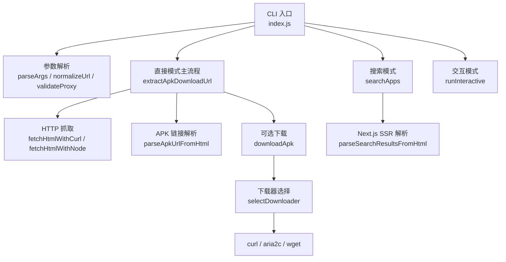
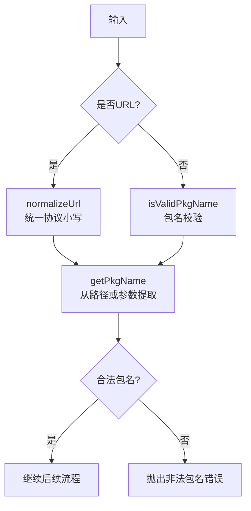
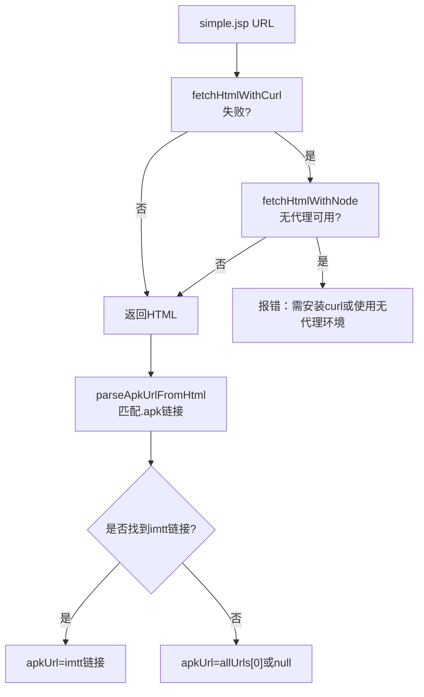
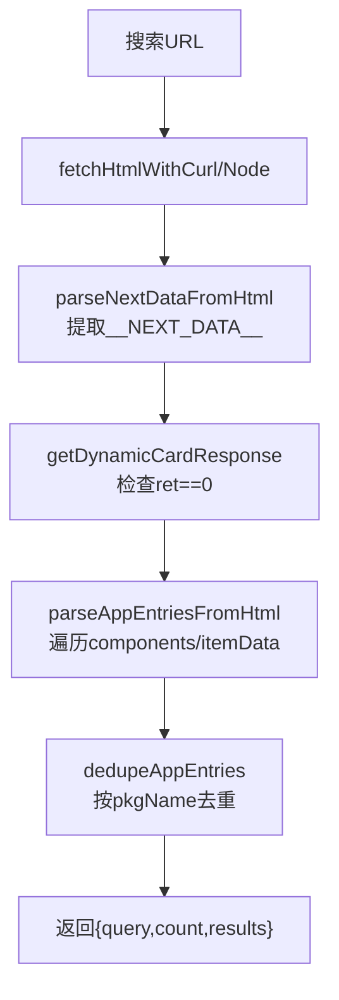
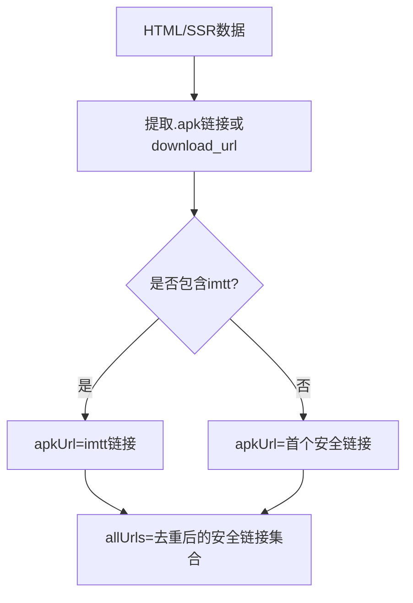
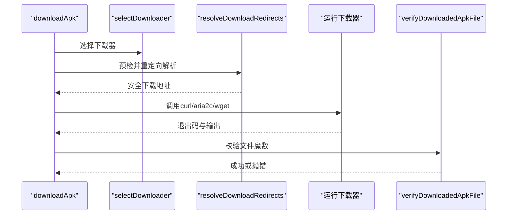
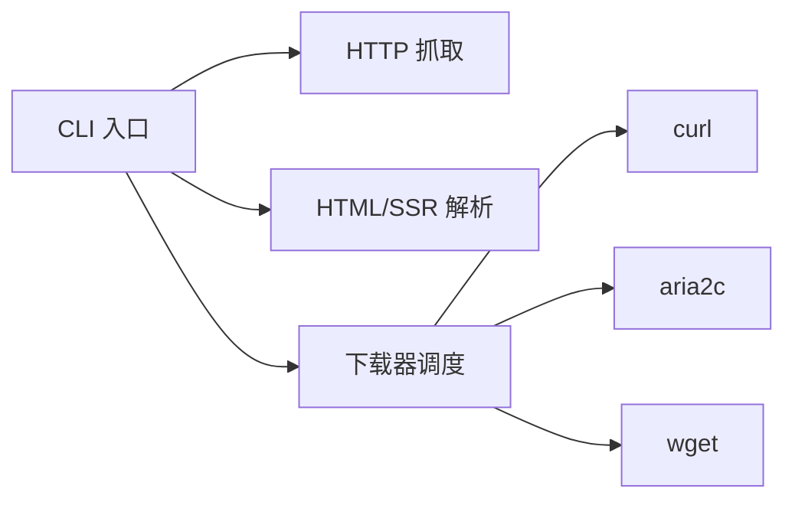

# 直接模式

<cite>
**本文引用的文件**
- [index.js](file://yyb-apk-extractor/index.js)
- [README.md](file://yyb-apk-extractor/README.md)
- [package.json](file://yyb-apk-extractor/package.json)
- [index.test.js](file://yyb-apk-extractor/test/index.test.js)
</cite>

## 目录
1. [简介](#简介)
2. [项目结构](#项目结构)
3. [核心组件](#核心组件)
4. [架构总览](#架构总览)
5. [详细组件分析](#详细组件分析)
6. [依赖关系分析](#依赖关系分析)
7. [性能与优化建议](#性能与优化建议)
8. [故障排查指南](#故障排查指南)
9. [结论](#结论)
10. [附录：使用示例与最佳实践](#附录使用示例与最佳实践)

## 简介
本文件聚焦“直接模式”的完整功能说明，围绕“包名提取 APK 直链”的核心目标，系统解释以下要点：
- 包名验证规则、URL 规范化处理
- HTML 内容抓取与解析流程（移动端 simple.jsp）
- 支持的输入格式（包名与应用宝详情页 URL）、处理流程与输出结果格式
- APK 链接提取算法（Next.js SSR 数据解析、JSON 数据提取、多版本 APK 选择逻辑）
- 丰富的使用示例（基本查询、URL 解析、代理配置、下载选项）
- 错误处理与异常场景（无效包名、网络超时、页面结构变化等）
- 性能优化建议与最佳实践
- 面向初学者的循序渐进指导，以及面向高级用户的技术实现细节

## 项目结构
该工具为纯 Node.js 命令行程序，无外部 npm 依赖。入口为 index.js，提供 CLI 参数解析、网络请求、HTML 解析、下载器调度、交互模式等功能；README 提供使用说明；package.json 定义元信息与脚本；测试用例覆盖关键函数与行为。



**图表来源**
- [index.js:209-338](file://yyb-apk-extractor/index.js#L209-L338)
- [index.js:1520-1576](file://yyb-apk-extractor/index.js#L1520-L1576)
- [index.js:1578-1606](file://yyb-apk-extractor/index.js#L1578-L1606)
- [index.js:1634-1767](file://yyb-apk-extractor/index.js#L1634-L1767)

**章节来源**
- [index.js:1-800](file://yyb-apk-extractor/index.js#L1-L800)
- [README.md:1-120](file://yyb-apk-extractor/README.md#L1-L120)
- [package.json:1-47](file://yyb-apk-extractor/package.json#L1-L47)

## 核心组件
- 参数与环境解析：支持 --proxy、--timeout、--download-dir、--downloader、--multi-thread、--connections、--insecure、--verbose、--no-color 等；环境变量优先级读取代理。
- 输入校验与安全：包名校验、URL 白名单、SSRF 防护、终端输出净化、文件名净化、代理凭据脱敏。
- 网络抓取：优先 curl（支持各类代理），失败回退 Node 内置 https；重定向限制与大小限制。
- 解析层：移动端 simple.jsp 页面正则匹配 .apk 链接；搜索模式从 Next.js SSR __NEXT_DATA__ 中解析应用列表。
- 下载器调度：自动选择 curl/aria2c/wget，支持多线程、断点续传、证书校验控制、代理安全传递。
- 交互模式：readline 驱动的命令循环，支持 search/select/download/get/proxy/timeout/doctor/help/exit。

**章节来源**
- [index.js:209-338](file://yyb-apk-extractor/index.js#L209-L338)
- [index.js:401-521](file://yyb-apk-extractor/index.js#L401-L521)
- [index.js:801-821](file://yyb-apk-extractor/index.js#L801-L821)
- [index.js:1112-1280](file://yyb-apk-extractor/index.js#L1112-L1280)
- [index.js:1282-1385](file://yyb-apk-extractor/index.js#L1282-L1385)
- [index.js:1634-1767](file://yyb-apk-extractor/index.js#L1634-L1767)
- [index.js:1769-2163](file://yyb-apk-extractor/index.js#L1769-L2163)

## 架构总览
直接模式的工作流如下：
1. 解析输入并提取 Android 包名（支持包名或应用宝详情页 URL）。
2. 构造移动端 simple.jsp 地址并抓取 HTML（优先 curl，失败回退 Node）。
3. 从 HTML 中匹配所有 .apk 链接，优先返回 imtt 官方 CDN 链接。
4. 若指定下载目录，则按策略选择下载器进行下载，并校验文件完整性。

```mermaid
sequenceDiagram
participant U as "用户"
participant CLI as "CLI 入口"
participant EX as "extractApkDownloadUrl"
participant NET as "HTTP 抓取"
participant PAR as "APK 链接解析"
participant DL as "下载器调度"
U->>CLI : 执行命令包名或URL
CLI->>EX : 传入输入与选项
EX->>NET : 请求 simple.jsp
NET-->>EX : 返回 HTML
EX->>PAR : 解析 .apk 链接
PAR-->>EX : 返回 apkUrl/allUrls
alt 需要下载
EX->>DL : 选择下载器并下载
DL-->>EX : 返回文件路径
end
EX-->>CLI : 返回 JSON 结果
CLI-->>U : stdout 输出 JSON
```

**图表来源**
- [index.js:1520-1576](file://yyb-apk-extractor/index.js#L1520-L1576)
- [index.js:1112-1280](file://yyb-apk-extractor/index.js#L1112-L1280)
- [index.js:1282-1299](file://yyb-apk-extractor/index.js#L1282-L1299)
- [index.js:1634-1767](file://yyb-apk-extractor/index.js#L1634-L1767)

## 详细组件分析

### 包名验证与 URL 规范化
- 包名校验：要求以字母开头，段内可含字母/数字/下划线，至少两段，例如 com.example.app。
- URL 规范化：将裸包名转换为 sj.qq.com/appdetail/<包名>；对已有 URL 统一协议小写化，避免输出异常格式。
- 包名提取：从 URL 路径末尾或 simple.jsp 的 pkgname 参数中提取，并进行合法性校验。



**图表来源**
- [index.js:401-450](file://yyb-apk-extractor/index.js#L401-L450)
- [index.js:427-430](file://yyb-apk-extractor/index.js#L427-L430)

**章节来源**
- [index.js:401-450](file://yyb-apk-extractor/index.js#L401-L450)
- [index.js:1520-1533](file://yyb-apk-extractor/index.js#L1520-L1533)

### HTML 抓取与解析（直接模式）
- 抓取策略：优先通过 curl 获取页面（天然支持 http/https/socks5/socks5h 代理），失败时回退到 Node 内置 https。
- 重定向处理：限制最大重定向次数，严格校验重定向目标域名（仅允许 qq.com/myapp.com/qpic.cn/qlogo.cn 及特定 CDN 标识）。
- 解析逻辑：正则匹配所有 .apk 链接，过滤非腾讯域名的不安全链接；优先选择包含 imtt 的官方 CDN 链接作为 apkUrl，allUrls 保留去重后的候选列表。



**图表来源**
- [index.js:1112-1280](file://yyb-apk-extractor/index.js#L1112-L1280)
- [index.js:1282-1299](file://yyb-apk-extractor/index.js#L1282-L1299)

**章节来源**
- [index.js:1112-1280](file://yyb-apk-extractor/index.js#L1112-L1280)
- [index.js:1282-1299](file://yyb-apk-extractor/index.js#L1282-L1299)
- [index.js:1520-1576](file://yyb-apk-extractor/index.js#L1520-L1576)

### Next.js SSR 数据解析（搜索模式）
- 数据源：应用宝搜索页通过 Next.js SSR 输出 __NEXT_DATA__ 脚本块，内部包含 dynamicCardResponse。
- 解析流程：提取 JSON 后定位 props.pageProps.dynamicCardResponse.data.components[].data.itemData，逐项映射为应用条目。
- 去重与筛选：按包名去重，保留首次出现顺序；过滤非法包名项；接口返回异常（ret != 0）时抛出错误。
- 输出：返回 query、count、results（包含 pkgName、appId、name、developer、version、icon、apkSize、rating、intro、detailUrl、rawDownloadUrl）。



**图表来源**
- [index.js:1313-1385](file://yyb-apk-extractor/index.js#L1313-L1385)
- [index.js:1578-1606](file://yyb-apk-extractor/index.js#L1578-L1606)

**章节来源**
- [index.js:1313-1385](file://yyb-apk-extractor/index.js#L1313-L1385)
- [index.js:1578-1606](file://yyb-apk-extractor/index.js#L1578-L1606)

### APK 链接提取算法与多版本选择
- 直接模式：从 simple.jsp 页面正则匹配所有 .apk 链接，优先选择 imtt 官方 CDN 链接；allUrls 包含所有候选。
- 搜索模式：从 Next.js SSR 数据中提取 rawDownloadUrl（经安全校验），用于展示与后续下载。
- 多版本选择：直接模式不主动选择版本，返回所有候选；搜索模式返回当前页面列出的各应用条目，具体版本由应用宝页面决定。



**图表来源**
- [index.js:1282-1299](file://yyb-apk-extractor/index.js#L1282-L1299)
- [index.js:1333-1349](file://yyb-apk-extractor/index.js#L1333-L1349)

**章节来源**
- [index.js:1282-1299](file://yyb-apk-extractor/index.js#L1282-L1299)
- [index.js:1333-1349](file://yyb-apk-extractor/index.js#L1333-L1349)

### 下载流程与校验
- 下载器选择：auto 模式下默认 curl -> aria2c -> wget；--multi-thread 优先 aria2c；根据代理能力与凭据安全性排除不可用工具。
- 重定向预检：curl GET + Range 0-0 探测真实下载地址，防止 HEAD 被拒绝导致无法解析；支持 BEIDOU 调度 IP 放行（带 /imtt.dd.qq.com/ 路径标识）。
- 文件校验：下载完成后检查文件存在、非空，并校验 ZIP/APK 魔数（504b0304），否则清理并报错。
- 代理安全：代理凭据仅在必要处传递，日志与错误信息中自动脱敏；子进程环境变量剥离凭据。



**图表来源**
- [index.js:1634-1767](file://yyb-apk-extractor/index.js#L1634-L1767)
- [index.js:1440-1518](file://yyb-apk-extractor/index.js#L1440-L1518)

**章节来源**
- [index.js:1440-1518](file://yyb-apk-extractor/index.js#L1440-L1518)
- [index.js:1634-1767](file://yyb-apk-extractor/index.js#L1634-L1767)

### 错误处理与异常场景
- 无效包名：抛出“非法包名”错误，提示应为类似 com.example.app 的格式。
- 网络超时：fetch 阶段设置超时；下载阶段连接/断流检测超时，不限制大文件总时长。
- 页面结构变化：未能解析 __NEXT_DATA__ 或无法匹配 .apk 链接时，抛出相应错误，提示可能页面结构已变更。
- 代理问题：未检测到 curl 且使用代理时报错；wget 不支持 socks5/socks5h 或带认证代理时报错。
- 重定向异常：重定向次数过多或缺少 Location 头时报错；非腾讯域名或缺少 CDN 标识的重定向被拒绝。

**章节来源**
- [index.js:1520-1576](file://yyb-apk-extractor/index.js#L1520-L1576)
- [index.js:1112-1280](file://yyb-apk-extractor/index.js#L1112-L1280)
- [index.js:1440-1518](file://yyb-apk-extractor/index.js#L1440-L1518)
- [index.js:1634-1767](file://yyb-apk-extractor/index.js#L1634-L1767)

## 依赖关系分析
- 外部命令依赖：curl（推荐）、aria2c（多线程下载）、wget（兜底）。
- 运行时依赖：Node.js >= 16.3.0；无 npm 依赖。
- 模块耦合：index.js 集中实现 CLI、网络、解析、下载、交互；测试用例通过 require 导入导出函数进行单元测试。



**图表来源**
- [index.js:870-951](file://yyb-apk-extractor/index.js#L870-L951)
- [index.js:1634-1767](file://yyb-apk-extractor/index.js#L1634-L1767)

**章节来源**
- [index.js:870-951](file://yyb-apk-extractor/index.js#L870-L951)
- [index.js:1634-1767](file://yyb-apk-extractor/index.js#L1634-L1767)
- [package.json:1-47](file://yyb-apk-extractor/package.json#L1-L47)

## 性能与优化建议
- 优先使用 curl：对代理支持最完整，且具备重定向预检能力。
- 多线程下载：大体积 APK 建议使用 --multi-thread --connections=N（N 在 1-16 之间），实际效果取决于 CDN 分片支持。
- 超时配置：--timeout 支持 ms/s/m；下载阶段不限制总时长，适合慢速网络。
- 缓存与重试：网络请求采用同步/异步重试机制，减少瞬时失败影响。
- 终端输出：非 TTY 或 NO_COLOR/--no-color 时禁用颜色，保证管道输出干净。

[本节为通用性能建议，不直接分析具体文件]

## 故障排查指南
- 无法通过代理访问：确保安装 curl；若未检测到 curl 且使用代理，会报错提示安装或移除代理。
- 下载失败或文件为空：检查下载器退出码与 stderr；verifyDownloadedApkFile 会校验魔数并清理无效文件。
- 搜索结果异常：检查 __NEXT_DATA__ 是否存在与 ret 是否为 0；接口返回异常会抛出错误。
- 重定向被拒绝：确认目标为 qq.com 或带 /imtt.dd.qq.com/ 路径标识的 BEIDOU 调度 IP；其他 IP 将被拒绝。
- 代理凭据泄露风险：日志与错误信息中已自动脱敏；避免在命令行明文暴露密码。

**章节来源**
- [index.js:1112-1280](file://yyb-apk-extractor/index.js#L1112-L1280)
- [index.js:1440-1518](file://yyb-apk-extractor/index.js#L1440-L1518)
- [index.js:1634-1767](file://yyb-apk-extractor/index.js#L1634-L1767)
- [index.js:1578-1606](file://yyb-apk-extractor/index.js#L1578-L1606)

## 结论
直接模式通过严格的输入校验、安全的网络抓取、稳健的 HTML/SSR 解析与可靠的下载器调度，实现了从包名或详情页 URL 快速提取 APK 直链的能力。其设计兼顾易用性与安全性，适用于脚本化集成与自动化任务。对于复杂场景（如代理、多线程、大文件下载），提供了丰富选项与容错机制。

[本节为总结性内容，不直接分析具体文件]

## 附录：使用示例与最佳实践

### 基本包名查询
- 命令：node index.js <包名>
- 输出：JSON，包含 pkgName、detailUrl、apkUrl、allUrls
- 示例参考：[README.md:147-165](file://yyb-apk-extractor/README.md#L147-L165)

**章节来源**
- [README.md:147-165](file://yyb-apk-extractor/README.md#L147-L165)

### URL 解析并下载
- 命令：node index.js <应用宝详情页URL>
- 行为：解析包名并自动下载到 ./downloads；可通过 --download-dir 覆盖
- 示例参考：[README.md:167-178](file://yyb-apk-extractor/README.md#L167-L178)

**章节来源**
- [README.md:167-178](file://yyb-apk-extractor/README.md#L167-L178)

### 代理配置
- HTTP 代理：--proxy=http://127.0.0.1:7890
- 省略协议：--proxy=127.0.0.1:7890（按 HTTP 处理）
- SOCKS5h：--proxy=socks5h://127.0.0.1:7890（推荐远程 DNS）
- 环境变量：HTTPS_PROXY/HTTP_PROXY/ALL_PROXY 等
- 示例参考：[README.md:260-289](file://yyb-apk-extractor/README.md#L260-L289)

**章节来源**
- [README.md:260-289](file://yyb-apk-extractor/README.md#L260-L289)

### 下载选项
- 自动下载：--download-dir=./downloads
- 多线程：--multi-thread --connections=8
- 指定下载器：--downloader=aria2c/curl/wget
- 跳过证书校验（测试环境）：--insecure
- 示例参考：[README.md:180-191](file://yyb-apk-extractor/README.md#L180-L191)

**章节来源**
- [README.md:180-191](file://yyb-apk-extractor/README.md#L180-L191)

### 搜索应用
- 命令：node index.js search <关键词>
- 输出：JSON，包含 query、count、results（应用条目）
- 示例参考：[README.md:193-222](file://yyb-apk-extractor/README.md#L193-L222)

**章节来源**
- [README.md:193-222](file://yyb-apk-extractor/README.md#L193-L222)

### 交互模式
- 进入：node index.js 或 node index.js --interactive
- 常用命令：search、select、download、get、proxy、timeout、doctor、help、exit
- 示例参考：[README.md:224-258](file://yyb-apk-extractor/README.md#L224-L258)

**章节来源**
- [README.md:224-258](file://yyb-apk-extractor/README.md#L224-L258)

### 最佳实践
- 使用 curl 作为首选下载器，以获得最佳代理支持与重定向预检能力。
- 大文件下载启用多线程，并根据 CDN 分片情况调整连接数。
- 在非 TTY 环境下避免交互模式，显式传入包名/URL/search/doctor。
- 使用 --no-color 或设置 NO_COLOR 以禁用颜色输出，便于管道处理。
- 定期运行 doctor 检查环境与工具可用性。

[本节为通用最佳实践，不直接分析具体文件]