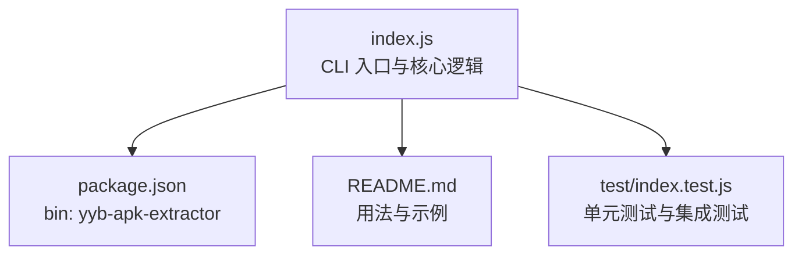
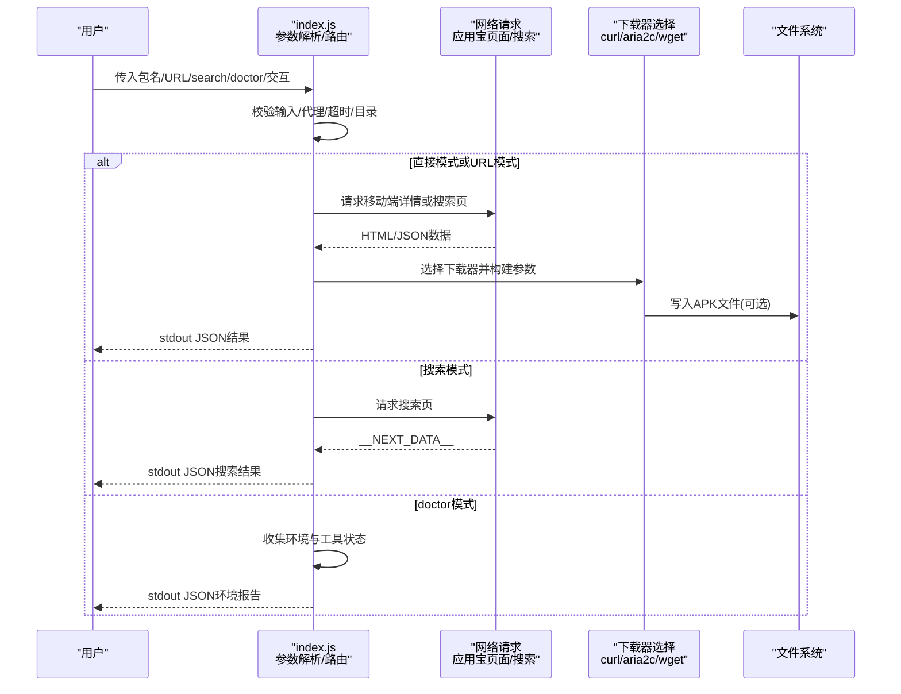
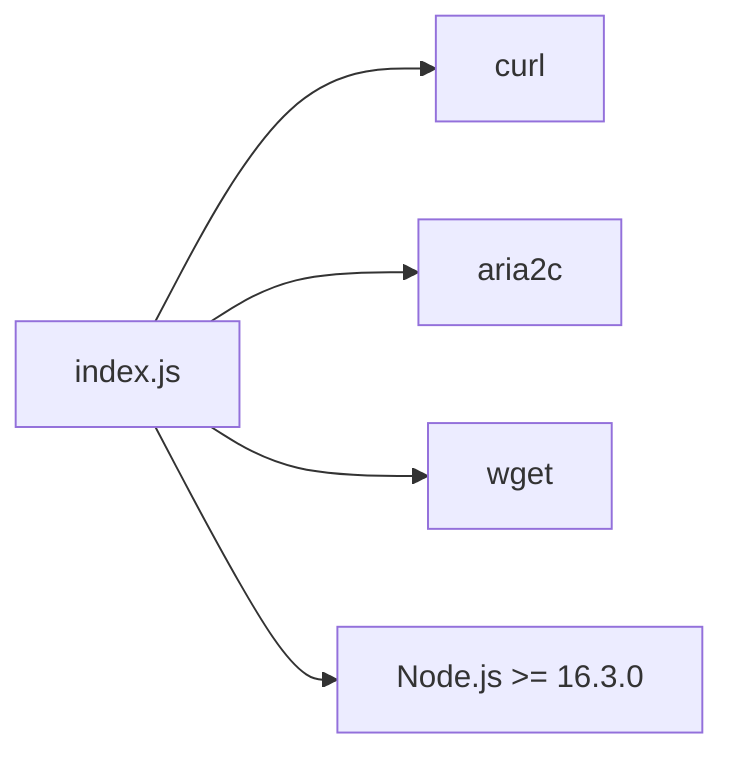

# 命令行参考

<cite>
**本文引用的文件**
- [index.js](file://yyb-apk-extractor/index.js)
- [README.md](file://yyb-apk-extractor/README.md)
- [package.json](file://yyb-apk-extractor/package.json)
- [test/index.test.js](file://yyb-apk-extractor/test/index.test.js)
</cite>

## 目录
1. [简介](#简介)
2. [项目结构](#项目结构)
3. [核心组件](#核心组件)
4. [架构总览](#架构总览)
5. [详细命令与选项](#详细命令与选项)
6. [依赖关系分析](#依赖关系分析)
7. [性能注意事项](#性能注意事项)
8. [故障排查指南](#故障排查指南)
9. [结论](#结论)
10. [附录：JSON 输出格式与环境变量](#附录json-输出格式与环境变量)

## 简介
本工具为纯命令行程序，用于从腾讯应用宝官网提取 Android APK 直链、解析详情页 URL、关键词搜索、交互式选择下载、检查运行环境等。成功时标准输出保持 JSON，便于脚本化集成；终端摘要、进度和调试信息写入标准错误。支持 HTTP/HTTPS/SOCKS 代理、多连接下载（aria2c）、超时控制、颜色开关与安全加固。

## 项目结构
- 入口与主逻辑：index.js（包含参数解析、网络请求、下载器调度、交互模式、安全校验等）
- 元数据与可执行名：package.json（定义 bin 名称 yyb-apk-extractor）
- 用户文档：README.md（用法、示例、环境变量说明）
- 测试用例：test/index.test.js（覆盖参数解析、下载器选择、输出行为、安全策略等）

图表来源
- [index.js:1-42](file://yyb-apk-extractor/index.js#L1-L42)
- [package.json:1-47](file://yyb-apk-extractor/package.json#L1-L47)

章节来源
- [index.js:1-42](file://yyb-apk-extractor/index.js#L1-L42)
- [package.json:1-47](file://yyb-apk-extractor/package.json#L1-L47)

## 核心组件
- 参数解析与模式路由：直接模式、搜索模式、doctor 模式、交互模式
- 网络层：移动端页面抓取、搜索结果 SSR 数据解析、SSRF 白名单域名限制
- 下载器调度：curl / aria2c / wget 自动选择与回退，支持多线程与断点续传
- 安全与健壮性：输入校验、URL 白名单、凭据脱敏、临时文件清理、信号处理
- 交互模式：readline 驱动的命令循环，支持 search/select/download/proxy/timeout/doctor/help/exit

章节来源
- [index.js:209-338](file://yyb-apk-extractor/index.js#L209-L338)
- [index.js:458-493](file://yyb-apk-extractor/index.js#L458-L493)
- [index.js:495-521](file://yyb-apk-extractor/index.js#L495-L521)
- [index.js:653-679](file://yyb-apk-extractor/index.js#L653-L679)
- [index.js:723-734](file://yyb-apk-extractor/index.js#L723-L734)
- [index.js:775-790](file://yyb-apk-extractor/index.js#L775-L790)

## 架构总览
下图展示了从 CLI 到网络请求再到下载的调用序列，以及各阶段的安全校验与工具选择。

图表来源
- [index.js:209-338](file://yyb-apk-extractor/index.js#L209-L338)
- [index.js:458-493](file://yyb-apk-extractor/index.js#L458-L493)
- [index.js:653-679](file://yyb-apk-extractor/index.js#L653-L679)

## 详细命令与选项

### 命令总览
- 直接模式：输入包名或应用宝详情页 URL
- 搜索模式：search <关键词>
- 环境检查：doctor
- 交互模式：无参数或 --interactive

注意：非 TTY 环境下无法进入交互模式，需显式提供包名、URL、search 或 doctor。

章节来源
- [index.js:209-338](file://yyb-apk-extractor/index.js#L209-L338)
- [README.md:95-117](file://yyb-apk-extractor/README.md#L95-L117)

### 选项清单与用途
- --proxy=地址：设置代理，支持 http/https/socks5/socks5h；省略协议按 HTTP 处理
- --no-proxy：忽略环境变量中的代理设置
- --download-dir=目录：指定 APK 下载目录；包名输入时启用下载，URL 输入时覆盖默认 ./downloads
- --downloader=工具：指定下载工具 auto/curl/aria2c/wget，默认 auto
- --multi-thread：自动模式下优先使用 aria2c 多连接下载
- --connections=数量：aria2c 连接数，默认 16，范围 1-16
- --timeout=时长：网络超时时间，默认 30000；支持整数毫秒或带单位时长（如 500ms、10s、5m）
- --insecure：下载时跳过 HTTPS 证书校验，仅限测试环境
- --verbose, -v：显示详细调试日志
- --interactive, -i：进入交互式向导
- --version, -V：显示版本号
- --no-color：强制禁用 ANSI 颜色输出
- --help, -h：显示帮助信息

章节来源
- [index.js:124-207](file://yyb-apk-extractor/index.js#L124-L207)
- [index.js:209-338](file://yyb-apk-extractor/index.js#L209-L338)
- [README.md:119-143](file://yyb-apk-extractor/README.md#L119-L143)

### 命令语法与示例

#### 包名提取直链
- 语法：node index.js <包名> [选项]
- 示例：
  - node index.js com.tencent.mm
  - node index.js com.tencent.mm --download-dir=./downloads
  - node index.js com.tencent.mm --proxy=http://127.0.0.1:7890
  - node index.js com.tencent.mm --multi-thread --connections=8

章节来源
- [README.md:147-191](file://yyb-apk-extractor/README.md#L147-L191)
- [index.js:417-425](file://yyb-apk-extractor/index.js#L417-L425)

#### URL 解析并下载
- 语法：node index.js <应用宝详情页URL> [选项]
- 示例：
  - node index.js https://sj.qq.com/appdetail/com.tencent.mm
  - node index.js 'https://a.app.qq.com/o/simple.jsp?pkgname=com.tencent.mm'
  - node index.js https://sj.qq.com/appdetail/com.tencent.mm --download-dir=./apk

说明：URL 直接调用会解析包名并自动下载到 ./downloads（可通过 --download-dir 覆盖）。

章节来源
- [README.md:167-178](file://yyb-apk-extractor/README.md#L167-L178)
- [index.js:401-420](file://yyb-apk-extractor/index.js#L401-L420)

#### 关键词搜索
- 语法：node index.js search <关键词> [选项]
- 示例：
  - node index.js search 微信

说明：搜索返回 JSON，包含 query、count、results 列表。

章节来源
- [README.md:193-222](file://yyb-apk-extractor/README.md#L193-L222)
- [index.js:69-75](file://yyb-apk-extractor/index.js#L69-L75)

#### 环境检查
- 语法：node index.js doctor
- 示例：
  - node index.js doctor

说明：stdout 输出 JSON 环境报告；stderr 为空。

章节来源
- [README.md:107-117](file://yyb-apk-extractor/README.md#L107-L117)
- [test/index.test.js:749-757](file://yyb-apk-extractor/test/index.test.js#L749-L757)

#### 交互模式
- 语法：node index.js 或 node index.js --interactive
- 示例：
  - node index.js
  - node index.js --interactive

说明：在真实 TTY 下进入向导，支持 search/select/download/get/proxy/timeout/doctor/help/exit。

章节来源
- [README.md:110-115](file://yyb-apk-extractor/README.md#L110-L115)
- [index.js:295-315](file://yyb-apk-extractor/index.js#L295-L315)

### 标准输出与标准错误的行为差异
- 成功时：stdout 输出结构化 JSON；stderr 输出终端摘要、进度、调试信息
- 失败时：stdout 通常为空；stderr 输出错误信息（已对代理凭据进行脱敏）
- 颜色控制：NO_COLOR 环境变量存在或 --no-color 时禁用 ANSI 颜色

章节来源
- [README.md:117-117](file://yyb-apk-extractor/README.md#L117-L117)
- [index.js:85-117](file://yyb-apk-extractor/index.js#L85-L117)
- [index.js:775-782](file://yyb-apk-extractor/index.js#L775-L782)
- [test/index.test.js:749-776](file://yyb-apk-extractor/test/index.test.js#L749-L776)

### JSON 输出格式与数据结构

#### 包名直链输出
- 字段：
  - pkgName：Android 包名
  - detailUrl：应用宝详情页 URL
  - apkUrl：首选 APK 直链
  - allUrls：所有候选 APK 链接数组

章节来源
- [README.md:153-165](file://yyb-apk-extractor/README.md#L153-L165)

#### 搜索结果输出
- 字段：
  - query：搜索关键词
  - count：当前页面解析到的唯一应用数量
  - results：应用条目数组，每项包含 pkgName、appId、name、developer、version、icon、apkSize、rating、intro、detailUrl

章节来源
- [README.md:199-222](file://yyb-apk-extractor/README.md#L199-L222)

#### 环境检查输出（doctor）
- 字段：
  - nodeVersion：Node.js 版本
  - platform：平台标识
  - tools：各工具可用性（如 curl、aria2c、wget）
  - notes：提示与建议

章节来源
- [test/index.test.js:749-757](file://yyb-apk-extractor/test/index.test.js#L749-L757)

### 环境变量配置
- 支持的环境变量（按优先级读取）：HTTPS_PROXY / https_proxy / HTTP_PROXY / http_proxy / ALL_PROXY / all_proxy
- 通过 --no-proxy 可忽略环境变量代理
- 子进程环境中会剥离代理凭据，避免泄露

章节来源
- [README.md:137-143](file://yyb-apk-extractor/README.md#L137-L143)
- [index.js:653-679](file://yyb-apk-extractor/index.js#L653-L679)
- [index.js:523-560](file://yyb-apk-extractor/index.js#L523-L560)

### 实际使用场景示例

#### 批量下载
- 思路：结合 shell 循环与 jq 解析 JSON 输出，逐个下载
- 示例步骤：
  - 使用 search 获取 JSON 列表
  - 用 jq 筛选目标包名
  - 对每个包名执行下载命令（可加 --download-dir、--multi-thread、--connections）

章节来源
- [README.md:147-191](file://yyb-apk-extractor/README.md#L147-L191)
- [index.js:458-493](file://yyb-apk-extractor/index.js#L458-L493)

#### 自动化脚本集成
- 思路：CI 中调用 node index.js doctor 检查环境；根据 stdout JSON 判断工具可用性；再执行下载任务
- 示例步骤：
  - 运行 node index.js doctor --no-color
  - 解析 stdout JSON 的 tools 字段
  - 若缺少 aria2c，则回退到 curl 单线程下载

章节来源
- [test/index.test.js:749-757](file://yyb-apk-extractor/test/index.test.js#L749-L757)
- [index.js:458-493](file://yyb-apk-extractor/index.js#L458-L493)

## 依赖关系分析
- 外部工具依赖：
  - curl：页面提取与默认下载首选，支持多种代理
  - aria2c：多线程下载与断点续传，需本机安装
  - wget：兜底下载器，不支持安全传递代理凭据与 SOCKS
- 运行时依赖：
  - Node.js >= 16.3.0
  - 系统 PATH 中可找到上述工具

图表来源
- [index.js:458-493](file://yyb-apk-extractor/index.js#L458-L493)
- [package.json:34-36](file://yyb-apk-extractor/package.json#L34-L36)

章节来源
- [index.js:458-493](file://yyb-apk-extractor/index.js#L458-L493)
- [package.json:34-36](file://yyb-apk-extractor/package.json#L34-L36)

## 性能注意事项
- 默认超时：fetch 阶段限制请求总时长；下载阶段仅作为连接建立与断流检测时间，不限制大文件总下载时间
- 多连接下载：--multi-thread 优先使用 aria2c；是否真正分片取决于 CDN 支持
- 断点续传：curl/wget 支持断点续传；aria2c 支持 --continue=true
- 下载顺序：auto 模式优先 curl，多线程模式优先 aria2c

章节来源
- [README.md:291-301](file://yyb-apk-extractor/README.md#L291-L301)
- [index.js:458-493](file://yyb-apk-extractor/index.js#L458-L493)

## 故障排查指南
- 非 TTY 无法进入交互模式：在非 TTY 环境下请显式传入包名、URL、search 或 doctor
- 代理凭据泄露风险：stderr 与 verbose 日志会自动脱敏；避免使用不支持安全传递凭据的工具组合
- 下载失败或中断：检查网络连接、CDN 分片支持、超时设置；必要时增大 --connections 或使用 --multi-thread
- 工具不可用：运行 doctor 查看工具状态；按需安装 curl/aria2c/wget
- 路径与文件名问题：下载文件名经过净化，避免 Windows 非法字符与保留名冲突

章节来源
- [index.js:295-315](file://yyb-apk-extractor/index.js#L295-L315)
- [index.js:775-782](file://yyb-apk-extractor/index.js#L775-L782)
- [test/index.test.js:749-776](file://yyb-apk-extractor/test/index.test.js#L749-L776)

## 结论
本工具提供了完整的命令行能力，涵盖包名提取、URL 解析、关键词搜索、交互模式与环境检查。通过严格的输入校验、SSRF 防护、凭据脱敏与下载完整性验证，确保在脚本与 CI 环境中稳定可靠。建议在生产环境谨慎使用 --insecure，并结合 --multi-thread 与合适的 --connections 提升大文件下载效率。

## 附录：JSON 输出格式与环境变量

### JSON 输出字段说明
- 包名直链：pkgName、detailUrl、apkUrl、allUrls
- 搜索结果：query、count、results[]（含 pkgName、appId、name、developer、version、icon、apkSize、rating、intro、detailUrl）
- 环境检查：nodeVersion、platform、tools{}、notes[]

章节来源
- [README.md:153-222](file://yyb-apk-extractor/README.md#L153-L222)
- [test/index.test.js:749-757](file://yyb-apk-extractor/test/index.test.js#L749-L757)

### 环境变量优先级
- HTTPS_PROXY / https_proxy / HTTP_PROXY / http_proxy / ALL_PROXY / all_proxy
- 通过 --no-proxy 可忽略环境变量代理

章节来源
- [README.md:137-143](file://yyb-apk-extractor/README.md#L137-L143)
- [index.js:653-679](file://yyb-apk-extractor/index.js#L653-L679)