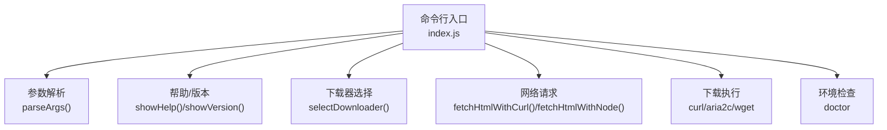
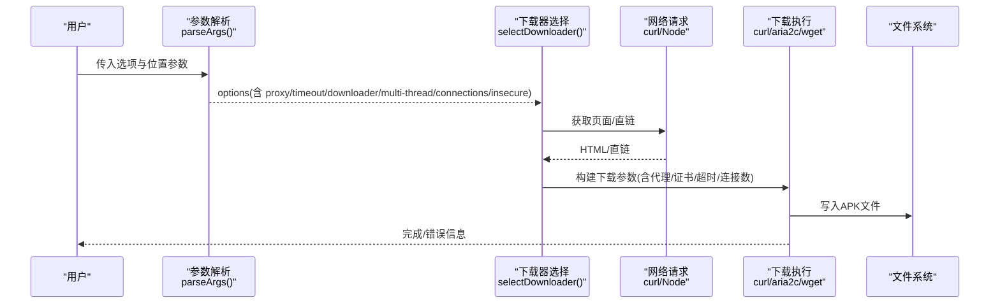

# 命令选项

<cite>
**本文引用的文件**
- [index.js](file://yyb-apk-extractor/index.js)
- [package.json](file://yyb-apk-extractor/package.json)
- [README.md](file://yyb-apk-extractor/README.md)
</cite>

## 目录
1. [简介](#简介)
2. [项目结构](#项目结构)
3. [核心组件](#核心组件)
4. [架构总览](#架构总览)
5. [详细选项参考](#详细选项参考)
6. [依赖与冲突关系](#依赖与冲突关系)
7. [性能与超时说明](#性能与超时说明)
8. [故障排查](#故障排查)
9. [结论](#结论)
10. [附录：复杂组合示例](#附录复杂组合示例)

## 简介
本工具为“应用宝 APK 下载链接提取器”的纯命令行版本，支持通过包名或详情页 URL 提取 APK 直链，并可自动下载。所有网络请求与下载均支持代理；提供多线程下载、连接数控制、超时配置、交互模式、颜色控制等丰富选项。成功输出保持 JSON，便于脚本化集成。

## 项目结构
- 入口与全部逻辑集中在单一脚本中，便于直接运行与二次集成。
- 版本号来源于 package.json，保证单一来源。
- README 提供用法概览、环境变量、安全设计与工作原理说明。

图表来源
- [index.js:209-338](file://yyb-apk-extractor/index.js#L209-L338)
- [index.js:458-493](file://yyb-apk-extractor/index.js#L458-L493)
- [index.js:1205-1280](file://yyb-apk-extractor/index.js#L1205-L1280)
- [index.js:973-1073](file://yyb-apk-extractor/index.js#L973-L1073)
- [index.js:923-966](file://yyb-apk-extractor/index.js#L923-L966)

章节来源
- [index.js:1-800](file://yyb-apk-extractor/index.js#L1-L800)
- [package.json:1-47](file://yyb-apk-extractor/package.json#L1-L47)
- [README.md:1-353](file://yyb-apk-extractor/README.md#L1-L353)

## 核心组件
- 参数解析：统一处理位置参数与选项，校验并生成内部 options。
- 下载器选择：根据 --downloader、--multi-thread 及可用工具决定实际使用的下载器。
- 网络层：优先使用 curl（代理兼容性好），失败时回退到 Node.js 内置模块。
- 下载执行：按策略调用 curl/aria2c/wget，并做重定向预检与完整性校验。
- 环境与诊断：doctor 检查本机工具可用性；verbose 输出调试信息。

章节来源
- [index.js:209-338](file://yyb-apk-extractor/index.js#L209-L338)
- [index.js:458-493](file://yyb-apk-extractor/index.js#L458-L493)
- [index.js:923-966](file://yyb-apk-extractor/index.js#L923-L966)

## 架构总览
下图展示了从命令行到下载完成的端到端流程，以及各选项如何影响行为。

图表来源
- [index.js:209-338](file://yyb-apk-extractor/index.js#L209-L338)
- [index.js:458-493](file://yyb-apk-extractor/index.js#L458-L493)
- [index.js:973-1073](file://yyb-apk-extractor/index.js#L973-L1073)
- [index.js:1205-1280](file://yyb-apk-extractor/index.js#L1205-L1280)

## 详细选项参考
以下逐项说明每个选项的用途、参数格式、取值范围、默认值与示例。为避免泄露敏感信息，示例中的地址与凭据已脱敏。

- --proxy=地址
  - 用途：设置代理，支持 http/https/socks5/socks5h。省略协议时按 HTTP 代理处理。
  - 参数格式：URL 形式，必须包含主机与端口，不能包含路径、查询串或片段。
  - 取值范围：http://host:port | https://host:port | socks5://host:port | socks5h://host:port
  - 默认值：无；若未显式设置且未使用 --no-proxy，则按优先级读取环境变量 HTTPS_PROXY/https_proxy/HTTP_PROXY/http_proxy/ALL_PROXY/all_proxy。
  - 注意：aria2c 仅支持 http/https 代理；wget 不支持 SOCKS 与带凭据的安全传递。
  - 示例：
    - node index.js com.example.app --proxy=http://127.0.0.1:7890
    - node index.js com.example.app --proxy=socks5h://127.0.0.1:7890
  - 相关实现：[index.js:495-521](file://yyb-apk-extractor/index.js#L495-L521), [index.js:653-679](file://yyb-apk-extractor/index.js#L653-L679)

- --no-proxy
  - 用途：忽略环境变量中的代理设置。
  - 参数格式：布尔开关。
  - 默认值：false。
  - 示例：node index.js com.example.app --no-proxy
  - 相关实现：[index.js:245-247](file://yyb-apk-extractor/index.js#L245-L247)

- --download-dir=目录
  - 用途：指定 APK 下载目录。包名输入时启用下载；URL 输入时覆盖默认 ./downloads。
  - 参数格式：相对或绝对路径，不能为空，不能包含 ..，不能为根目录。
  - 默认值：URL 输入时为 ./downloads；包名输入时不启用下载（除非显式指定）。
  - 示例：node index.js com.example.app --download-dir=./downloads
  - 相关实现：[index.js:326-332](file://yyb-apk-extractor/index.js#L326-L332), [index.js:386-399](file://yyb-apk-extractor/index.js#L386-L399), [index.js:417-420](file://yyb-apk-extractor/index.js#L417-L420)

- --downloader=工具
  - 用途：指定下载工具。
  - 参数格式：auto | curl | aria2c | wget。
  - 默认值：auto。
  - 行为：auto 模式下优先顺序为 curl -> aria2c -> wget；开启 --multi-thread 时优先 aria2c -> curl -> wget。
  - 限制：aria2c 不支持 socks5/socks5h；wget 不支持 SOCKS 与凭据安全传递。
  - 示例：node index.js com.example.app --downloader=aria2c
  - 相关实现：[index.js:362-368](file://yyb-apk-extractor/index.js#L362-L368), [index.js:458-493](file://yyb-apk-extractor/index.js#L458-L493)

- --multi-thread
  - 用途：优先使用 aria2c 多连接下载大文件。
  - 参数格式：布尔开关。
  - 默认值：false。
  - 依赖：需本机安装 aria2c；配合 --connections 调整连接数。
  - 示例：node index.js com.example.app --download-dir=./downloads --multi-thread --connections=8
  - 相关实现：[index.js:257-258](file://yyb-apk-extractor/index.js#L257-L258), [index.js:458-463](file://yyb-apk-extractor/index.js#L458-L463)

- --connections=数量
  - 用途：aria2c 的连接数。
  - 参数格式：整数。
  - 取值范围：1-16。
  - 默认值：16。
  - 示例：node index.js com.example.app --multi-thread --connections=8
  - 相关实现：[index.js:370-380](file://yyb-apk-extractor/index.js#L370-L380), [index.js:973-1015](file://yyb-apk-extractor/index.js#L973-L1015)

- --timeout=时长
  - 用途：网络超时时间。
  - 参数格式：正整数毫秒，或带单位的时长（如 500ms、10s、5m）。
  - 默认值：30000（毫秒）。
  - 行为：fetch 阶段为请求总时长；下载阶段作为连接建立与断流检测时长，不限制大文件总下载时间。
  - 示例：node index.js com.example.app --timeout=10s
  - 相关实现：[index.js:340-360](file://yyb-apk-extractor/index.js#L340-L360), [index.js:382-384](file://yyb-apk-extractor/index.js#L382-L384)

- --insecure
  - 用途：下载时跳过 HTTPS 证书校验，仅限测试环境。
  - 参数格式：布尔开关。
  - 默认值：false。
  - 示例：node index.js com.example.app --insecure
  - 相关实现：[index.js:1010-1012](file://yyb-apk-extractor/index.js#L1010-L1012), [index.js:1048-1049](file://yyb-apk-extractor/index.js#L1048-L1049), [index.js:1070-1071](file://yyb-apk-extractor/index.js#L1070-L1071)

- --verbose, -v
  - 用途：显示详细调试日志。
  - 参数格式：布尔开关。
  - 默认值：false。
  - 示例：node index.js com.example.app -v
  - 相关实现：[index.js:261-262](file://yyb-apk-extractor/index.js#L261-L262), [index.js:823-827](file://yyb-apk-extractor/index.js#L823-L827)

- --interactive, -i
  - 用途：进入交互式向导。
  - 参数格式：布尔开关。
  - 默认值：false。
  - 约束：非 TTY 终端无法进入交互模式；该模式下不支持位置参数。
  - 示例：node index.js --interactive
  - 相关实现：[index.js:265-266](file://yyb-apk-extractor/index.js#L265-L266), [index.js:295-315](file://yyb-apk-extractor/index.js#L295-L315)

- --version, -V
  - 用途：显示版本号。
  - 参数格式：布尔开关。
  - 默认值：不适用。
  - 示例：node index.js --version
  - 相关实现：[index.js:129-132](file://yyb-apk-extractor/index.js#L129-L132), [package.json:1-10](file://yyb-apk-extractor/package.json#L1-L10)

- --no-color
  - 用途：强制禁用 ANSI 颜色输出。
  - 参数格式：布尔开关。
  - 默认值：false；当 stdout/stderr 非 TTY 或设置 NO_COLOR 环境变量时也会禁用。
  - 示例：node index.js com.example.app --no-color
  - 相关实现：[index.js:88-94](file://yyb-apk-extractor/index.js#L88-L94), [index.js:243-244](file://yyb-apk-extractor/index.js#L243-L244)

- --help, -h
  - 用途：显示帮助信息。
  - 参数格式：布尔开关。
  - 默认值：不适用。
  - 示例：node index.js --help
  - 相关实现：[index.js:138-207](file://yyb-apk-extractor/index.js#L138-L207)

章节来源
- [index.js:209-338](file://yyb-apk-extractor/index.js#L209-L338)
- [index.js:340-380](file://yyb-apk-extractor/index.js#L340-L380)
- [index.js:458-493](file://yyb-apk-extractor/index.js#L458-L493)
- [index.js:823-827](file://yyb-apk-extractor/index.js#L823-L827)
- [index.js:973-1073](file://yyb-apk-extractor/index.js#L973-L1073)
- [package.json:1-10](file://yyb-apk-extractor/package.json#L1-L10)
- [README.md:119-135](file://yyb-apk-extractor/README.md#L119-L135)

## 依赖与冲突关系
- 代理与下载器
  - aria2c 不支持 socks5/socks5h 代理；若使用此类代理，将自动回退至 curl 或 wget。
  - wget 不支持 SOCKS 代理与凭据安全传递；若检测到凭据或 SOCKS，将被拒绝。
  - 推荐在需要代理时使用 curl 或 http/https 代理。
  - 相关实现：[index.js:458-493](file://yyb-apk-extractor/index.js#L458-L493)

- 多线程与连接数
  - --multi-thread 仅在 aria2c 可用时生效；未安装 aria2c 时将回退到 curl/wget。
  - --connections 仅对 aria2c 有效，范围 1-16，默认 16。
  - 相关实现：[index.js:370-380](file://yyb-apk-extractor/index.js#L370-L380), [index.js:973-1015](file://yyb-apk-extractor/index.js#L973-L1015)

- 交互模式
  - --interactive 在非 TTY 环境下不可用；该模式不接受位置参数。
  - 相关实现：[index.js:295-315](file://yyb-apk-extractor/index.js#L295-L315)

- 颜色输出
  - --no-color 或 NO_COLOR 环境变量会禁用颜色；管道或非 TTY 下默认禁用。
  - 相关实现：[index.js:88-94](file://yyb-apk-extractor/index.js#L88-L94)

- 超时
  - --timeout 同时影响 fetch 与下载阶段的连接/断流检测；不限制大文件总下载时间。
  - 相关实现：[index.js:340-360](file://yyb-apk-extractor/index.js#L340-L360), [index.js:382-384](file://yyb-apk-extractor/index.js#L382-L384)

章节来源
- [index.js:295-315](file://yyb-apk-extractor/index.js#L295-L315)
- [index.js:340-380](file://yyb-apk-extractor/index.js#L340-L380)
- [index.js:458-493](file://yyb-apk-extractor/index.js#L458-L493)
- [index.js:88-94](file://yyb-apk-extractor/index.js#L88-L94)

## 性能与超时说明
- 默认超时 30000 毫秒；可通过 --timeout 调整。
- 下载阶段使用 curl/aria2c/wget 的重试与断点续传能力，避免慢速网络中断导致失败。
- 大文件建议开启 --multi-thread 并使用合适的 --connections 以提升吞吐。
- 相关实现：[index.js:340-360](file://yyb-apk-extractor/index.js#L340-L360), [index.js:973-1073](file://yyb-apk-extractor/index.js#L973-L1073)

## 故障排查
- 未知选项或多余参数：解析阶段会抛出错误，请检查拼写与参数顺序。
- 搜索关键词非法：长度超限或包含非法字符会被拒绝。
- 下载失败：检查代理是否被正确传递、下载工具是否安装、目标域名是否在白名单内。
- 证书问题：测试环境可使用 --insecure 跳过校验。
- 非 TTY 无法交互：请使用显式参数而非 --interactive。
- 相关实现：[index.js:267-278](file://yyb-apk-extractor/index.js#L267-L278), [index.js:1301-1311](file://yyb-apk-extractor/index.js#L1301-L1311), [index.js:1440-1518](file://yyb-apk-extractor/index.js#L1440-L518)

章节来源
- [index.js:267-278](file://yyb-apk-extractor/index.js#L267-L278)
- [index.js:1301-1311](file://yyb-apk-extractor/index.js#L1301-L1311)
- [index.js:1440-1518](file://yyb-apk-extractor/index.js#L1440-L518)

## 结论
本工具的命令行选项覆盖了代理、下载、并发、超时、交互、颜色与帮助等关键场景。通过合理的选项组合，可在不同网络与平台环境下稳定地提取并下载 APK。建议在受限网络中使用 http/https 代理，在大文件下载时启用多线程与合适的连接数，并在 CI 环境中关闭颜色输出以获得干净的 JSON 结果。

## 附录：复杂组合示例
以下为常见复杂组合的实际使用方式（示例中的地址与凭据已脱敏）：

- 代理 + 多线程 + 自定义目录
  - node index.js com.example.app --proxy=http://127.0.0.1:7890 --download-dir=./downloads --multi-thread --connections=8
- 代理 + 超时 + 详细日志
  - node index.js com.example.app --proxy=socks5h://127.0.0.1:7890 --timeout=10s -v
- 忽略环境变量代理 + 指定下载器
  - node index.js com.example.app --no-proxy --downloader=curl
- 交互模式 + 代理
  - node index.js --interactive --proxy=http://127.0.0.1:7890
- 颜色控制 + 超时
  - node index.js com.example.app --no-color --timeout=5m

章节来源
- [index.js:209-338](file://yyb-apk-extractor/index.js#L209-L338)
- [index.js:458-493](file://yyb-apk-extractor/index.js#L458-L493)
- [index.js:973-1073](file://yyb-apk-extractor/index.js#L973-L1073)
- [README.md:145-191](file://yyb-apk-extractor/README.md#L145-L191)