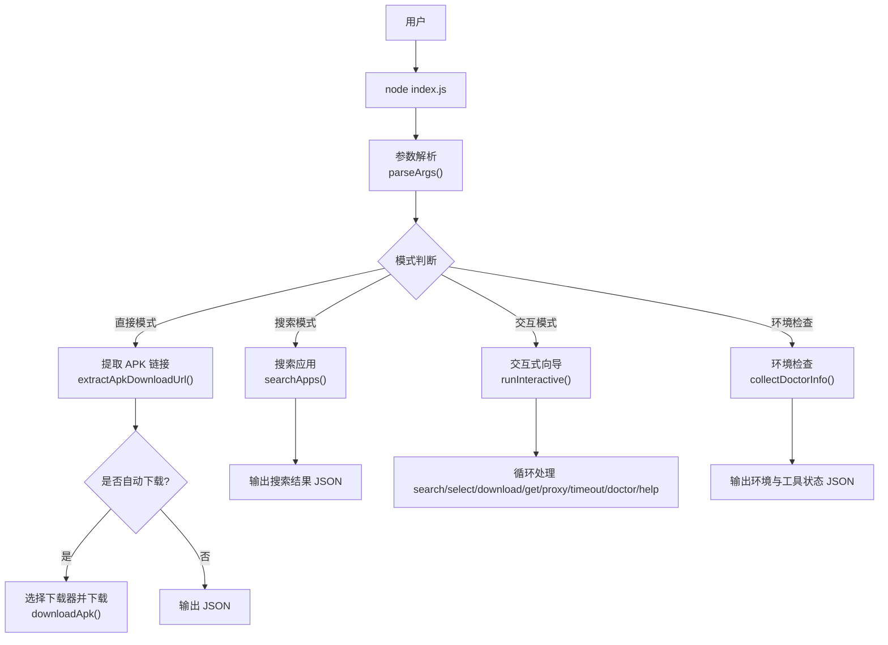
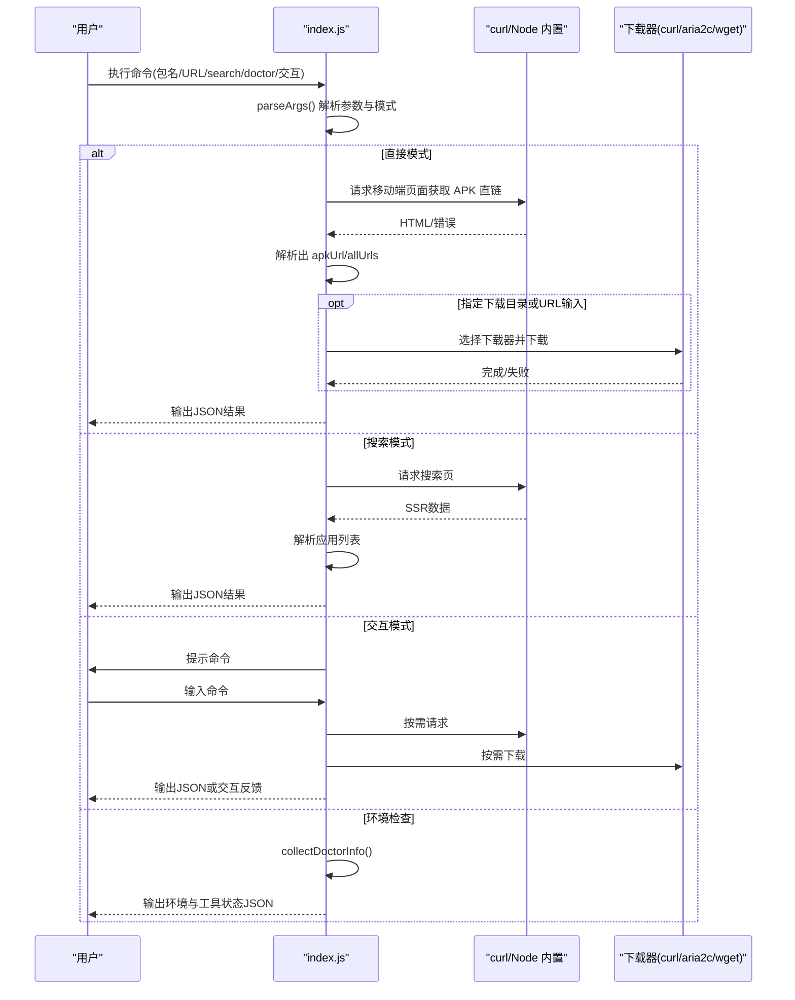

# 基本命令

<cite>
**本文引用的文件**
- [index.js](file://yyb-apk-extractor/index.js)
- [package.json](file://yyb-apk-extractor/package.json)
- [README.md](file://yyb-apk-extractor/README.md)
</cite>

## 目录
1. [简介](#简介)
2. [项目结构](#项目结构)
3. [核心命令总览](#核心命令总览)
4. [架构与执行流程](#架构与执行流程)
5. [详细命令说明](#详细命令说明)
6. [依赖与环境检查](#依赖与环境检查)
7. [性能与下载行为](#性能与下载行为)
8. [常见问题排查](#常见问题排查)
9. [结论](#结论)

## 简介
本工具用于从腾讯应用宝官网提取 Android APK 直链，支持包名输入、详情页 URL 解析、关键词搜索、交互模式与环境检查。所有命令通过 Node.js 脚本运行，成功输出保持 JSON（便于自动化），终端提示与进度写入标准错误流。

## 项目结构
- 入口脚本：index.js（命令行主逻辑）
- 元信息：package.json（名称、版本、可执行入口等）
- 文档：README.md（使用说明、示例、代理与下载说明）

图表来源
- [index.js:209-338](file://yyb-apk-extractor/index.js#L209-L338)
- [index.js:1520-1606](file://yyb-apk-extractor/index.js#L1520-L1606)
- [index.js:1608-1632](file://yyb-apk-extractor/index.js#L1608-L1632)
- [index.js:1634-1767](file://yyb-apk-extractor/index.js#L1634-L1767)
- [index.js:1769-2163](file://yyb-apk-extractor/index.js#L1769-L2163)
- [index.js:2165-2208](file://yyb-apk-extractor/index.js#L2165-L2208)

章节来源
- [index.js:1-2311](file://yyb-apk-extractor/index.js#L1-L2311)
- [package.json:1-47](file://yyb-apk-extractor/package.json#L1-L47)
- [README.md:1-353](file://yyb-apk-extractor/README.md#L1-L353)

## 核心命令总览
- 包名提取命令：node index.js <包名> [选项]
- URL 解析命令：node index.js <应用宝详情页URL> [选项]
- 搜索命令：node index.js search <关键词> [选项]
- 交互模式命令：node index.js 或 node index.js --interactive
- 环境检查命令：node index.js doctor

各命令的语法、参数说明与使用示例见下文“详细命令说明”。

## 架构与执行流程
- 参数解析：统一由 parseArgs 解析位置参数与选项，决定模式（direct/search/interactive/doctor）。
- 网络请求：优先使用 curl；不可用时回退到 Node.js 内置 https/http。
- 页面解析：移动端 simple.jsp 返回 HTML，正则提取 .apk 链接；搜索页解析 __NEXT_DATA__ 中的动态卡片数据。
- 下载策略：根据选项选择 curl/aria2c/wget，支持多连接、断点续传、重定向预检与完整性校验。
- 交互模式：基于 readline 实现命令循环，支持 search/select/download/get/proxy/timeout/doctor/help。

图表来源
- [index.js:209-338](file://yyb-apk-extractor/index.js#L209-L338)
- [index.js:1520-1606](file://yyb-apk-extractor/index.js#L1520-L1606)
- [index.js:1634-1767](file://yyb-apk-extractor/index.js#L1634-L1767)
- [index.js:2165-2208](file://yyb-apk-extractor/index.js#L2165-L2208)

## 详细命令说明

### 包名提取命令
- 语法
  - node index.js <包名> [选项]
- 参数说明
  - 包名：Android 包名格式，如 com.example.app
  - 选项：--proxy、--download-dir、--downloader、--multi-thread、--connections、--timeout、--insecure、--verbose/-v、--no-color、--help/-h、--version/-V
- 执行流程
  - 校验包名合法性
  - 构造移动端页面 URL 并请求
  - 解析 HTML 提取 APK 直链与候选链接
  - 若指定下载目录则自动下载并校验文件
  - 输出包含 pkgName/detailUrl/apkUrl/allUrls 的 JSON
- 实际示例
  - 仅提取直链：node index.js com.tencent.mm
  - 自动下载到指定目录：node index.js com.tencent.mm --download-dir=./downloads
  - 多连接下载大文件：node index.js com.tencent.mm --download-dir=./downloads --multi-thread --connections=8
  - 使用代理：node index.js com.tencent.mm --proxy=http://127.0.0.1:7890
- 输出差异
  - 未指定下载目录：仅输出 JSON，不下载文件
  - 指定下载目录：除 JSON 外，还会生成 APK 文件并校验完整性

章节来源
- [index.js:427-430](file://yyb-apk-extractor/index.js#L427-L430)
- [index.js:1520-1576](file://yyb-apk-extractor/index.js#L1520-L1576)
- [index.js:2191-2208](file://yyb-apk-extractor/index.js#L2191-L2208)

### URL 解析命令
- 语法
  - node index.js <应用宝详情页URL> [选项]
- 参数说明
  - 应用宝详情页URL：https://sj.qq.com/appdetail/<包名> 或 a.app.qq.com/simple.jsp?pkgname=...
  - 选项：同上
- 执行流程
  - 规范化 URL，提取包名
  - 请求详情页或移动端页面，解析 APK 直链
  - 默认自动下载到 ./downloads（可通过 --download-dir 覆盖）
  - 下载完成后校验文件存在、非空且头部魔数正确
- 实际示例
  - 解析并下载：node index.js https://sj.qq.com/appdetail/com.tencent.mm
  - 指定目录：node index.js https://sj.qq.com/appdetail/com.tencent.mm --download-dir=./apk
  - 使用 SOCKS5h 代理：node index.js https://sj.qq.com/appdetail/com.tencent.mm --proxy=socks5h://127.0.0.1:7890
- 输出差异
  - 始终输出 JSON；若自动下载，会额外生成文件并在 stderr 显示进度

章节来源
- [index.js:401-415](file://yyb-apk-extractor/index.js#L401-L415)
- [index.js:417-425](file://yyb-apk-extractor/index.js#L417-L425)
- [index.js:1634-1767](file://yyb-apk-extractor/index.js#L1634-L1767)
- [index.js:2191-2208](file://yyb-apk-extractor/index.js#L2191-L2208)

### 搜索命令
- 语法
  - node index.js search <关键词> [选项]
- 参数说明
  - 关键词：中文、英文、数字及常用标点，长度限制
  - 选项：同包名提取命令
- 执行流程
  - 校验关键词合法性
  - 请求应用宝搜索页
  - 解析 Next.js SSR 数据，去重后输出应用列表
  - 输出包含 query/count/results 的 JSON
- 实际示例
  - 搜索微信：node index.js search 微信
  - 使用代理搜索：node index.js search 微信 --proxy=http://127.0.0.1:7890
- 输出差异
  - 仅输出 JSON；stderr 在 TTY 下显示摘要

章节来源
- [index.js:1301-1311](file://yyb-apk-extractor/index.js#L1301-L1311)
- [index.js:1578-1606](file://yyb-apk-extractor/index.js#L1578-L1606)
- [index.js:2173-2180](file://yyb-apk-extractor/index-index.js#L2173-L2180)

### 交互模式命令
- 语法
  - node index.js 或 node index.js --interactive
- 参数说明
  - 无位置参数；需在真实 TTY 终端中运行
- 可用命令
  - search/s <关键词>：搜索应用
  - list/ls：列出上一次搜索结果
  - select/sel <序号>：选中应用
  - download/d：下载当前选中的应用（默认 ./downloads）
  - download/d <序号>：直接下载搜索结果第 N 项
  - get/g <包名或URL>：解析 APK 并确认下载
  - proxy/p <地址>：设置/切换代理（空地址清除）
  - timeout/t [时长]：查看或调整超时时间
  - doctor/env：检查本机 Node.js 与下载工具
  - help/h/?：显示帮助
  - exit/quit/q：退出
- 执行流程
  - 创建 readline 接口，循环读取用户命令
  - 根据命令调用对应处理器（搜索、选择、下载、get、代理、超时、环境检查）
  - 下载前展示应用详情并询问确认
- 实际示例
  - 进入交互：node index.js
  - 搜索并下载：search 微信 -> select 1 -> download
  - 直接粘贴链接：https://sj.qq.com/appdetail/com.tencent.mm -> 确认下载
- 输出差异
  - 交互过程在 stderr 显示提示与进度；最终下载结果以 JSON 输出到 stdout

章节来源
- [index.js:1769-1833](file://yyb-apk-extractor/index.js#L1769-L1833)
- [index.js:1882-1942](file://yyb-apk-extractor/index.js#L1882-L1942)
- [index.js:2008-2060](file://yyb-apk-extractor/index.js#L2008-L2060)
- [index.js:2086-2163](file://yyb-apk-extractor/index.js#L2086-L2163)

### 环境检查命令
- 语法
  - node index.js doctor
- 参数说明
  - 无位置参数
- 执行流程
  - 检测 Node.js 版本、平台
  - 检测 curl/aria2c/wget 是否可用
  - 生成提示信息（如未安装下载工具的注意事项）
- 实际示例
  - 检查环境：node index.js doctor
- 输出差异
  - 输出包含 nodeVersion/platform/tools/notes 的 JSON；TTY 下同时显示人类可读摘要

章节来源
- [index.js:923-966](file://yyb-apk-extractor/index.js#L923-L966)
- [index.js:2182-2189](file://yyb-apk-extractor/index.js#L2182-L2189)

## 依赖与环境检查
- 环境要求
  - Node.js >= 16.3.0
  - 下载工具：curl / aria2c / wget 任意一个；多连接下载需要 aria2c
- 常见安装方式
  - macOS：brew install aria2 wget
  - Debian/Ubuntu：sudo apt-get install curl aria2 wget
  - Windows：通常内置 curl；aria2c/wget 可通过 winget/Scoop/Chocolatey 安装并加入 PATH
- 检查方法
  - node index.js doctor

章节来源
- [package.json:34-36](file://yyb-apk-extractor/package.json#L34-L36)
- [README.md:67-93](file://yyb-apk-extractor/README.md#L67-L93)
- [index.js:923-966](file://yyb-apk-extractor/index.js#L923-L966)

## 性能与下载行为
- 超时配置
  - --timeout=时长：支持整数毫秒或带单位时长（如 500ms、10s、5m）
  - fetch 阶段为请求总时长；下载阶段为连接建立和断流检测时长，不限制大文件总下载时间
- 下载器选择
  - 默认顺序：curl -> aria2c -> wget
  - 多线程模式：--multi-thread 优先 aria2c
  - 连接数：--connections=数量（范围 1-16）
- 大文件与慢速下载
  - curl：--connect-timeout + --speed-time + --speed-limit 1024 + -C -，下载前做重定向预检
  - aria2c：-x/-s 控制连接数，--continue=true 断点续传
  - wget：兜底工具
- 安全性
  - 仅允许腾讯域名与特定 CDN 路径
  - 代理凭据脱敏，子进程环境变量剥离密码
  - 下载文件校验 APK/ZIP 头部魔数

章节来源
- [index.js:340-384](file://yyb-apk-extractor/index.js#L340-L384)
- [index.js:458-493](file://yyb-apk-extractor/index.js#L458-L493)
- [index.js:1440-1518](file://yyb-apk-extractor/index.js#L1440-L1518)
- [index.js:1634-1767](file://yyb-apk-extractor/index.js#L1634-L1767)
- [README.md:260-302](file://yyb-apk-extractor/README.md#L260-L302)

## 常见问题排查
- 无法通过代理访问
  - 现象：未检测到 curl 时，带 --proxy 会报错
  - 解决：安装 curl 或移除 --proxy 在无代理网络中使用
- 下载失败或文件为空
  - 现象：下载完成后文件大小为 0 或魔数不匹配
  - 解决：检查网络连接、代理配置；重试或使用 --multi-thread
- 搜索结果为空
  - 现象：count 为 0
  - 解决：更换关键词或检查网络与代理
- 交互模式无法启动
  - 现象：非 TTY 终端报错
  - 解决：提供包名/URL/search/doctor，或在真实终端运行

章节来源
- [index.js:1540-1559](file://yyb-apk-extractor/index.js#L1540-L1559)
- [index.js:1590-1602](file://yyb-apk-extractor/index.js#L1590-L1602)
- [index.js:1769-1814](file://yyb-apk-extractor/index.js#L1769-L1814)
- [index.js:2086-2089](file://yyb-apk-extractor/index.js#L2086-L2089)

## 结论
本工具提供了完整的命令行能力：包名提取、URL 解析、搜索、交互模式与环境检查。通过统一的参数解析与安全的网络/下载策略，既适合日常使用，也便于脚本化集成。建议在生产环境中安装 curl 与 aria2c，以获得最佳兼容性与性能。