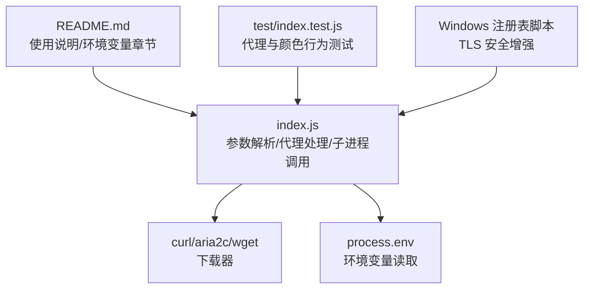
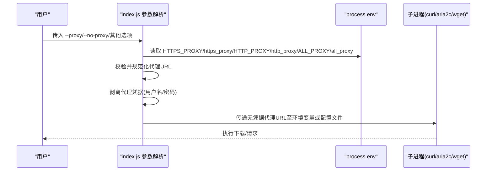
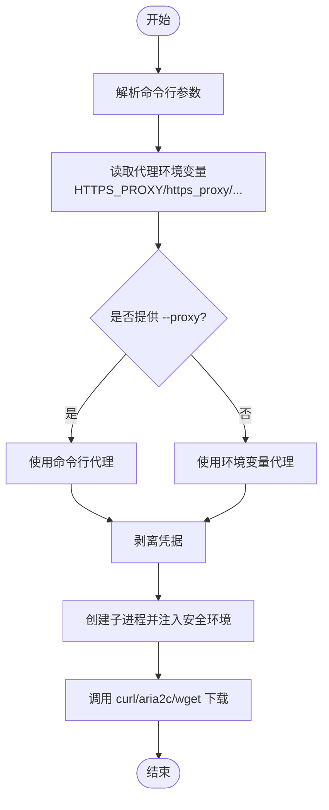

# 环境变量

<cite>
**本文引用的文件**
- [yyb-apk-extractor/README.md](file://yyb-apk-extractor/README.md)
- [yyb-apk-extractor/index.js](file://yyb-apk-extractor/index.js)
- [yyb-apk-extractor/test/index.test.js](file://yyb-apk-extractor/test/index.test.js)
- [qdm_tls12_enable.reg](file://qdm_tls12_enable.reg)
- [qdm_tls12_restore.reg](file://qdm_tls12_restore.reg)
</cite>

## 目录
1. [简介](#简介)
2. [项目结构](#项目结构)
3. [核心组件](#核心组件)
4. [架构总览](#架构总览)
5. [详细组件分析](#详细组件分析)
6. [依赖关系分析](#依赖关系分析)
7. [性能与行为特性](#性能与行为特性)
8. [故障排除指南](#故障排除指南)
9. [结论](#结论)
10. [附录：各平台设置与环境变量优先级](#附录各平台设置与环境变量优先级)

## 简介
本文件面向 yyb-apk-extractor 的环境变量配置，聚焦以下变量：HTTPS_PROXY、https_proxy、HTTP_PROXY、http_proxy、ALL_PROXY、all_proxy、NO_COLOR。文档说明每个变量的作用、读取优先级、配置格式、在不同操作系统下的设置方法、与命令行选项的优先级关系，并提供实际示例与故障排除建议，同时给出代理相关的安全注意事项与最佳实践。

## 项目结构
本项目为纯命令行工具，核心逻辑集中在 index.js，使用说明在 README.md，测试用例在 test/index.test.js，另有 Windows 注册表脚本用于 TLS 安全增强（与代理无关但属于运行环境的一部分）。

图表来源
- [yyb-apk-extractor/index.js:209-337](file://yyb-apk-extractor/index.js#L209-L337)
- [yyb-apk-extractor/index.js:653-679](file://yyb-apk-extractor/index.js#L653-L679)
- [yyb-apk-extractor/README.md:137-143](file://yyb-apk-extractor/README.md#L137-L143)
- [yyb-apk-extractor/test/index.test.js:1005-1063](file://yyb-apk-extractor/test/index.test.js#L1005-L1063)

章节来源
- [yyb-apk-extractor/README.md:137-143](file://yyb-apk-extractor/README.md#L137-L143)
- [yyb-apk-extractor/index.js:209-337](file://yyb-apk-extractor/index.js#L209-L337)

## 核心组件
- 代理环境变量集合与大小写不敏感匹配：支持 HTTPS_PROXY / https_proxy / HTTP_PROXY / http_proxy / ALL_PROXY / all_proxy，并在内部统一按小写键集合进行识别。
- 默认代理读取顺序：优先 HTTPS_PROXY，其次 https_proxy，再 HTTP_PROXY、http_proxy，最后 ALL_PROXY、all_proxy。
- NO_COLOR：存在即禁用终端颜色输出；也可通过 --no-color 命令行选项禁用。
- 子进程环境变量隔离：传递给 curl/aria2c/wget 的子进程时，会剥离代理 URL 中的用户名与密码，避免凭据泄露到日志或环境变量中。

章节来源
- [yyb-apk-extractor/index.js:64-83](file://yyb-apk-extractor/index.js#L64-L83)
- [yyb-apk-extractor/index.js:217-224](file://yyb-apk-extractor/index.js#L217-L224)
- [yyb-apk-extractor/index.js:88-94](file://yyb-apk-extractor/index.js#L88-L94)
- [yyb-apk-extractor/index.js:523-579](file://yyb-apk-extractor/index.js#L523-L579)
- [yyb-apk-extractor/test/index.test.js:1005-1063](file://yyb-apk-extractor/test/index.test.js#L1005-L1063)

## 架构总览
下图展示从命令行参数与环境变量到最终下载器的调用流程，以及代理凭据的脱敏过程。

图表来源
- [yyb-apk-extractor/index.js:209-337](file://yyb-apk-extractor/index.js#L209-L337)
- [yyb-apk-extractor/index.js:523-579](file://yyb-apk-extractor/index.js#L523-L579)
- [yyb-apk-extractor/index.js:653-679](file://yyb-apk-extractor/index.js#L653-L679)

## 详细组件分析

### 代理环境变量与优先级
- 支持的变量：HTTPS_PROXY、https_proxy、HTTP_PROXY、http_proxy、ALL_PROXY、all_proxy。
- 读取优先级（从高到低）：
  1) HTTPS_PROXY
  2) https_proxy
  3) HTTP_PROXY
  4) http_proxy
  5) ALL_PROXY
  6) all_proxy
- 大小写不敏感：内部使用小写键集合进行匹配，因此 Http_Proxy 等混合大小写也能被识别。
- 当未显式设置 --proxy 且未使用 --no-proxy 时，将按上述顺序从环境变量中读取第一个非空值作为默认代理。

章节来源
- [yyb-apk-extractor/index.js:64-83](file://yyb-apk-extractor/index.js#L64-L83)
- [yyb-apk-extractor/index.js:217-224](file://yyb-apk-extractor/index.js#L217-L224)
- [yyb-apk-extractor/test/index.test.js:1052-1063](file://yyb-apk-extractor/test/index.test.js#L1052-L1063)

### NO_COLOR 与 --no-color
- NO_COLOR：只要存在（包括空值），即禁用终端颜色输出。
- --no-color：命令行选项，同样禁用颜色输出。
- 在非 TTY 环境下也会自动禁用颜色，保证管道输出干净。

章节来源
- [yyb-apk-extractor/index.js:88-94](file://yyb-apk-extractor/index.js#L88-L94)
- [yyb-apk-extractor/test/index.test.js:150-153](file://yyb-apk-extractor/test/index.test.js#L150-L153)

### 代理凭据安全与子进程透传
- 子进程环境变量与工具配置输入中不会包含代理用户名与密码。
- 若父进程设置了带凭据的代理环境变量，传递给子进程时会剥离凭据，仅保留无凭据的代理地址。
- 错误信息、verbose 日志与工具输出均会进行凭据脱敏。

章节来源
- [yyb-apk-extractor/index.js:523-579](file://yyb-apk-extractor/index.js#L523-L579)
- [yyb-apk-extractor/test/index.test.js:1005-1063](file://yyb-apk-extractor/test/index.test.js#L1005-L1063)

### 代理协议与下载器兼容性
- 支持的代理协议：http、https、socks5、socks5h。
- aria2c 不支持 socks5/socks5h 代理；wget 对认证代理和 SOCKS 代理支持有限，会被拒绝以避免凭据泄露或不一致行为。
- 推荐优先使用 http 或 socks5h（远程 DNS 解析），避免本地 DNS 失败。

章节来源
- [yyb-apk-extractor/index.js:452-485](file://yyb-apk-extractor/index.js#L452-L485)
- [yyb-apk-extractor/README.md:277-289](file://yyb-apk-extractor/README.md#L277-L289)

## 依赖关系分析
- 参数解析模块负责合并命令行选项与环境变量，确定最终代理策略。
- 代理校验与归一化确保 URL 合法且仅包含必要字段。
- 子进程创建时构建安全的环境对象，剥离代理凭据并按需写入工具配置。
- 下载器选择基于可用性与代理协议支持度决定 curl、aria2c 或 wget。

图表来源
- [yyb-apk-extractor/index.js:209-337](file://yyb-apk-extractor/index.js#L209-L337)
- [yyb-apk-extractor/index.js:523-579](file://yyb-apk-extractor/index.js#L523-L579)
- [yyb-apk-extractor/index.js:653-679](file://yyb-apk-extractor/index.js#L653-L679)

章节来源
- [yyb-apk-extractor/index.js:209-337](file://yyb-apk-extractor/index.js#L209-L337)
- [yyb-apk-extractor/index.js:452-485](file://yyb-apk-extractor/index.js#L452-L485)

## 性能与行为特性
- 超时控制：fetch 阶段受 --timeout 限制；下载阶段主要用于连接建立与断流检测，不限制大文件总时长。
- 多连接下载：启用 --multi-thread 时优先使用 aria2c，未安装则回退到 curl/wget。
- 命令查找缓存：同一进程内避免重复探测系统命令，提升启动效率。

章节来源
- [yyb-apk-extractor/index.js:340-384](file://yyb-apk-extractor/index.js#L340-L384)
- [yyb-apk-extractor/index.js:458-493](file://yyb-apk-extractor/index.js#L458-L493)
- [yyb-apk-extractor/index.js:870-899](file://yyb-apk-extractor/index.js#L870-L899)

## 故障排除指南
- 无法连接网络或下载失败：
  - 检查代理环境变量是否正确设置，确认优先级与大小写。
  - 若使用 socks5/socks5h，注意 aria2c 不支持该协议，应改用 curl 或切换为 http/https 代理。
  - 若 wget 被选择但代理含凭据或为 SOCKS，将被拒绝；请改用 curl 或 aria2c（仅限 http/https）。
- 凭据泄露风险：
  - 工具会自动剥离子进程环境变量与日志中的代理凭据；如仍发现凭据出现在日志，请检查自定义包装脚本或第三方工具。
- 颜色输出干扰管道：
  - 设置 NO_COLOR=1 或使用 --no-color 禁用颜色，确保 stdout 保持 JSON。
- 非 TTY 下交互模式不可用：
  - 在非交互式环境中必须显式提供包名、URL 或 search/doctor 命令。

章节来源
- [yyb-apk-extractor/index.js:452-485](file://yyb-apk-extractor/index.js#L452-L485)
- [yyb-apk-extractor/index.js:523-579](file://yyb-apk-extractor/index.js#L523-L579)
- [yyb-apk-extractor/index.js:88-94](file://yyb-apk-extractor/index.js#L88-L94)
- [yyb-apk-extractor/test/index.test.js:1005-1063](file://yyb-apk-extractor/test/index.test.js#L1005-L1063)

## 结论
yyb-apk-extractor 对环境变量的处理遵循明确的优先级与安全策略：代理环境变量按 HTTPS_PROXY > https_proxy > HTTP_PROXY > http_proxy > ALL_PROXY > all_proxy 的顺序读取；NO_COLOR 可禁用颜色输出；所有子进程调用都会剥离代理凭据，避免泄露。结合合理的代理协议选择与下载器策略，可在不同网络环境下稳定完成 APK 提取与下载任务。

## 附录：各平台设置与环境变量优先级

### 环境变量优先级与格式
- 优先级顺序：HTTPS_PROXY → https_proxy → HTTP_PROXY → http_proxy → ALL_PROXY → all_proxy。
- 格式要求：
  - 标准 URL 形式：http://host:port、https://host:port、socks5://host:port、socks5h://host:port。
  - 省略协议时按 http 代理处理。
  - 禁止包含路径、查询串或片段；必须包含主机与端口。
- 大小写不敏感：Http_Proxy 等混合大小写也会被识别。

章节来源
- [yyb-apk-extractor/index.js:217-224](file://yyb-apk-extractor/index.js#L217-L224)
- [yyb-apk-extractor/index.js:495-521](file://yyb-apk-extractor/index.js#L495-L521)
- [yyb-apk-extractor/test/index.test.js:1052-1063](file://yyb-apk-extractor/test/index.test.js#L1052-L1063)

### 与命令行选项的优先级关系
- --proxy 最高优先级：显式传入 --proxy 将覆盖环境变量。
- --no-proxy 忽略环境变量：即使设置了代理环境变量也不会生效。
- NO_COLOR 与 --no-color：二者任一即可禁用颜色输出。

章节来源
- [yyb-apk-extractor/index.js:209-337](file://yyb-apk-extractor/index.js#L209-L337)
- [yyb-apk-extractor/index.js:88-94](file://yyb-apk-extractor/index.js#L88-L94)

### 各平台设置方法
- Windows 注册表（系统级环境变量）：
  - 可通过“系统属性”→“高级”→“环境变量”添加或修改系统级环境变量。
  - 如需启用 TLS 1.2 等安全增强，可使用仓库提供的注册表脚本（qdm_tls12_enable.reg / qdm_tls12_restore.reg）进行开启与恢复。
- Linux/Mac 系统配置：
  - 在 shell 配置文件（如 ~/.bashrc、~/.zshrc、/etc/profile.d/*.sh）中 export 相应环境变量。
  - 在 systemd 服务或容器环境中，于服务定义或镜像层设置环境变量。
- Shell 临时设置：
  - 当前会话临时设置：export HTTPS_PROXY=http://host:port；unset HTTPS_PROXY 取消。
  - 仅作用于当前命令：HTTPS_PROXY=http://host:port node index.js ...

章节来源
- [qdm_tls12_enable.reg:1-10](file://qdm_tls12_enable.reg#L1-L10)
- [qdm_tls12_restore.reg:1-10](file://qdm_tls12_restore.reg#L1-L10)

### 实际配置示例
- 设置 HTTP 代理：
  - export HTTP_PROXY=http://127.0.0.1:7890
- 设置 HTTPS 代理（推荐）：
  - export HTTPS_PROXY=https://127.0.0.1:7890
- 设置 SOCKS5h 代理（远程 DNS）：
  - export ALL_PROXY=socks5h://127.0.0.1:7890
- 禁用颜色输出：
  - export NO_COLOR=1 或命令行加 --no-color

章节来源
- [yyb-apk-extractor/README.md:137-143](file://yyb-apk-extractor/README.md#L137-L143)
- [yyb-apk-extractor/index.js:217-224](file://yyb-apk-extractor/index.js#L217-L224)

### 安全考虑与最佳实践
- 始终使用 https 或 socks5h 代理，避免本地 DNS 解析失败。
- 不要在日志或环境变量中暴露代理凭据；工具已自动剥离，但仍应避免在包装脚本中拼接明文凭据。
- 谨慎使用 --insecure，仅在测试环境跳过证书校验。
- 在 CI 或非 TTY 环境中，设置 NO_COLOR 以保证 stdout 纯净。
- 定期更新系统与依赖，确保 TLS 与加密套件符合安全基线（必要时使用注册表脚本启用 TLS 1.2）。

章节来源
- [yyb-apk-extractor/index.js:452-485](file://yyb-apk-extractor/index.js#L452-L485)
- [yyb-apk-extractor/index.js:523-579](file://yyb-apk-extractor/index.js#L523-L579)
- [qdm_tls12_enable.reg:1-10](file://qdm_tls12_enable.reg#L1-L10)