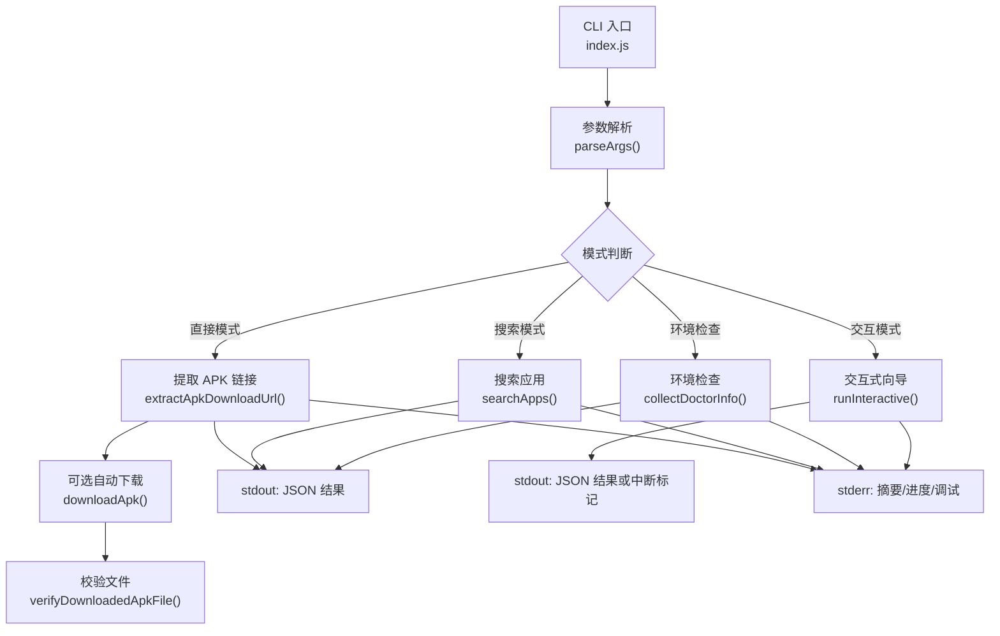
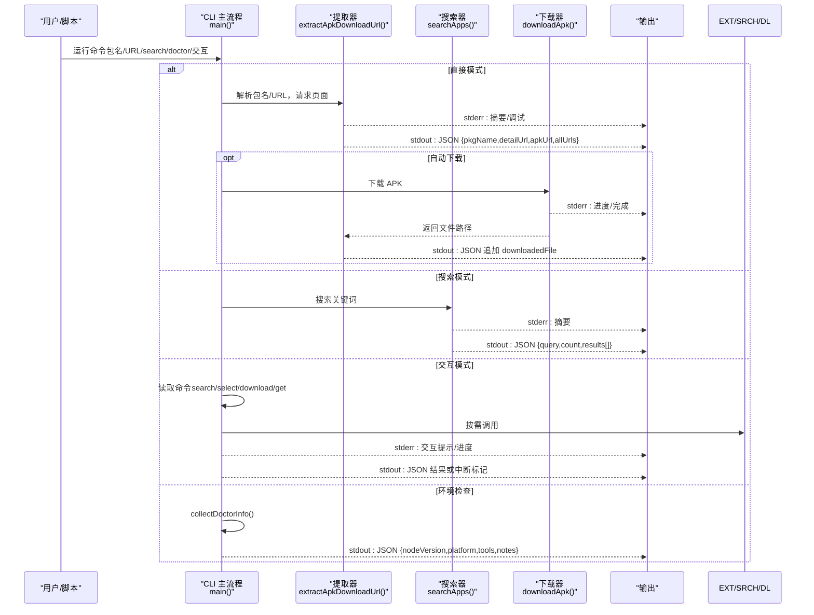

# 输出格式

<cite>
**本文引用的文件**
- [index.js](file://yyb-apk-extractor/index.js)
- [package.json](file://yyb-apk-extractor/package.json)
- [README.md](file://yyb-apk-extractor/README.md)
- [index.test.js](file://yyb-apk-extractor/test/index.test.js)
</cite>

## 目录
1. [简介](#简介)
2. [项目结构](#项目结构)
3. [核心组件](#核心组件)
4. [架构总览](#架构总览)
5. [详细组件分析](#详细组件分析)
6. [依赖关系分析](#依赖关系分析)
7. [性能与稳定性](#性能与稳定性)
8. [故障排查指南](#故障排查指南)
9. [结论](#结论)
10. [附录：自动化集成示例](#附录自动化集成示例)

## 简介
本规范文档聚焦 yyb-apk-extractor 的输出格式，覆盖以下方面：
- 标准 JSON 输出结构（成功结果）
- 错误输出格式（标准错误流）
- 进度信息展示（下载进度、交互提示）
- 调试日志格式（verbose 模式）
- JSON 字段定义与数据类型（apkUrl、allUrls、downloadedFile、error 等）
- 不同模式的输出对比（直接模式、搜索模式、交互模式）
- 标准输出与标准错误的行为差异
- 管道处理与脚本集成的输出处理建议
- 颜色输出的控制与禁用方法
- 自动化处理的完整示例流程

该工具在成功时保持 stdout 为纯 JSON，便于被 jq、CI、脚本解析；终端摘要、进度、调试日志写入 stderr，避免污染 JSON 流。

**章节来源**
- [README.md:10-118](file://yyb-apk-extractor/README.md#L10-L118)

## 项目结构
仓库包含一个单入口 CLI 程序 index.js，配合 package.json 暴露命令行入口，以及测试用例和说明文档。输出逻辑集中在 index.js 中，按模式分流到不同的输出路径。



**图表来源**
- [index.js:2165-2208](file://yyb-apk-extractor/index.js#L2165-L2208)
- [index.js:1578-1606](file://yyb-apk-extractor/index.js#L1578-L1606)
- [index.js:923-966](file://yyb-apk-extractor/index.js#L923-L966)
- [index.js:1634-1767](file://yyb-apk-extractor/index.js#L1634-L1767)

**章节来源**
- [package.json:1-47](file://yyb-apk-extractor/package.json#L1-L47)
- [index.js:2165-2229](file://yyb-apk-extractor/index.js#L2165-L2229)

## 核心组件
- 参数解析与模式路由：决定进入直接、搜索、交互或环境检查模式，并设置选项（代理、超时、下载器、多线程等）。
- 网络请求与页面解析：通过 curl 或 Node.js 内置模块获取页面，解析 APK 直链或搜索结果。
- 下载器选择与执行：根据可用性与配置选择 curl/aria2c/wget，构建参数并执行，支持断点续传与多连接。
- 输出格式化：
  - stdout：始终输出结构化 JSON（成功结果），便于自动化消费。
  - stderr：输出人类可读的摘要、进度、调试日志、错误信息。
- 安全与净化：对 URL、文件名、终端输出进行净化，脱敏代理凭据，防止注入与泄露。

**章节来源**
- [index.js:209-338](file://yyb-apk-extractor/index.js#L209-L338)
- [index.js:1520-1576](file://yyb-apk-extractor/index.js#L1520-L1576)
- [index.js:1578-1606](file://yyb-apk-extractor/index.js#L1578-L1606)
- [index.js:1634-1767](file://yyb-apk-extractor/index.js#L1634-L1767)
- [index.js:784-790](file://yyb-apk-extractor/index.js#L784-L790)
- [index.js:775-782](file://yyb-apk-extractor/index.js#L775-L782)

## 架构总览
下图展示了三种主要模式下的数据流与输出位置：



**图表来源**
- [index.js:2165-2208](file://yyb-apk-extractor/index.js#L2165-L2208)
- [index.js:1520-1576](file://yyb-apk-extractor/index.js#L1520-L1576)
- [index.js:1578-1606](file://yyb-apk-extractor/index.js#L1578-L1606)
- [index.js:1634-1767](file://yyb-apk-extractor/index.js#L1634-L1767)

## 详细组件分析

### 标准 JSON 输出结构
- 直接模式（提取 APK 直链）
  - 成功时 stdout 输出：
    - pkgName: 字符串，Android 包名
    - detailUrl: 字符串，应用宝详情页 URL
    - apkUrl: 字符串，首选 APK 下载地址（优先官方 CDN）
    - allUrls: 字符串数组，所有候选 APK 地址
  - 若启用自动下载（URL 输入或显式 --download-dir），则追加：
    - downloadedFile: 字符串，已下载的 APK 文件绝对路径
- 搜索模式
  - 成功时 stdout 输出：
    - query: 字符串，搜索关键词
    - count: 整数，唯一应用数量
    - results: 对象数组，每项包含：
      - pkgName, appId, name, developer, version, icon, apkSize, rating, intro, detailUrl, rawDownloadUrl
- 环境检查（doctor）
  - 成功时 stdout 输出：
    - nodeVersion: 字符串
    - platform: 字符串
    - tools: 对象，包含 curl/aria2c/wget 的可用性信息
    - notes: 字符串数组，提示信息
- 交互模式
  - 当用户确认下载后，stdout 输出与直接模式相同（可能包含 appInfo/appInfoError 与 downloadedFile）
  - 若用户取消或中断，stdout 可能为空或仅包含部分结果（取决于实现分支）

注意：
- 所有 JSON 均使用 UTF-8 编码，确保跨平台一致。
- 非 TTY 环境下不会进入交互模式，避免阻塞。

**章节来源**
- [index.js:1520-1576](file://yyb-apk-extractor/index.js#L1520-L1576)
- [index.js:1578-1606](file://yyb-apk-extractor/index.js#L1578-L1606)
- [index.js:923-966](file://yyb-apk-extractor/index.js#L923-L966)
- [index.js:2165-2208](file://yyb-apk-extractor/index.js#L2165-L2208)
- [index.js:2008-2046](file://yyb-apk-extractor/index.js#L2008-L2046)

### 错误输出格式（stderr）
- 错误信息统一写入 stderr，包含：
  - 参数校验错误（如非法包名、过长关键词、未知选项）
  - 网络请求失败（HTTP 状态码、重定向异常、超时）
  - 下载失败（工具退出码、stderr 内容脱敏）
  - 文件验证失败（空文件、魔数不匹配）
- 错误消息中的代理凭据会被脱敏，避免泄露。
- 非 TTY 下，交互模式会提前拒绝并给出明确提示。

**章节来源**
- [index.js:209-338](file://yyb-apk-extractor/index.js#L209-L338)
- [index.js:1112-1178](file://yyb-apk-extractor/index.js#L1112-L1178)
- [index.js:1205-1280](file://yyb-apk-extractor/index.js#L1205-L1280)
- [index.js:1634-1767](file://yyb-apk-extractor/index.js#L1634-L1767)
- [index.js:1412-1438](file://yyb-apk-extractor/index.js#L1412-L1438)
- [index.js:775-782](file://yyb-apk-extractor/index.js#L775-L782)

### 进度信息显示
- 下载阶段：
  - 非 verbose 模式下，stderr 显示简洁进度（文件名、完成状态、大小）。
  - verbose 模式下，可透传下载工具的原始输出（已脱敏）。
- 交互模式：
  - 提示当前任务状态（正在提取、正在解析应用信息等）。
  - 搜索结果列表与选中项提示。
- 摘要信息：
  - 直接模式：已找到 APK 链接及候选数量。
  - 搜索模式：搜索结果摘要（前 5 条详情）。
  - 环境检查：Node.js 版本、平台、工具可用性、提示。

**章节来源**
- [index.js:1634-1767](file://yyb-apk-extractor/index.js#L1634-L1767)
- [index.js:1816-1866](file://yyb-apk-extractor/index.js#L1816-L1866)
- [index.js:953-966](file://yyb-apk-extractor/index.js#L953-L966)
- [index.js:968-971](file://yyb-apk-extractor/index.js#L968-L971)

### 调试日志格式
- 启用 --verbose/-v 后，stderr 输出带 [debug] 标签的详细日志。
- 内容包括：
  - 目标包名、请求 URL、执行命令（参数已脱敏）
  - 下载工具执行细节（stdout/stderr 脱敏后输出）
- 注意：调试日志不影响 stdout JSON 的纯净性。

**章节来源**
- [index.js:823-827](file://yyb-apk-extractor/index.js#L823-L827)
- [index.js:1668-1705](file://yyb-apk-extractor/index.js#L1668-L1705)

### 颜色输出的控制与禁用
- 默认：
  - 当 stderr 为 TTY 且未设置 NO_COLOR 或未传入 --no-color 时，启用 ANSI 颜色。
- 禁用方法：
  - 环境变量 NO_COLOR=1 或 NO_COLOR=（空值）
  - 命令行参数 --no-color
- 影响范围：
  - 帮助信息、进度提示、错误高亮等终端输出。
  - stdout JSON 不受颜色影响（JSON 本身不含 ANSI 码）。

**章节来源**
- [index.js:85-117](file://yyb-apk-extractor/index.js#L85-L117)
- [index.test.js:149-189](file://yyb-apk-extractor/test/index.test.js#L149-L189)

### 不同模式下的输出对比
- 直接模式：
  - stdout: JSON {pkgName, detailUrl, apkUrl, allUrls[, downloadedFile]}
  - stderr: 摘要、进度、调试日志
- 搜索模式：
  - stdout: JSON {query, count, results[]}
  - stderr: 摘要、调试日志
- 交互模式：
  - stdout: JSON 结果（下载确认后）或空（取消/中断）
  - stderr: 交互提示、进度、调试日志
- 环境检查：
  - stdout: JSON {nodeVersion, platform, tools, notes}
  - stderr: 摘要（TTY 时）

**章节来源**
- [index.js:2165-2208](file://yyb-apk-extractor/index.js#L2165-L2208)
- [index.js:1578-1606](file://yyb-apk-extractor/index.js#L1578-L1606)
- [index.js:2008-2046](file://yyb-apk-extractor/index.js#L2008-L2046)

## 依赖关系分析
- 外部工具依赖：
  - curl：推荐用于页面提取与下载预检，支持多种代理协议。
  - aria2c：可选，用于多连接下载大 APK。
  - wget：兜底下载工具，功能受限。
- 内部依赖：
  - Node.js 内置 https/http：无代理时的回退方案。
  - readline：交互模式输入处理。
- 输出依赖：
  - stdout：严格 JSON，供自动化消费。
  - stderr：人类可读信息，便于调试与监控。

**章节来源**
- [index.js:44-50](file://yyb-apk-extractor/index.js#L44-L50)
- [index.js:870-921](file://yyb-apk-extractor/index.js#L870-L921)
- [index.js:1634-1767](file://yyb-apk-extractor/index.js#L1634-L1767)

## 性能与稳定性
- 超时策略：
  - fetch 阶段：请求总时长限制。
  - 下载阶段：连接建立与断流检测时间，不限制大文件总下载时间。
- 重试机制：
  - 网络请求与下载失败时自动重试，提升鲁棒性。
- 资源清理：
  - 临时配置文件在进程退出或信号处理时自动清理。
- 安全性：
  - URL 白名单、SSRF 防护、终端输出净化、代理凭据脱敏。

**章节来源**
- [index.js:340-384](file://yyb-apk-extractor/index.js#L340-L384)
- [index.js:833-859](file://yyb-apk-extractor/index.js#L833-L859)
- [index.js:597-651](file://yyb-apk-extractor/index.js#L597-L651)
- [index.js:784-790](file://yyb-apk-extractor/index.js#L784-L790)

## 故障排查指南
- 常见问题：
  - 非 TTY 下无法进入交互模式：请提供包名、URL 或 search 命令。
  - 代理配置错误：检查协议、主机、端口，避免路径/查询串/片段。
  - 下载失败：检查工具可用性、网络连通性、证书校验（--insecure 仅限测试）。
  - 文件验证失败：确认 APK 魔数正确，清理无效文件。
- 调试步骤：
  - 启用 --verbose 查看详细日志。
  - 检查 stderr 中的错误信息与脱敏后的代理 URL。
  - 使用 doctor 命令检查环境与工具状态。

**章节来源**
- [index.js:209-338](file://yyb-apk-extractor/index.js#L209-L338)
- [index.js:1634-1767](file://yyb-apk-extractor/index.js#L1634-L1767)
- [index.js:923-966](file://yyb-apk-extractor/index.js#L923-L966)

## 结论
yyb-apk-extractor 通过严格的 stdout JSON 输出与丰富的 stderr 信息，实现了脚本友好与人类可读的双重目标。其设计充分考虑了代理、安全、性能与跨平台兼容性，适合 CI、自动化任务与日常命令行使用。遵循本规范可确保在不同模式下稳定获取结构化输出，并有效利用进度与调试信息进行问题定位。

## 附录：自动化集成示例
以下为典型自动化流程（以 shell 为例），展示如何捕获 stdout JSON 并处理错误：

```bash
# 直接模式：提取 APK 直链
OUTPUT=$(node index.js com.example.app 2>/dev/null)
if [ $? -eq 0 ]; then
  echo "$OUTPUT" | jq '.apkUrl'
else
  echo "直接模式失败，请检查 stderr" >&2
fi

# 搜索模式：获取搜索结果
SEARCH_OUTPUT=$(node index.js search 微信 2>/dev/null)
if [ $? -eq 0 ]; then
  echo "$SEARCH_OUTPUT" | jq '.results[0].detailUrl'
else
  echo "搜索模式失败，请检查 stderr" >&2
fi

# 自动下载：URL 输入自动下载到 ./downloads
DOWNLOAD_OUTPUT=$(node index.js https://sj.qq.com/appdetail/com.example.app 2>/dev/null)
if [ $? -eq 0 ]; then
  echo "$DOWNLOAD_OUTPUT" | jq '.downloadedFile'
else
  echo "下载失败，请检查 stderr" >&2
fi

# 禁用颜色：确保输出干净
NO_COLOR=1 node index.js com.example.app > output.json 2> errors.log
```

注意事项：
- 使用 2>/dev/null 屏蔽 stderr，仅捕获 stdout JSON。
- 使用 jq 解析 JSON 字段，便于后续处理。
- 设置 NO_COLOR=1 或 --no-color 禁用颜色，确保输出纯净。
- 在 CI 环境中，建议使用 --timeout 与 --downloader=auto 提高稳定性。

**章节来源**
- [README.md:145-223](file://yyb-apk-extractor/README.md#L145-L223)
- [index.test.js:749-782](file://yyb-apk-extractor/test/index.test.js#L749-L782)