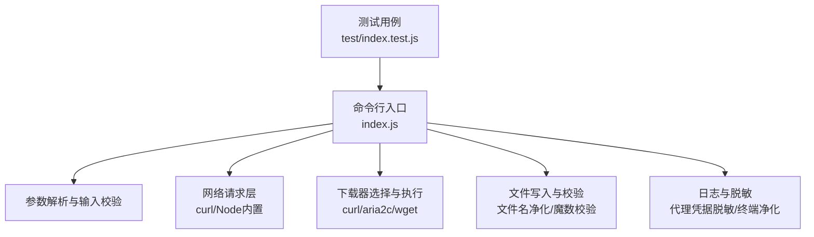
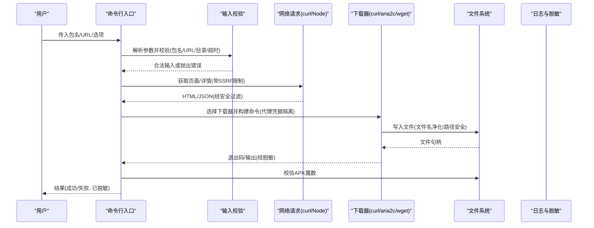
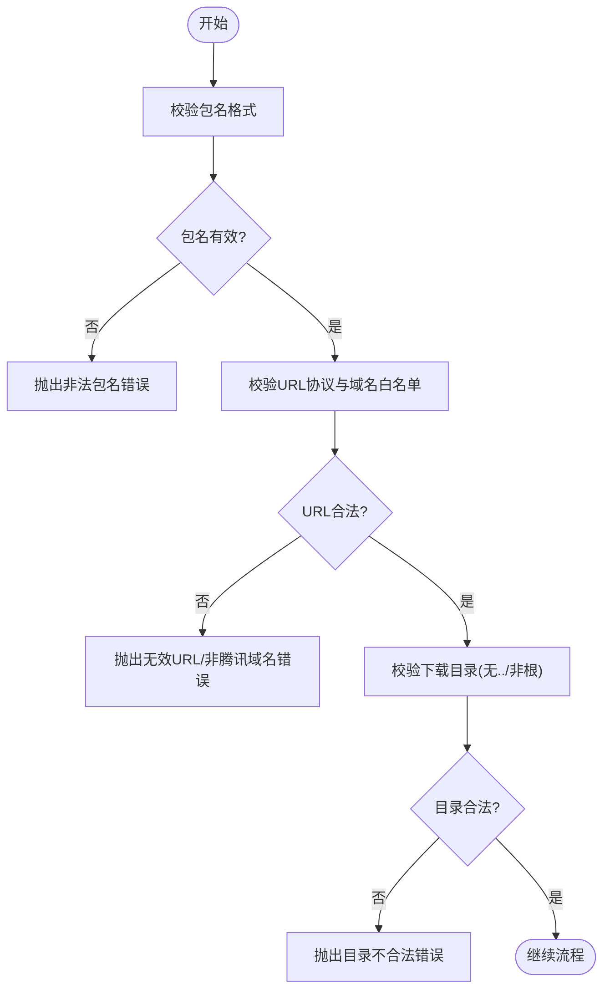
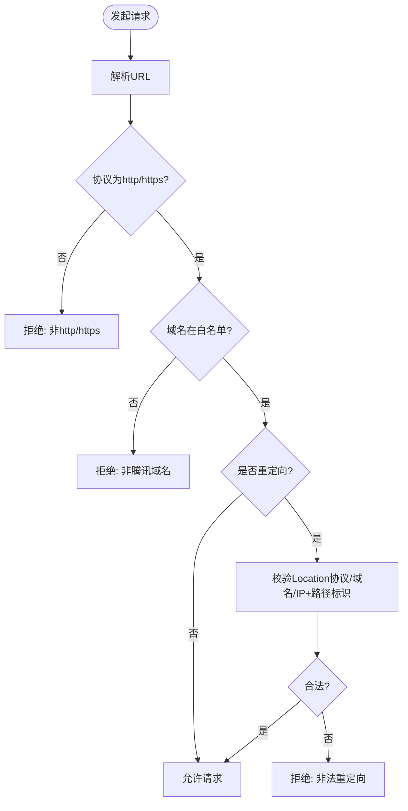
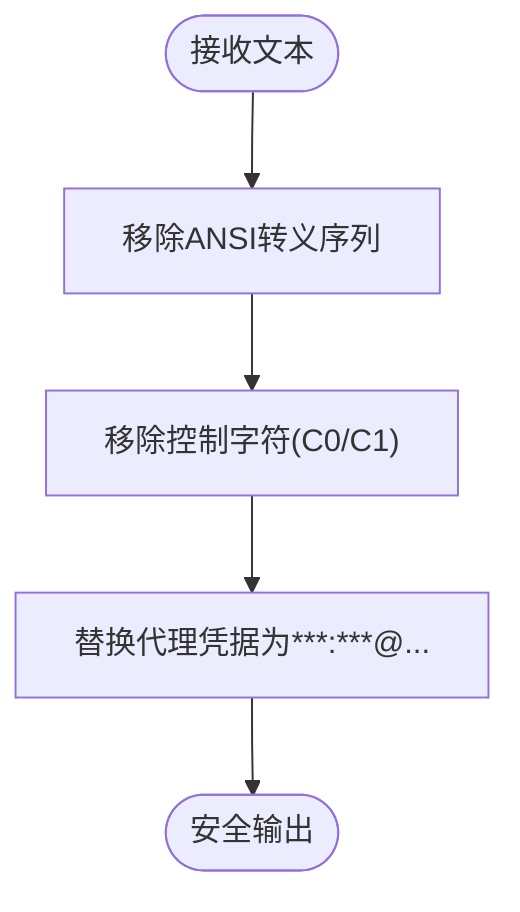
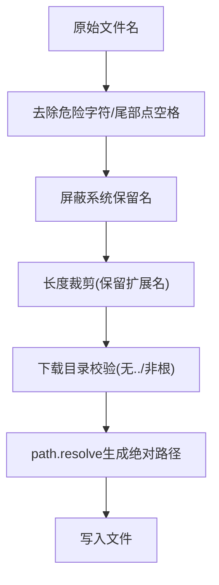
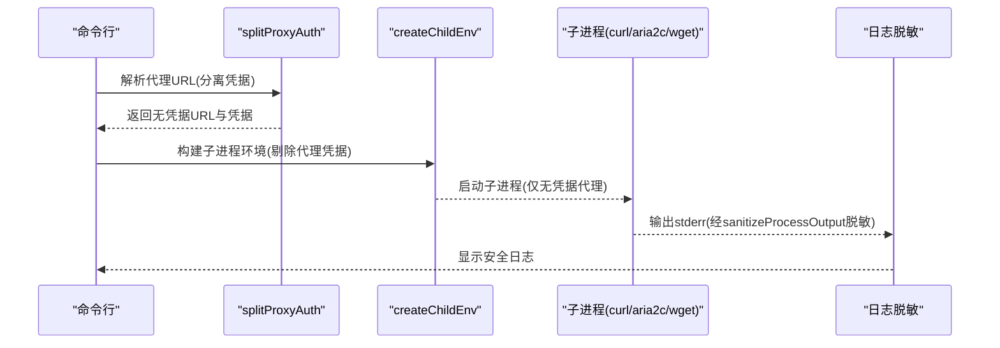
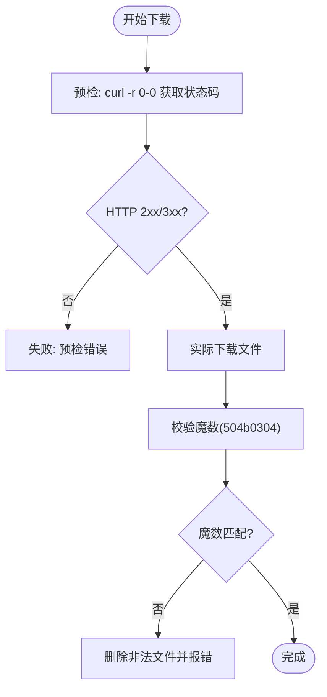
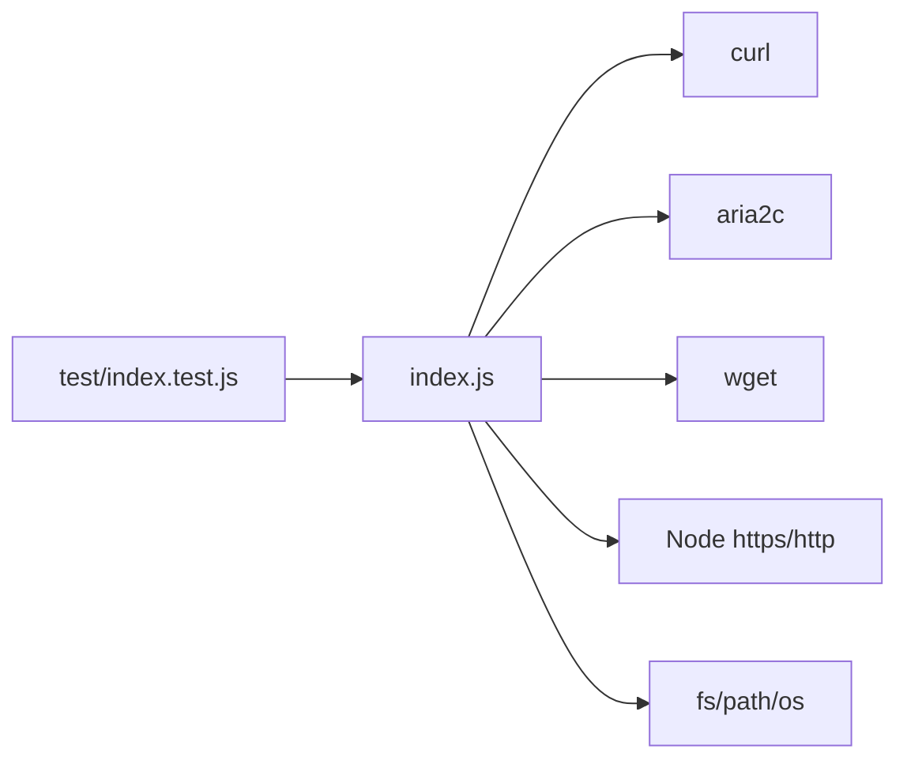

# 安全设计

<cite>
**本文引用的文件**
- [index.js](file://yyb-apk-extractor/index.js)
- [package.json](file://yyb-apk-extractor/package.json)
- [index.test.js](file://yyb-apk-extractor/test/index.test.js)
</cite>

## 目录
1. [简介](#简介)
2. [项目结构](#项目结构)
3. [核心组件](#核心组件)
4. [架构总览](#架构总览)
5. [详细组件分析](#详细组件分析)
6. [依赖关系分析](#依赖关系分析)
7. [性能与安全权衡](#性能与安全权衡)
8. [故障排除指南](#故障排除指南)
9. [结论](#结论)
10. [附录：配置最佳实践](#附录配置最佳实践)

## 简介
本安全设计文档围绕“应用宝 APK 下载链接提取器”的安全实现进行系统化说明。重点覆盖输入验证、SSRF 防护、终端输出净化、路径与文件名安全、凭据保护、下载安全（HTTPS 证书校验与文件完整性）、信任模型与安全边界，以及安全相关的配置与故障排除建议。目标是帮助使用者理解各项安全措施的设计动机、实现方式与使用约束，确保在真实环境中以最小风险运行该工具。

## 项目结构
- 入口与主逻辑：yyb-apk-extractor/index.js
- 包元数据与脚本：yyb-apk-extractor/package.json
- 单元测试（含大量安全用例）：yyb-apk-extractor/test/index.test.js

**图表来源**
- [index.js:2165-2229](file://yyb-apk-extractor/index.js#L2165-L2229)
- [index.js:502-521](file://yyb-apk-extractor/index.js#L502-L521)
- [index.js:742-753](file://yyb-apk-extractor/index.js#L742-L753)
- [index.js:1387-1438](file://yyb-apk-extractor/index.js#L1387-L1438)
- [index.js:775-790](file://yyb-apk-extractor/index.js#L775-L790)

**章节来源**
- [index.js:2165-2229](file://yyb-apk-extractor/index.js#L2165-L2229)
- [package.json:1-47](file://yyb-apk-extractor/package.json#L1-L47)

## 核心组件
- 输入与参数校验：包名白名单、URL 协议与域名白名单、搜索关键词过滤、下载目录合法性检查。
- SSRF 防护：强制 http/https；目标域名限制为腾讯可控域；对重定向目标进行严格校验；拒绝 IP 直连除非满足特定 CDN 标识。
- 终端安全：过滤 ANSI 转义序列与控制字符，避免终端注入。
- 路径与文件名安全：文件名净化、禁止路径遍历、限制系统保留名、长度裁剪。
- 凭据保护：代理 URL 拆分与临时配置文件、子进程环境剥离凭据、日志与错误信息中的凭据脱敏。
- 下载安全：可选跳过 HTTPS 证书校验（仅测试用）；下载完成后 APK 魔数校验；重定向探测仅取首字节避免大流量泄露。
- 信任模型与安全边界：默认信任腾讯生态域名；外部资源需通过白名单或通配符模式放行；所有用户输入均视为不可信。

**章节来源**
- [index.js:427-450](file://yyb-apk-extractor/index.js#L427-L450)
- [index.js:742-753](file://yyb-apk-extractor/index.js#L742-L753)
- [index.js:801-821](file://yyb-apk-extractor/index.js#L801-L821)
- [index.js:1075-1110](file://yyb-apk-extractor/index.js#L1075-L1110)
- [index.js:1387-1438](file://yyb-apk-extractor/index.js#L1387-L1438)
- [index.js:523-579](file://yyb-apk-extractor/index.js#L523-L579)
- [index.js:775-790](file://yyb-apk-extractor/index.js#L775-L790)

## 架构总览
下图展示从输入到下载完成的关键安全控制点与调用顺序。

**图表来源**
- [index.js:2165-2229](file://yyb-apk-extractor/index.js#L2165-L2229)
- [index.js:1520-1576](file://yyb-apk-extractor/index.js#L1520-L1576)
- [index.js:1634-1767](file://yyb-apk-extractor/index.js#L1634-L1767)
- [index.js:1387-1438](file://yyb-apk-extractor/index.js#L1387-L1438)
- [index.js:775-790](file://yyb-apk-extractor/index.js#L775-L790)

## 详细组件分析

### 输入验证
- 包名白名单：仅允许符合 Android 包名规则的字符串（字母开头、分段由字母数字下划线组成），用于直接模式与详情页解析。
- URL 协议与域名校验：所有对外请求必须为 http/https；域名必须属于腾讯可控范围（*.qq.com、*.myapp.com、*.qpic.cn、*.qlogo.cn 等），或通过 allowedHosts 通配符精确匹配。
- 搜索关键词过滤：仅允许中英文、数字及常用标点，防止注入与超长输入。
- 下载目录校验：禁止空值、根目录、路径遍历（..），并解析为绝对路径。

**图表来源**
- [index.js:427-450](file://yyb-apk-extractor/index.js#L427-L450)
- [index.js:742-753](file://yyb-apk-extractor/index.js#L742-L753)
- [index.js:801-821](file://yyb-apk-extractor/index.js#L801-L821)
- [index.js:386-399](file://yyb-apk-extractor/index.js#L386-L399)
- [index.js:1301-1311](file://yyb-apk-extractor/index.js#L1301-L1311)

**章节来源**
- [index.js:427-450](file://yyb-apk-extractor/index.js#L427-L450)
- [index.js:742-753](file://yyb-apk-extractor/index.js#L742-L753)
- [index.js:801-821](file://yyb-apk-extractor/index.js#L801-L821)
- [index.js:386-399](file://yyb-apk-extractor/index.js#L386-L399)
- [index.js:1301-1311](file://yyb-apk-extractor/index.js#L1301-L1311)

### SSRF 防护
- 强制协议：仅允许 http/https。
- 域名白名单：限制为目标为 *.qq.com（以及 myapp/qpic/qlogo 等腾讯生态域名）。
- 重定向目标校验：对 HTTP 重定向的 Location 再次进行域名与协议校验；针对 BEIDOU 调度场景，若主机为 IP 且路径包含 /imtt.dd.qq.com/ 则放行，否则拒绝。
- 搜索与详情页请求：均经过 assertAllowedHttpUrl 与域名白名单检查。

**图表来源**
- [index.js:742-753](file://yyb-apk-extractor/index.js#L742-L753)
- [index.js:1075-1110](file://yyb-apk-extractor/index.js#L1075-L1110)
- [index.js:1112-1178](file://yyb-apk-extractor/index.js#L1112-L1178)
- [index.js:1440-1518](file://yyb-apk-extractor/index.js#L1440-L1518)

**章节来源**
- [index.js:742-753](file://yyb-apk-extractor/index.js#L742-L753)
- [index.js:1075-1110](file://yyb-apk-extractor/index.js#L1075-L1110)
- [index.js:1112-1178](file://yyb-apk-extractor/index.js#L1112-L1178)
- [index.js:1440-1518](file://yyb-apk-extractor/index.js#L1440-L1518)

### 终端安全（ANSI 与控制字符过滤）
- 终端输出净化：过滤 ANSI 转义序列与 C1 控制字符，避免恶意渲染或终端注入。
- 子进程输出脱敏：stderr/stdout 统一经 sanitizeProcessOutput 处理，隐藏代理凭据。

**图表来源**
- [index.js:775-790](file://yyb-apk-extractor/index.js#L775-L790)
- [index.js:572-579](file://yyb-apk-extractor/index.js#L572-L579)

**章节来源**
- [index.js:775-790](file://yyb-apk-extractor/index.js#L775-L790)
- [index.js:572-579](file://yyb-apk-extractor/index.js#L572-L579)

### 路径安全（文件名净化与防路径遍历）
- 文件名净化：去除危险字符、截断过长名称、屏蔽系统保留名（con/prn/aux/nul/com/lpt 等）。
- 路径安全：下载目录不允许为空、根目录或包含 ..；最终路径通过 path.resolve 规范化。
- 临时配置文件：创建在系统临时目录，权限设置为私有（0o700/0o600），并在进程退出时清理。

**图表来源**
- [index.js:1387-1410](file://yyb-apk-extractor/index.js#L1387-L1410)
- [index.js:386-399](file://yyb-apk-extractor/index.js#L386-L399)
- [index.js:623-651](file://yyb-apk-extractor/index.js#L623-L651)

**章节来源**
- [index.js:1387-1410](file://yyb-apk-extractor/index.js#L1387-L1410)
- [index.js:386-399](file://yyb-apk-extractor/index.js#L386-L399)
- [index.js:623-651](file://yyb-apk-extractor/index.js#L623-L651)

### 凭据保护机制（代理账号密码脱敏）
- 代理 URL 拆分：将用户名/密码从 URL 中分离，避免在子进程参数与环境变量中暴露明文。
- 子进程环境隔离：创建子进程时剔除环境变量中的代理凭据，仅传递无凭据的代理地址。
- 日志与错误信息脱敏：maskUrl/maskProxySecrets 在所有日志、错误消息、stderr 中替换凭据为 ***:***@...。
- 临时配置文件：当 aria2c/curl 需要认证代理时，将凭据写入受限权限的临时配置文件，并在结束后删除。

**图表来源**
- [index.js:523-579](file://yyb-apk-extractor/index.js#L523-L579)
- [index.js:653-679](file://yyb-apk-extractor/index.js#L653-L679)
- [index.js:775-790](file://yyb-apk-extractor/index.js#L775-L790)
- [index.js:623-651](file://yyb-apk-extractor/index.js#L623-L651)

**章节来源**
- [index.js:523-579](file://yyb-apk-extractor/index.js#L523-L579)
- [index.js:653-679](file://yyb-apk-extractor/index.js#L653-L679)
- [index.js:775-790](file://yyb-apk-extractor/index.js#L775-L790)
- [index.js:623-651](file://yyb-apk-extractor/index.js#L623-L651)

### 下载安全（HTTPS 证书校验与文件完整性）
- HTTPS 证书校验：默认启用；可通过 --insecure 跳过（仅限测试环境）。
- 重定向探测：使用 curl 的 GET + Range 0-0 预检，仅传输首字节，避免在大文件场景下泄露带宽。
- 文件完整性：下载完成后读取前 4 字节魔数，校验是否为 ZIP/APK（504b0304），不匹配则自动删除文件并报错。

**图表来源**
- [index.js:1440-1518](file://yyb-apk-extractor/index.js#L1440-L1518)
- [index.js:1412-1438](file://yyb-apk-extractor/index.js#L1412-L1438)
- [index.js:1010-1013](file://yyb-apk-extractor/index.js#L1010-L1013)
- [index.js:1048-1049](file://yyb-apk-extractor/index.js#L1048-L1049)
- [index.js:1070-1071](file://yyb-apk-extractor/index.js#L1070-L1071)

**章节来源**
- [index.js:1440-1518](file://yyb-apk-extractor/index.js#L1440-L1518)
- [index.js:1412-1438](file://yyb-apk-extractor/index.js#L1412-L1438)
- [index.js:1010-1013](file://yyb-apk-extractor/index.js#L1010-L1013)
- [index.js:1048-1049](file://yyb-apk-extractor/index.js#L1048-L1049)
- [index.js:1070-1071](file://yyb-apk-extractor/index.js#L1070-L1071)

### 安全边界与信任模型
- 信任边界：默认信任腾讯生态域名（*.qq.com、*.myapp.com、*.qpic.cn、*.qlogo.cn）；其他域名一律拒绝。
- 外部资源：图标、下载链接等来自页面的字段均需通过 safeTencentUrl 校验。
- 用户输入：全部视为不可信，需经过严格白名单与格式校验。
- 重定向：对 Location 头进行二次校验，防止 SSRF 绕过。

**章节来源**
- [index.js:801-821](file://yyb-apk-extractor/index.js#L801-L821)
- [index.js:1333-1349](file://yyb-apk-extractor/index.js#L1333-L1349)
- [index.js:1112-1178](file://yyb-apk-extractor/index.js#L1112-L1178)
- [index.js:1440-1518](file://yyb-apk-extractor/index.js#L1440-L1518)

## 依赖关系分析
- 外部工具依赖：curl、aria2c、wget 作为下载器；未安装时将回退或提示。
- Node 内置模块：https/http/fs/path/os/child_process/readline。
- 测试覆盖：大量安全相关用例验证代理、URL、终端净化、临时文件清理等行为。

**图表来源**
- [index.js:870-921](file://yyb-apk-extractor/index.js#L870-L921)
- [index.js:1634-1767](file://yyb-apk-extractor/index.js#L1634-L1767)
- [index.test.js:954-1158](file://yyb-apk-extractor/test/index.test.js#L954-L1158)

**章节来源**
- [index.js:870-921](file://yyb-apk-extractor/index.js#L870-L921)
- [index.js:1634-1767](file://yyb-apk-extractor/index.js#L1634-L1767)
- [index.test.js:954-1158](file://yyb-apk-extractor/test/index.test.js#L954-L1158)

## 性能与安全权衡
- 重定向预检使用 Range 0-0 以降低带宽占用与时间成本，同时保持安全性。
- 下载器选择策略优先 curl（代理支持更好），其次 aria2c（多连接），最后 wget（稳定性较差）。
- 临时配置文件仅在需要认证代理时使用，减少不必要 IO。
- 终端颜色输出在非 TTY 或 NO_COLOR/--no-color 时禁用，保证管道输出稳定。

[本节为通用指导，无需具体文件引用]

## 故障排除指南
- 代理问题：
  - 确认代理 URL 格式正确（http/https/socks5/socks5h），且包含主机与端口。
  - 若使用带认证的代理，请确保安装了 curl 或 aria2c；wget 不支持 socks5/socks5h 与命令行传递密码。
  - 查看日志中的脱敏信息，确认凭据未被泄露。
- 域名被拒绝：
  - 检查目标是否为 *.qq.com 或允许的腾讯生态域名；如为重定向，确认 Location 也符合要求。
  - 对于 BEIDOU 调度 IP 重定向，需包含 /imtt.dd.qq.com/ 路径标识。
- 下载失败：
  - 检查网络超时设置（--timeout）；必要时增大超时。
  - 确认下载工具可用（doctor 模式检查）。
  - 若文件魔数不匹配，工具会自动删除并报错，请重试或检查源链接。
- 终端异常：
  - 如遇 ANSI 控制字符导致显示异常，可使用 --no-color 禁用颜色输出。
  - 检查 stderr 输出是否被 sanitizeTerminalOutput 净化。

**章节来源**
- [index.js:502-521](file://yyb-apk-extractor/index.js#L502-L521)
- [index.js:923-966](file://yyb-apk-extractor/index.js#L923-L966)
- [index.js:1412-1438](file://yyb-apk-extractor/index.js#L1412-L1438)
- [index.js:775-790](file://yyb-apk-extractor/index.js#L775-L790)

## 结论
该工具通过严格的输入白名单、域名白名单、重定向校验、终端净化、路径与文件名安全、凭据脱敏与隔离、HTTPS 证书校验与文件完整性检查，构建了多层次的安全边界。这些措施共同抵御了常见的 SSRF、终端注入、路径遍历、凭据泄露与恶意文件风险。建议在生产环境中始终启用证书校验、避免使用 --insecure，并遵循最小权限原则配置代理与下载目录。

[本节为总结性内容，无需具体文件引用]

## 附录：配置最佳实践
- 代理配置：
  - 推荐使用 http:// 或 socks5h:// 代理；避免使用 socks5://（本地 DNS 易失败）。
  - 不要将代理凭据暴露在命令行或日志中；工具已自动脱敏，但仍应避免手动打印。
- 下载目录：
  - 指定明确的下载目录，避免使用当前目录或根目录；禁止包含 ..。
- 超时设置：
  - 根据网络状况调整 --timeout；单位可为 ms/s/m。
- 证书校验：
  - 生产环境务必启用 HTTPS 证书校验；--insecure 仅限测试。
- 工具可用性：
  - 使用 doctor 模式检查 curl/aria2c/wget 是否可用；缺失时将影响功能。
- 终端输出：
  - 在 CI/管道中使用 --no-color 以避免 ANSI 干扰。

**章节来源**
- [index.js:35-42](file://yyb-apk-extractor/index.js#L35-L42)
- [index.js:154-166](file://yyb-apk-extractor/index.js#L154-L166)
- [index.js:340-380](file://yyb-apk-extractor/index.js#L340-L380)
- [index.js:923-966](file://yyb-apk-extractor/index.js#L923-L966)