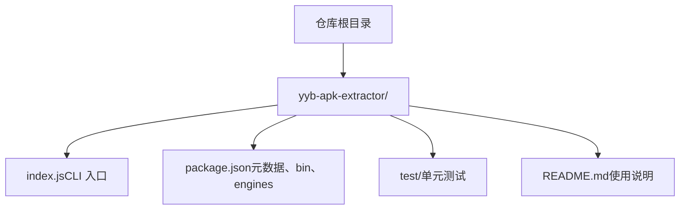
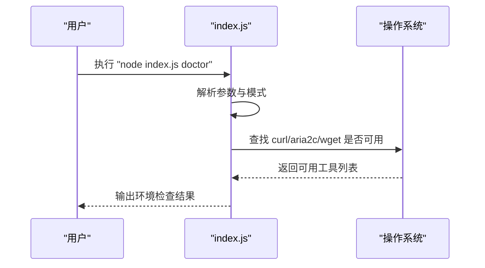
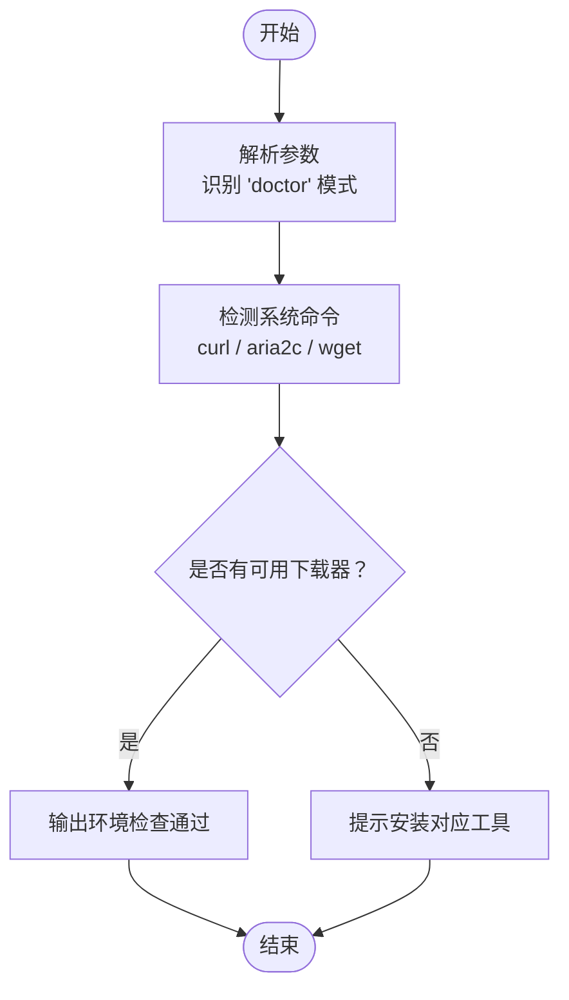
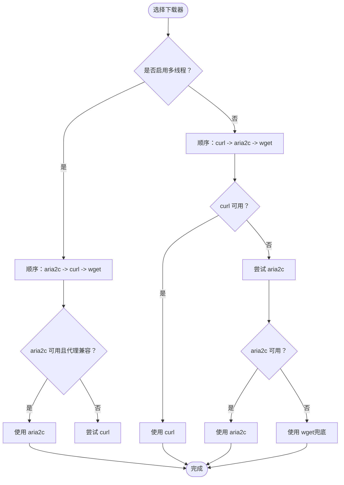
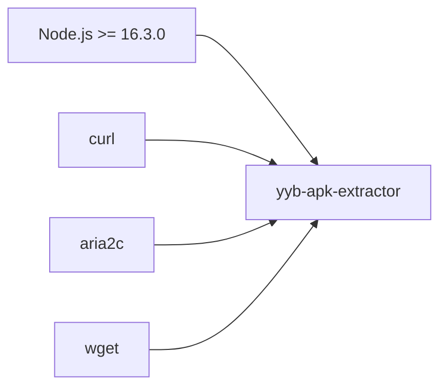
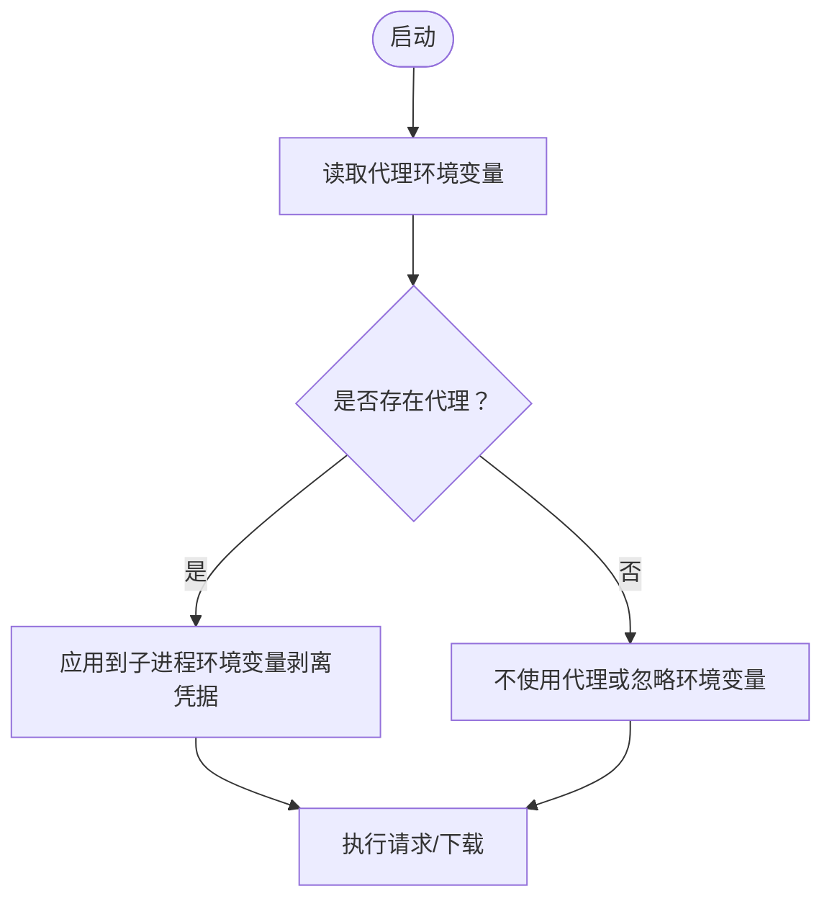

# 安装与环境配置

<cite>
**本文引用的文件**
- [yyb-apk-extractor/package.json](file://yyb-apk-extractor/package.json)
- [yyb-apk-extractor/README.md](file://yyb-apk-extractor/README.md)
- [yyb-apk-extractor/index.js](file://yyb-apk-extractor/index.js)
</cite>

## 目录
1. [简介](#简介)
2. [项目结构](#项目结构)
3. [核心组件](#核心组件)
4. [架构总览](#架构总览)
5. [详细组件分析](#详细组件分析)
6. [依赖关系分析](#依赖关系分析)
7. [性能与下载器选择](#性能与下载器选择)
8. [故障排除指南](#故障排除指南)
9. [结论](#结论)
10. [附录：环境变量与代理](#附录：环境变量与代理)

## 简介
本章节面向首次使用者，说明如何在本机正确安装并运行 yyb-apk-extractor。该工具是一个纯命令行程序，用于从应用宝官网提取 Android APK 直链，支持搜索、交互式选择、代理和多连接下载。它不依赖浏览器，且无 npm 第三方依赖，便于在脚本和 CI 中集成。

## 项目结构
仓库根目录下包含一个可独立运行的 CLI 工具目录 yyb-apk-extractor，其入口为 index.js，并通过 package.json 声明全局命令别名。

**图表来源**
- [yyb-apk-extractor/index.js:1-42](file://yyb-apk-extractor/index.js#L1-L42)
- [yyb-apk-extractor/package.json:1-47](file://yyb-apk-extractor/package.json#L1-L47)

**章节来源**
- [yyb-apk-extractor/package.json:1-47](file://yyb-apk-extractor/package.json#L1-L47)
- [yyb-apk-extractor/README.md:12-42](file://yyb-apk-extractor/README.md#L12-L42)

## 核心组件
- 环境要求与检查
  - Node.js 版本要求：>= 16.3.0（由 engines 字段声明）。
  - 可选下载工具：curl / aria2c / wget（至少具备其一；多连接下载需要 aria2c）。
  - 使用内置 doctor 命令检查本机环境与可用下载器。
- 安装方式
  - 克隆仓库后直接通过 node index.js 运行。
  - 可选安装全局命令：npm link 后使用 yyb-apk-extractor 命令。
- 平台差异
  - macOS：可通过 brew 安装 curl、aria2、wget。
  - Debian/Ubuntu：可通过 apt-get 安装 curl、aria2、wget。
  - Windows：通常自带 curl；aria2c/wget 可通过 winget、Scoop、Chocolatey 或官方 release 安装并加入 PATH。
- Windows 终端 UTF-8
  - 建议使用 Windows Terminal 或 PowerShell，保持 UTF-8 输出。
  - 若使用老旧 cmd.exe 且显示异常，可在运行前执行 chcp 65001 切换至 UTF-8。

**章节来源**
- [yyb-apk-extractor/package.json:34-36](file://yyb-apk-extractor/package.json#L34-L36)
- [yyb-apk-extractor/README.md:67-93](file://yyb-apk-extractor/README.md#L67-L93)
- [yyb-apk-extractor/README.md:12-42](file://yyb-apk-extractor/README.md#L12-L42)
- [yyb-apk-extractor/index.js:137-202](file://yyb-apk-extractor/index.js#L137-L202)

## 架构总览
下图展示了“环境检查”的调用流程：用户执行 doctor 命令后，程序解析参数、检测系统命令可用性（curl/aria2c/wget），并报告结果。

**图表来源**
- [yyb-apk-extractor/index.js:209-338](file://yyb-apk-extractor/index.js#L209-L338)
- [yyb-apk-extractor/index.js:458-493](file://yyb-apk-extractor/index.js#L458-L493)

## 详细组件分析

### 环境检查（doctor）
- 作用：验证 Node.js 版本、检测本机是否安装了 curl/aria2c/wget，并给出下一步建议。
- 使用方式：
  - 本地运行：node index.js doctor
  - 全局命令：yyb-apk-extractor doctor（需先执行 npm link）
- 行为要点：
  - 非 TTY 环境下无法进入交互模式，必须显式传入命令或参数。
  - 成功时标准输出保持 JSON，便于自动化处理。

**图表来源**
- [yyb-apk-extractor/index.js:209-338](file://yyb-apk-extractor/index.js#L209-L338)
- [yyb-apk-extractor/index.js:458-493](file://yyb-apk-extractor/index.js#L458-L493)

**章节来源**
- [yyb-apk-extractor/README.md:12-42](file://yyb-apk-extractor/README.md#L12-L42)
- [yyb-apk-extractor/README.md:67-93](file://yyb-apk-extractor/README.md#L67-L93)
- [yyb-apk-extractor/index.js:209-338](file://yyb-apk-extractor/index.js#L209-L338)

### 下载器选择与优先级
- 默认策略：优先 curl，其次 aria2c，最后 wget。
- 多线程模式：开启 --multi-thread 时优先 aria2c，再回退到 curl/wget。
- 限制条件：
  - aria2c 不支持 socks5/socks5h 代理。
  - wget 不支持安全传递代理凭据与 SOCKS 代理。
- 自动回退：当首选工具不可用或不满足条件时，自动尝试下一个可用工具。

**图表来源**
- [yyb-apk-extractor/index.js:458-493](file://yyb-apk-extractor/index.js#L458-L493)

**章节来源**
- [yyb-apk-extractor/index.js:458-493](file://yyb-apk-extractor/index.js#L458-L493)

### 跨平台安装方法
- macOS
  - 推荐通过 Homebrew 安装 curl、aria2、wget。
- Debian/Ubuntu
  - 推荐通过 apt-get 安装 curl、aria2、wget。
- Windows
  - 通常自带 curl；aria2c/wget 可通过 winget、Scoop、Chocolatey 或官方 release 安装并加入 PATH。
- 终端编码
  - 推荐使用 Windows Terminal 或 PowerShell，并保持 UTF-8 输出。
  - 若使用 cmd.exe 且中文显示异常，请先执行 chcp 65001。

**章节来源**
- [yyb-apk-extractor/README.md:67-93](file://yyb-apk-extractor/README.md#L67-L93)

### 全局命令安装
- 本地运行：node index.js
- 全局命令：
  - 执行 npm link 后，可使用 yyb-apk-extractor 命令。
  - 适用于希望在任何目录直接调用该工具的开发者或脚本。

**章节来源**
- [yyb-apk-extractor/README.md:12-42](file://yyb-apk-extractor/README.md#L12-L42)
- [yyb-apk-extractor/package.json:6-8](file://yyb-apk-extractor/package.json#L6-L8)

## 依赖关系分析
- 运行时依赖
  - Node.js >= 16.3.0（由 engines 字段约束）。
  - 外部命令：curl / aria2c / wget（至少具备其一；多连接下载需要 aria2c）。
- 包管理
  - 无第三方 npm 依赖，发布包体积小，适合脚本与 CI。
- 二进制入口
  - bin 字段将 index.js 映射为全局命令 yyb-apk-extractor。

**图表来源**
- [yyb-apk-extractor/package.json:34-36](file://yyb-apk-extractor/package.json#L34-L36)
- [yyb-apk-extractor/package.json:6-8](file://yyb-apk-extractor/package.json#L6-L8)

**章节来源**
- [yyb-apk-extractor/package.json:1-47](file://yyb-apk-extractor/package.json#L1-L47)

## 性能与下载器选择
- 超时策略
  - 默认网络超时 30000ms（可配置），下载阶段仅作为连接建立与断流检测时间，不限制大文件总下载时长。
- 多连接下载
  - 开启 --multi-thread 或使用 --downloader=aria2c 可提升大文件下载速度，实际效果取决于 CDN 分片支持。
- 工具选择
  - 页面提取阶段优先 curl；文件下载默认 curl，必要时回退到 aria2c 或 wget。
- 断点续传
  - aria2c 支持断点续传；curl/wget 在下载前会进行重定向预检以提升稳定性。

**章节来源**
- [yyb-apk-extractor/index.js:340-384](file://yyb-apk-extractor/index.js#L340-L384)
- [yyb-apk-extractor/index.js:458-493](file://yyb-apk-extractor/index.js#L458-L493)
- [yyb-apk-extractor/README.md:291-301](file://yyb-apk-extractor/README.md#L291-L301)

## 故障排除指南
- 无法进入交互模式
  - 在非 TTY 环境（如 CI、管道、重定向输入）下，请显式传入包名、URL、search 或 doctor 命令。
- 找不到下载器
  - 确保已安装 curl 或 aria2c 或 wget；如需多连接下载，请安装 aria2c。
  - 若使用代理，注意 aria2c 不支持 socks5/socks5h，wget 不支持 SOCKS 与安全凭据传递。
- 中文显示异常（Windows）
  - 使用 Windows Terminal 或 PowerShell，并确保 UTF-8 输出；或在 cmd.exe 中执行 chcp 65001。
- 代理相关错误
  - 检查代理 URL 格式与协议（http/https/socks5/socks5h），避免路径、查询串或片段。
  - 若凭据泄露风险，请使用 --no-proxy 或通过环境变量设置代理。
- 下载失败或中断
  - 调整 --timeout 值；对慢速网络可适当增大超时。
  - 对大文件启用 --multi-thread 并使用 aria2c。

**章节来源**
- [yyb-apk-extractor/index.js:209-338](file://yyb-apk-extractor/index.js#L209-L338)
- [yyb-apk-extractor/index.js:458-493](file://yyb-apk-extractor/index.js#L458-L493)
- [yyb-apk-extractor/README.md:67-93](file://yyb-apk-extractor/README.md#L67-L93)

## 结论
通过遵循本指南，您可以在不同平台上快速安装并运行 yyb-apk-extractor。使用 doctor 命令检查环境，按需安装下载器，并根据网络情况选择合适的代理与下载器。对于初学者，建议先从本地 node index.js 开始，熟悉后再考虑全局命令与自动化集成。

## 附录：环境变量与代理
- 支持的代理环境变量（按优先级读取）
  - HTTPS_PROXY / https_proxy / HTTP_PROXY / http_proxy / ALL_PROXY / all_proxy
- 使用方法
  - 通过命令行选项 --proxy=地址 设置代理，或设置上述环境变量以生效。
  - 使用 --no-proxy 可忽略环境变量中的代理设置。
- 安全注意事项
  - 子进程环境变量会剥离代理凭据，避免泄露。
  - 日志与错误信息会对代理凭据进行脱敏处理。

**图表来源**
- [yyb-apk-extractor/index.js:217-224](file://yyb-apk-extractor/index.js#L217-L224)
- [yyb-apk-extractor/index.js:653-679](file://yyb-apk-extractor/index.js#L653-L679)

**章节来源**
- [yyb-apk-extractor/README.md:137-143](file://yyb-apk-extractor/README.md#L137-L143)
- [yyb-apk-extractor/index.js:217-224](file://yyb-apk-extractor/index.js#L217-L224)
- [yyb-apk-extractor/index.js:653-679](file://yyb-apk-extractor/index.js#L653-L679)