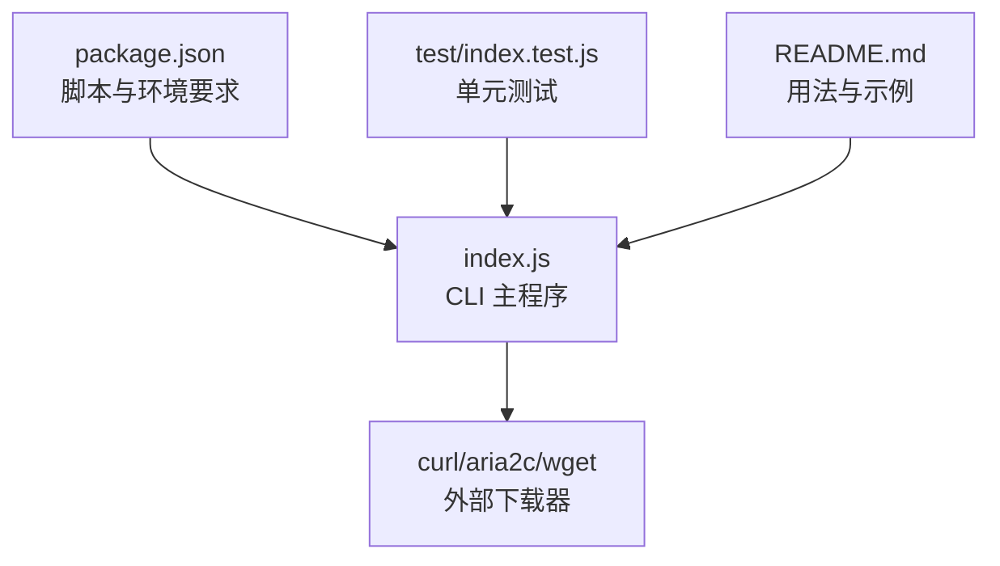
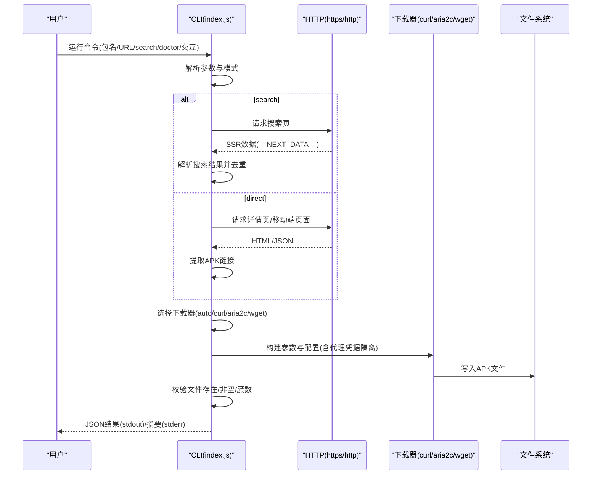
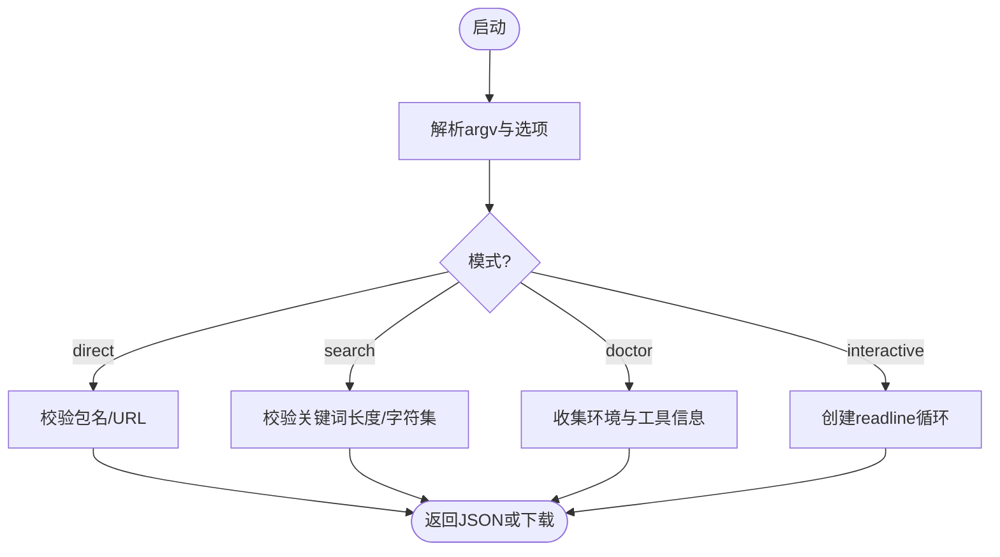
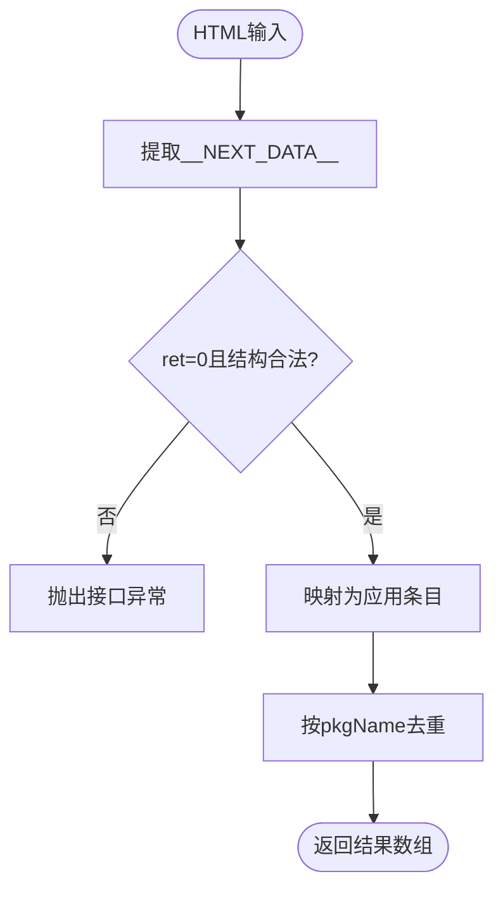
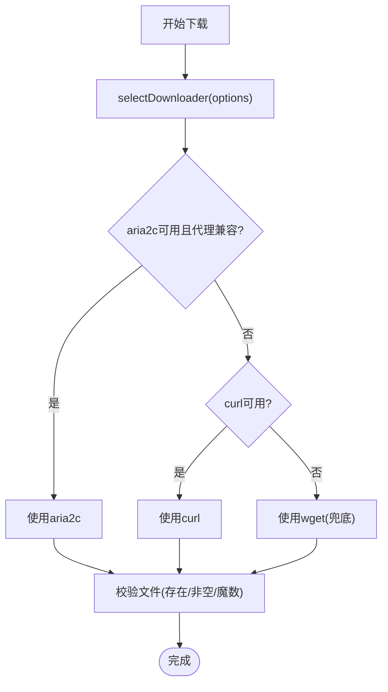
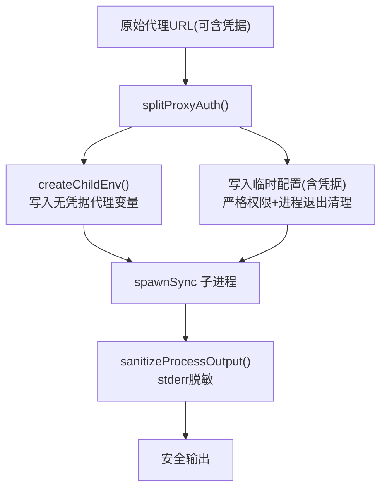
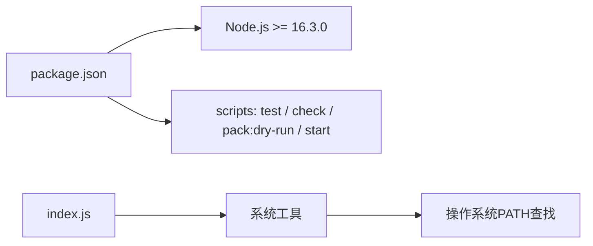

# 开发与测试

<cite>
**本文引用的文件**
- [package.json](file://yyb-apk-extractor/package.json)
- [README.md](file://yyb-apk-extractor/README.md)
- [index.js](file://yyb-apk-extractor/index.js)
- [index.test.js](file://yyb-apk-extractor/test/index.test.js)
</cite>

## 目录
1. [简介](#简介)
2. [项目结构](#项目结构)
3. [核心组件](#核心组件)
4. [架构总览](#架构总览)
5. [详细组件分析](#详细组件分析)
6. [依赖关系分析](#依赖关系分析)
7. [性能与稳定性](#性能与稳定性)
8. [故障排查指南](#故障排查指南)
9. [贡献指南](#贡献指南)
10. [结论](#结论)

## 简介
本指南面向贡献者与使用者，说明 yyb-apk-extractor 的开发环境搭建、测试框架与用例、测试执行命令、覆盖范围、调试技巧与常见问题。该工具是一个纯 Node.js CLI，用于从应用宝官网提取 APK 直链，支持搜索、交互选择、代理与自动下载，零 npm 运行时依赖（仅依赖系统工具 curl/aria2c/wget）。

## 项目结构
- 入口与主逻辑：index.js
- 包元信息与脚本：package.json
- 用户文档与使用说明：README.md
- 单元测试：test/index.test.js

**图表来源**
- [package.json:1-47](file://yyb-apk-extractor/package.json#L1-L47)
- [index.js:1-120](file://yyb-apk-extractor/index.js#L1-L120)
- [index.test.js:1-80](file://yyb-apk-extractor/test/index.test.js#L1-L80)
- [README.md:1-120](file://yyb-apk-extractor/README.md#L1-L120)

**章节来源**
- [package.json:1-47](file://yyb-apk-extractor/package.json#L1-L47)
- [README.md:1-120](file://yyb-apk-extractor/README.md#L1-L120)

## 核心组件
- 参数解析与模式路由：支持 direct/search/doctor/interactive 等模式，校验位置参数与选项。
- 网络与安全：SSRF 防护、域名白名单、URL 规范化、代理协议与凭据脱敏。
- 下载器选择：auto/curl/aria2c/wget，按可用性与代理能力动态选择。
- 交互与输出：readline 封装、ANSI 颜色控制、终端输出净化、JSON stdout、日志 stderr。
- 环境检查：doctor 模式汇总 Node、平台、工具可用性。

**章节来源**
- [index.js:209-338](file://yyb-apk-extractor/index.js#L209-L338)
- [index.js:458-493](file://yyb-apk-extractor/index.js#L458-L493)
- [index.js:495-580](file://yyb-apk-extractor/index.js#L495-L580)
- [index.js:742-800](file://yyb-apk-extractor/index.js#L742-L800)

## 架构总览
下图展示一次“搜索并下载”的典型调用序列，包括参数解析、网络请求、结果解析、下载器选择与下载验证。

**图表来源**
- [index.js:209-338](file://yyb-apk-extractor/index.js#L209-L338)
- [index.js:458-493](file://yyb-apk-extractor/index.js#L458-L493)
- [index.js:742-800](file://yyb-apk-extractor/index.js#L742-L800)
- [index.test.js:749-782](file://yyb-apk-extractor/test/index.test.js#L749-L782)

## 详细组件分析

### 参数解析与 CLI 行为
- 支持 --help/--version/--no-color/--verbose/--insecure/--timeout/--download-dir/--downloader/--multi-thread/--connections/--proxy/--no-proxy/--interactive。
- 非 TTY 下禁止进入交互模式，避免管道/CI 误用。
- 成功输出保持 JSON 到 stdout；提示与日志写入 stderr。

**图表来源**
- [index.js:209-338](file://yyb-apk-extractor/index.js#L209-L338)
- [index.test.js:520-657](file://yyb-apk-extractor/test/index.test.js#L520-L657)

**章节来源**
- [index.js:209-338](file://yyb-apk-extractor/index.js#L209-L338)
- [index.test.js:520-657](file://yyb-apk-extractor/test/index.test.js#L520-L657)

### 搜索结果解析
- 从 Next.js SSR 的 __NEXT_DATA__ 中抽取应用列表，过滤非法条目，按包名去重并保持顺序。
- 提供摘要格式化函数，便于终端快速浏览。

**图表来源**
- [index.test.js:274-393](file://yyb-apk-extractor/test/index.test.js#L274-L393)

**章节来源**
- [index.test.js:274-393](file://yyb-apk-extractor/test/index.test.js#L274-L393)

### 下载器选择与下载流程
- 默认优先 curl，多线程模式优先 aria2c；wget 作为兜底。
- 根据代理协议与凭据限制选择：aria2c 不支持 socks5/socks5h；wget 拒绝带凭据与 SOCKS 代理。
- 下载前进行重定向预检，下载后校验文件存在、非空及 APK 魔数。

**图表来源**
- [index.js:458-493](file://yyb-apk-extractor/index.js#L458-L493)
- [index.test.js:784-940](file://yyb-apk-extractor/test/index.test.js#L784-L940)

**章节来源**
- [index.js:458-493](file://yyb-apk-extractor/index.js#L458-L493)
- [index.test.js:784-940](file://yyb-apk-extractor/test/index.test.js#L784-L940)

### 代理凭据脱敏与安全
- 所有子进程环境变量中的代理键统一剥离账号密码，仅传递无凭据 URL。
- 工具配置通过独立配置文件或参数承载凭据，并在错误/日志输出中进行脱敏。
- 终端输出过滤 ANSI 转义与控制字符，防止注入。

**图表来源**
- [index.js:523-580](file://yyb-apk-extractor/index.js#L523-L580)
- [index.js:653-679](file://yyb-apk-extractor/index.js#L653-L679)
- [index.test.js:954-1158](file://yyb-apk-extractor/test/index.test.js#L954-L1158)

**章节来源**
- [index.js:523-580](file://yyb-apk-extractor/index.js#L523-L580)
- [index.js:653-679](file://yyb-apk-extractor/index.js#L653-L679)
- [index.test.js:954-1158](file://yyb-apk-extractor/test/index.test.js#L954-L1158)

### 交互模式与输入处理
- 基于 readline 封装，支持 search/select/download/get/proxy/timeout/doctor/help/exit。
- 对超时、关闭状态、单次 ask 禁用超时等进行测试覆盖。

**章节来源**
- [index.test.js:1160-1196](file://yyb-apk-extractor/test/index.test.js#L1160-L1196)

## 依赖关系分析
- 运行时依赖：无 npm 依赖，仅依赖 Node.js 标准库与系统工具 curl/aria2c/wget。
- 包元数据：声明 engines.node >= 16.3.0，bin 指向 index.js，scripts 定义 test/check/pack:dry-run/start。
- 测试依赖：仅使用 Node 内置 assert、fs、path、child_process。

**图表来源**
- [package.json:1-47](file://yyb-apk-extractor/package.json#L1-L47)
- [index.js:59-83](file://yyb-apk-extractor/index.js#L59-L83)

**章节来源**
- [package.json:1-47](file://yyb-apk-extractor/package.json#L1-L47)

## 性能与稳定性
- 大文件下载：curl/aria2c/wget 均支持断点续传；aria2c 多连接需 CDN 分片支持。
- 超时策略：fetch 阶段限制总时长；下载阶段以连接/断流检测为主，不限制总时长。
- 资源清理：临时配置文件在进程信号/退出时清理，避免凭据残留。
- 缓冲限制：子进程输出最大缓冲限制，防止内存占用过大。

[本节为通用指导，无需特定文件引用]

## 故障排查指南
- 非 TTY 无法交互：在非交互式环境中必须显式传入包名/URL/search/doctor，否则会报错。
- 代理凭据泄露：确保使用 --proxy 或环境变量；若失败，检查 stderr 是否已脱敏（不应出现明文密码）。
- 下载失败：确认 curl/aria2c/wget 已安装且在 PATH 中；必要时指定 --downloader；大文件建议开启 --multi-thread。
- 证书问题：测试环境可使用 --insecure；生产环境不建议。
- 路径与文件名：Windows 保留名与非法字符会被净化；如下载目录非法会提示重新输入。

**章节来源**
- [index.test.js:749-782](file://yyb-apk-extractor/test/index.test.js#L749-L782)
- [index.test.js:954-1158](file://yyb-apk-extractor/test/index.test.js#L954-L1158)

## 贡献指南

### 开发环境搭建
- Node.js 版本：>= 16.3.0（见 engines 字段）
- 依赖安装：本项目无 npm 依赖，直接克隆仓库即可
- 本地运行：node index.js 或安装全局命令后使用 yyb-apk-extractor

**章节来源**
- [package.json:34-36](file://yyb-apk-extractor/package.json#L34-L36)
- [README.md:12-42](file://yyb-apk-extractor/README.md#L12-L42)

### 测试框架与用例
- 测试框架：Node 内置 assert + 自定义队列 runner
- 覆盖范围：
  - 参数解析与 CLI 行为（模式切换、TTY 判断、帮助/版本/颜色）
  - 搜索结果解析（__NEXT_DATA__ 抽取、去重、摘要）
  - 下载器选择与执行（curl/aria2c/wget 参数构造、代理凭据隔离、临时配置清理）
  - 代理校验与脱敏（协议、主机、端口、凭据剥离、错误信息脱敏）
  - 终端输出净化（ANSI 控制符过滤）
  - 交互输入解析（readline 封装、超时、关闭状态）
  - 模拟 aria2c 下载链路（fake 命令验证参数与文件魔数）

**章节来源**
- [index.test.js:107-782](file://yyb-apk-extractor/test/index.test.js#L107-L782)
- [index.test.js:784-940](file://yyb-apk-extractor/test/index.test.js#L784-L940)
- [index.test.js:954-1196](file://yyb-apk-extractor/test/index.test.js#L954-L1196)

### 测试执行命令
- npm test：执行语法检查与单元测试
- npm run check：执行测试并额外进行 npm pack --dry-run，用于提交前确认发布包内容

**章节来源**
- [package.json:15-19](file://yyb-apk-extractor/package.json#L15-L19)
- [README.md:339-348](file://yyb-apk-extractor/README.md#L339-L348)

### CI/CD 流程
- 仓库未包含 GitHub Actions 工作流文件；README 中标注了 CI 徽章，但当前仓库内未检出 .github 目录与工作流配置。
- 建议在 .github/workflows/ci.yml 中配置多平台矩阵（macOS/Linux/Windows）与 Node.js 版本（16/20/24），统一执行 npm test 与 npm run check。

[本节为概念性说明，未直接分析具体文件]

### 代码风格与提交规范
- 代码风格：遵循 Node.js 社区惯例，保持函数职责单一、命名清晰、错误尽早抛出。
- 提交规范：建议采用 conventional commits（feat/fix/docs/test/chore），描述变更影响面。
- Pull Request 流程：
  - 分支命名：feature/xxx、fix/xxx、chore/xxx
  - PR 描述：说明目的、变更点、测试覆盖、兼容性影响
  - 检查：确保 npm test 与 npm run check 通过

[本节为通用实践建议，无需特定文件引用]

## 结论
yyb-apk-extractor 以零 npm 依赖、强安全设计、完善的测试覆盖和跨平台支持，提供了稳定可靠的 APK 直链提取与下载能力。贡献者可通过清晰的测试用例与脚本快速定位问题，并通过严格的代理凭据脱敏与输入校验保障安全性。建议在 CI 中补充多平台矩阵以进一步提升可靠性。