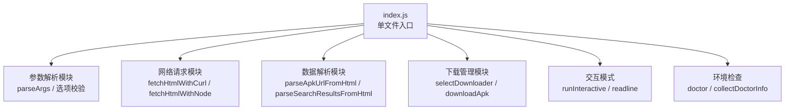
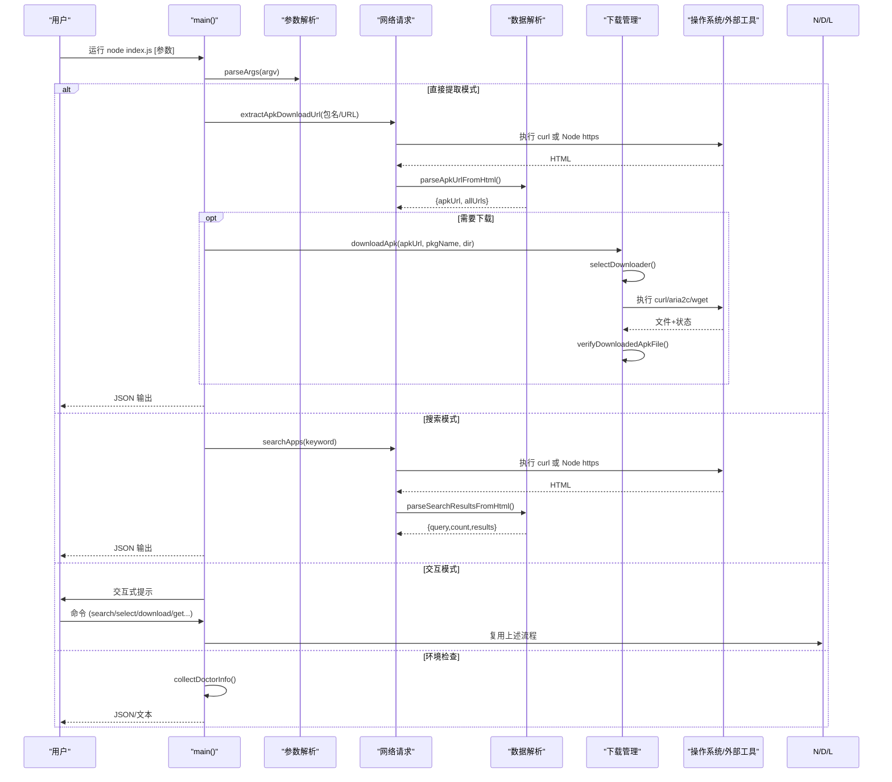
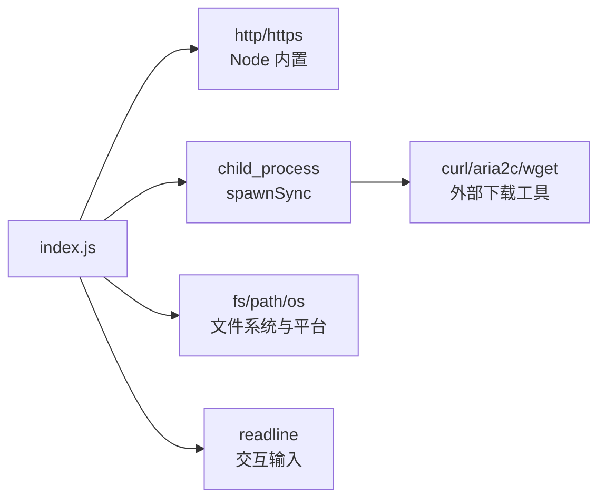

# 技术架构

<cite>
**本文引用的文件**
- [yyb-apk-extractor/index.js](file://yyb-apk-extractor/index.js)
- [yyb-apk-extractor/package.json](file://yyb-apk-extractor/package.json)
- [yyb-apk-extractor/README.md](file://yyb-apk-extractor/README.md)
</cite>

## 目录
1. [简介](#简介)
2. [项目结构](#项目结构)
3. [核心组件](#核心组件)
4. [架构总览](#架构总览)
5. [详细组件分析](#详细组件分析)
6. [依赖关系分析](#依赖关系分析)
7. [性能与可靠性](#性能与可靠性)
8. [故障排查指南](#故障排查指南)
9. [结论](#结论)
10. [附录：扩展点与自定义能力](#附录：扩展点与自定义能力)

## 简介
本项目是一个单文件 Node.js 命令行工具，用于从腾讯应用宝移动端页面提取 APK 直链并支持自动下载。系统采用“单文件应用 + 模块化设计”的架构：所有逻辑集中在一个入口文件中，通过函数分层和职责划分实现模块化的可维护性；在“下载器选择”上采用策略模式，在“下载器创建/发现”上采用工厂模式；网络请求优先使用外部命令 curl，失败时回退到 Node.js 内置 http/https 模块；数据解析基于正则与 JSON 片段抽取；下载管理负责多工具调度、重定向预检、断点续传与完整性校验。

## 项目结构
仓库包含一个可直接运行的 CLI 工具 yyb-apk-extractor，以及辅助脚本（与本架构文档无关）。核心代码位于 yyb-apk-extractor 目录下：
- index.js：单一入口，承载参数解析、网络请求、数据解析、下载管理与交互模式等全部功能。
- package.json：声明包名、版本、bin 入口、Node 引擎要求与脚本命令。
- README.md：使用说明、选项与环境要求。

图表来源
- [yyb-apk-extractor/index.js:2165-2229](file://yyb-apk-extractor/index.js#L2165-L2229)
- [yyb-apk-extractor/index.js:209-338](file://yyb-apk-extractor/index.js#L209-L338)
- [yyb-apk-extractor/index.js:1112-1280](file://yyb-apk-extractor/index.js#L1112-L1280)
- [yyb-apk-extractor/index.js:1282-1385](file://yyb-apk-extractor/index.js#L1282-L1385)
- [yyb-apk-extractor/index.js:1634-1767](file://yyb-apk-extractor/index.js#L1634-L1767)
- [yyb-apk-extractor/index.js:1769-2163](file://yyb-apk-extractor/index.js#L1769-L2163)
- [yyb-apk-extractor/index.js:923-966](file://yyb-apk-extractor/index.js#L923-L966)

章节来源
- [yyb-apk-extractor/package.json:1-47](file://yyb-apk-extractor/package.json#L1-L47)
- [yyb-apk-extractor/README.md:1-353](file://yyb-apk-extractor/README.md#L1-L353)

## 核心组件
- 参数解析模块
  - 职责：解析命令行参数、环境变量代理、超时、下载目录、下载器选择、交互模式开关等；提供输入校验与安全限制（长度、字符集、路径遍历防护）。
  - 关键点：支持 --proxy/--no-proxy、--timeout、--download-dir、--downloader、--multi-thread、--connections、--insecure、--verbose、--interactive、--help、--version、--no-color。
- 网络请求模块
  - 职责：获取应用宝移动端页面或搜索页 HTML；优先使用 curl，失败时回退到 Node.js 内置 https/http；处理重定向、超时、错误码与响应体大小限制。
  - 关键点：安全域名白名单（*.qq.com、*.myapp.com、*.qpic.cn、*.qlogo.cn），SSRF 防护；对 curl 输出进行头部解析以处理重定向。
- 数据解析模块
  - 职责：从简单页面中匹配 APK 链接（优先 imtt CDN）；从搜索页 Next.js SSR __NEXT_DATA__ 中提取应用列表；对结果去重与字段清洗。
  - 关键点：终端输出净化（过滤 ANSI 与控制字符），URL 安全校验，文件名净化（跨平台兼容）。
- 下载管理模块
  - 职责：根据策略选择下载器（curl/aria2c/wget），构建参数与环境，执行子进程下载，处理代理凭据隔离、临时配置文件清理、断点续传、重定向预检与完整性校验（ZIP/APK 魔数）。
  - 关键点：策略模式（下载器选择）、工厂模式（下载器创建/发现）、安全脱敏（日志与输出）、跨平台命令调用封装。
- 交互模式
  - 职责：基于 readline 的交互式向导，支持 search/select/download/get/proxy/timeout/doctor/help/exit 等命令，复用直接提取模式的下载链路。
- 环境检查
  - 职责：检测 Node.js 版本、平台、可用下载工具（curl/aria2c/wget），输出诊断信息。

章节来源
- [yyb-apk-extractor/index.js:209-338](file://yyb-apk-extractor/index.js#L209-L338)
- [yyb-apk-extractor/index.js:1112-1280](file://yyb-apk-extractor/index.js#L1112-L1280)
- [yyb-apk-extractor/index.js:1282-1385](file://yyb-apk-extractor/index.js#L1282-L1385)
- [yyb-apk-extractor/index.js:1634-1767](file://yyb-apk-extractor/index.js#L1634-L1767)
- [yyb-apk-extractor/index.js:1769-2163](file://yyb-apk-extractor/index.js#L1769-L2163)
- [yyb-apk-extractor/index.js:923-966](file://yyb-apk-extractor/index.js#L923-L966)

## 架构总览
系统采用“单文件应用 + 模块化设计”的总体架构。入口 main 根据模式分发到不同流程：直接提取、搜索、交互、环境检查。每个流程内部由参数解析、网络请求、数据解析、下载管理等模块协作完成。

图表来源
- [yyb-apk-extractor/index.js:2165-2229](file://yyb-apk-extractor/index.js#L2165-L2229)
- [yyb-apk-extractor/index.js:1520-1606](file://yyb-apk-extractor/index.js#L1520-L1606)
- [yyb-apk-extractor/index.js:1634-1767](file://yyb-apk-extractor/index.js#L1634-L1767)
- [yyb-apk-extractor/index.js:1769-2163](file://yyb-apk-extractor/index.js#L1769-L2163)
- [yyb-apk-extractor/index.js:923-966](file://yyb-apk-extractor/index.js#L923-L966)

## 详细组件分析

### 参数解析模块
- 职责与行为
  - 解析位置参数与选项，确定模式（direct/search/interactive/doctor）。
  - 校验代理、超时、连接数、下载目录合法性，防止路径遍历与非法协议。
  - 合并环境变量代理（HTTPS_PROXY/HTTP_PROXY/ALL_PROXY 等），支持 --no-proxy 忽略。
  - 提供帮助与版本输出。
- 关键函数
  - parseArgs、validateProxy、parseTimeoutMs、parseConnections、validateDownloadDir、normalizeUrl、isHttpUrl、resolveDirectDownloadDir、isDirectAppInput、isValidPkgName、getPkgName。
- 复杂度与健壮性
  - 输入长度限制与字符集校验，避免 DoS 与注入风险。
  - URL 规范化与域名白名单，防止 SSRF。
  - 错误抛出明确，便于上层捕获与用户提示。

章节来源
- [yyb-apk-extractor/index.js:209-338](file://yyb-apk-extractor/index.js#L209-L338)
- [yyb-apk-extractor/index.js:340-400](file://yyb-apk-extractor/index.js#L340-L400)
- [yyb-apk-extractor/index.js:401-463](file://yyb-apk-extractor/index.js#L401-L463)
- [yyb-apk-extractor/index.js:495-521](file://yyb-apk-extractor/index.js#L495-L521)

### 网络请求模块
- 职责与行为
  - 优先使用 curl 获取 HTML，失败时回退到 Node.js 内置 https/http。
  - 处理 HTTP 重定向（最多 5 次），限制响应体大小，设置超时。
  - 严格域名白名单（*.qq.com、*.myapp.com、*.qpic.cn、*.qlogo.cn），拒绝非预期目标。
- 关键函数
  - fetchHtmlWithCurl、fetchHtmlWithNode、assertAllowedHttpUrl、safeTencentUrl、parseCurlHeaders。
- 性能与可靠性
  - curl 具备更完善的代理支持与稳定性；Node 内置作为兜底。
  - 重试机制 retrySync/retryAsync，提升弱网下的成功率。
  - 响应体上限与错误流消费，避免内存占用与阻塞。

章节来源
- [yyb-apk-extractor/index.js:1112-1280](file://yyb-apk-extractor/index.js#L1112-L1280)
- [yyb-apk-extractor/index.js:801-821](file://yyb-apk-extractor/index.js#L801-L821)
- [yyb-apk-extractor/index.js:833-859](file://yyb-apk-extractor/index.js#L833-L859)

### 数据解析模块
- 职责与行为
  - 从简单页面匹配 APK 链接，优先返回官方 CDN（imtt）链接。
  - 从搜索页 Next.js SSR __NEXT_DATA__ 中解析应用条目，去重并按包名过滤。
  - 对终端输出进行净化，避免 ANSI 控制序列污染。
- 关键函数
  - parseApkUrlFromHtml、parseNextDataFromHtml、parseAppEntriesFromHtml、dedupeAppEntries、parseSearchResultsFromHtml、sanitizeTerminalOutput、sanitizeDownloadFileName。
- 复杂度与健壮性
  - 正则匹配与 JSON 片段解析，时间复杂度与页面规模线性相关。
  - 文件名净化与 Windows 保留名处理，确保跨平台落盘成功。

章节来源
- [yyb-apk-extractor/index.js:1282-1385](file://yyb-apk-extractor/index.js#L1282-L1385)
- [yyb-apk-extractor/index.js:1387-1410](file://yyb-apk-extractor/index.js#L1387-L1410)
- [yyb-apk-extractor/index.js:784-790](file://yyb-apk-extractor/index.js#L784-L790)

### 下载管理模块
- 职责与行为
  - 策略模式：根据配置与可用性选择下载器（auto/curl/aria2c/wget），考虑代理兼容性。
  - 工厂模式：发现并创建下载器命令（findCommand/getCommandCandidates/buildCommandInvocation），封装跨平台调用。
  - 下载前重定向预检（curl GET Range 0-0），避免无效地址；下载后验证 ZIP/APK 魔数。
  - 代理凭据隔离：剥离密码写入环境变量，必要时写临时配置文件并清理。
- 关键函数
  - selectDownloader、getDownloadOrder、findCommand、buildCommandInvocation、downloadApk、resolveDownloadRedirects、verifyDownloadedApkFile、writeTempConfigFile、createChildEnv。
- 性能与可靠性
  - aria2c 多线程下载大文件；curl/wget 断点续传与速度限制；超时与连接检测。
  - 子进程输出缓冲限制与错误脱敏，避免泄露敏感信息。

章节来源
- [yyb-apk-extractor/index.js:458-493](file://yyb-apk-extractor/index.js#L458-L493)
- [yyb-apk-extractor/index.js:870-921](file://yyb-apk-extractor/index.js#L870-L921)
- [yyb-apk-extractor/index.js:1440-1518](file://yyb-apk-extractor/index.js#L1440-L1518)
- [yyb-apk-extractor/index.js:1634-1767](file://yyb-apk-extractor/index.js#L1634-L1767)
- [yyb-apk-extractor/index.js:623-651](file://yyb-apk-extractor/index.js#L623-L651)
- [yyb-apk-extractor/index.js:653-679](file://yyb-apk-extractor/index.js#L653-L679)

### 交互模式
- 职责与行为
  - 基于 readline 的交互式循环，支持搜索、选择、下载、获取详情、设置代理与超时、环境检查等。
  - 复用直接提取模式的下载链路，统一输出 JSON 到 stdout，交互提示到 stderr。
- 关键函数
  - createReadline、printInteractiveHelp、handleInteractiveSearch、handleInteractiveSelect、handleInteractiveDownload、handleInteractiveGet、runInteractive。
- 用户体验
  - 清晰的命令提示与错误信息；支持批量操作与快速下载。

章节来源
- [yyb-apk-extractor/index.js:1769-2163](file://yyb-apk-extractor/index.js#L1769-L2163)

### 环境检查
- 职责与行为
  - 检测 Node.js 版本、平台、可用下载工具（curl/aria2c/wget），输出诊断信息与提示。
- 关键函数
  - collectDoctorInfo、formatDoctorSummary。

章节来源
- [yyb-apk-extractor/index.js:923-966](file://yyb-apk-extractor/index.js#L923-L966)

## 依赖关系分析
- 外部依赖
  - 无 npm 依赖；仅依赖 Node.js 内置模块（http、https、fs、path、os、child_process、readline）。
  - 可选外部工具：curl、aria2c、wget，用于增强代理支持与多线程下载。
- 内部依赖
  - 各模块通过函数调用耦合，职责清晰，低内聚高内聚。
  - 策略模式与工厂模式解耦了下载器选择与创建，便于扩展新下载器。
- 外部边界
  - 目标域名为 *.qq.com、*.myapp.com、*.qpic.cn、*.qlogo.cn，防止 SSRF。
  - 搜索接口限定 sj.qq.com，进一步收敛攻击面。

图表来源
- [yyb-apk-extractor/index.js:44-49](file://yyb-apk-extractor/index.js#L44-L49)
- [yyb-apk-extractor/index.js:870-921](file://yyb-apk-extractor/index.js#L870-L921)
- [yyb-apk-extractor/index.js:1112-1280](file://yyb-apk-extractor/index.js#L1112-L1280)
- [yyb-apk-extractor/index.js:1634-1767](file://yyb-apk-extractor/index.js#L1634-L1767)

章节来源
- [yyb-apk-extractor/package.json:1-47](file://yyb-apk-extractor/package.json#L1-L47)
- [yyb-apk-extractor/README.md:67-93](file://yyb-apk-extractor/README.md#L67-L93)

## 性能与可靠性
- 性能特性
  - 优先使用 curl，具备更好的代理与稳定性；aria2c 多线程下载大文件，提高吞吐。
  - 下载前预检（GET Range 0-0）减少无效下载；断点续传与速度限制提升慢速网络体验。
  - 响应体大小限制与错误流消费，避免内存泄漏与阻塞。
- 可靠性措施
  - 重试机制（retrySync/retryAsync）应对瞬时失败。
  - 严格域名白名单与 URL 校验，防止 SSRF 与恶意跳转。
  - 代理凭据隔离与日志脱敏，避免敏感信息泄露。
  - 全局异常捕获（unhandledRejection/uncaughtException），保证优雅退出。

[本节为通用指导，不直接分析具体文件]

## 故障排查指南
- 常见问题定位
  - 未检测到 curl/aria2c/wget：运行 doctor 查看环境，安装对应工具并确保 PATH 正确。
  - 代理认证失败：确认代理协议与凭据传递方式（curl 支持命令行或配置输入；aria2c 需临时配置文件；wget 不支持 SOCKS 与认证代理）。
  - 下载失败或文件损坏：检查重定向预检与魔数校验；确认 CDN 是否支持分片；调整 connections 或切换下载器。
  - 搜索结果为空：检查关键词合法性与网络连通性；尝试更换关键词或网络环境。
- 调试建议
  - 启用 --verbose 查看详细日志；注意日志中的代理凭据已被脱敏。
  - 在非 TTY 环境下无法进入交互模式，应显式传入包名、URL、search 或 doctor。
  - 使用 NO_COLOR=1 或 --no-color 禁用颜色输出，便于管道处理。

章节来源
- [yyb-apk-extractor/index.js:923-966](file://yyb-apk-extractor/index.js#L923-L966)
- [yyb-apk-extractor/index.js:1634-1767](file://yyb-apk-extractor/index.js#L1634-L1767)
- [yyb-apk-extractor/index.js:2165-2229](file://yyb-apk-extractor/index.js#L2165-L2229)

## 结论
本系统以单文件应用架构实现高度模块化的功能组织，通过策略模式与工厂模式解耦下载器选择与创建，结合 Node.js 内置模块与外部工具的优势，提供了稳定、安全、可扩展的 APK 直链提取与下载能力。严格的输入校验、域名白名单与代理凭据隔离确保了安全性；重试机制与断点续传提升了可靠性；交互模式与 JSON 输出便于自动化集成。整体设计兼顾易用性与可维护性，适合脚本化与 CI 场景。

[本节为总结性内容，不直接分析具体文件]

## 附录：扩展点与自定义能力
- 新增下载器
  - 在 getDownloadOrder 中添加优先级；在 selectDownloader 中增加可用性判断与代理兼容性检查；在 downloadApk 中实现构建参数与执行逻辑。
- 自定义网络层
  - 可在 fetchHtmlWithCurl/fetchHtmlWithNode 基础上扩展新的请求实现，保持安全域名白名单与重定向处理一致。
- 自定义数据源
  - 扩展 parseSearchResultsFromHtml 以适配新的搜索结果格式；保持字段映射与去重逻辑。
- 自定义交互命令
  - 在 runInteractive 的命令映射中添加新命令处理器，复用现有下载与解析能力。
- 环境变量与配置
  - 支持 HTTPS_PROXY/HTTP_PROXY/ALL_PROXY 等环境变量；可通过 --proxy/--no-proxy 覆盖；--timeout/--connections 等选项灵活调整。

章节来源
- [yyb-apk-extractor/index.js:458-493](file://yyb-apk-extractor/index.js#L458-L493)
- [yyb-apk-extractor/index.js:1634-1767](file://yyb-apk-extractor/index.js#L1634-L1767)
- [yyb-apk-extractor/index.js:2086-2163](file://yyb-apk-extractor/index.js#L2086-L2163)