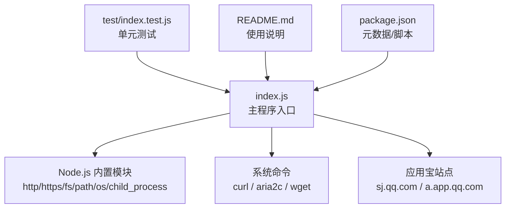
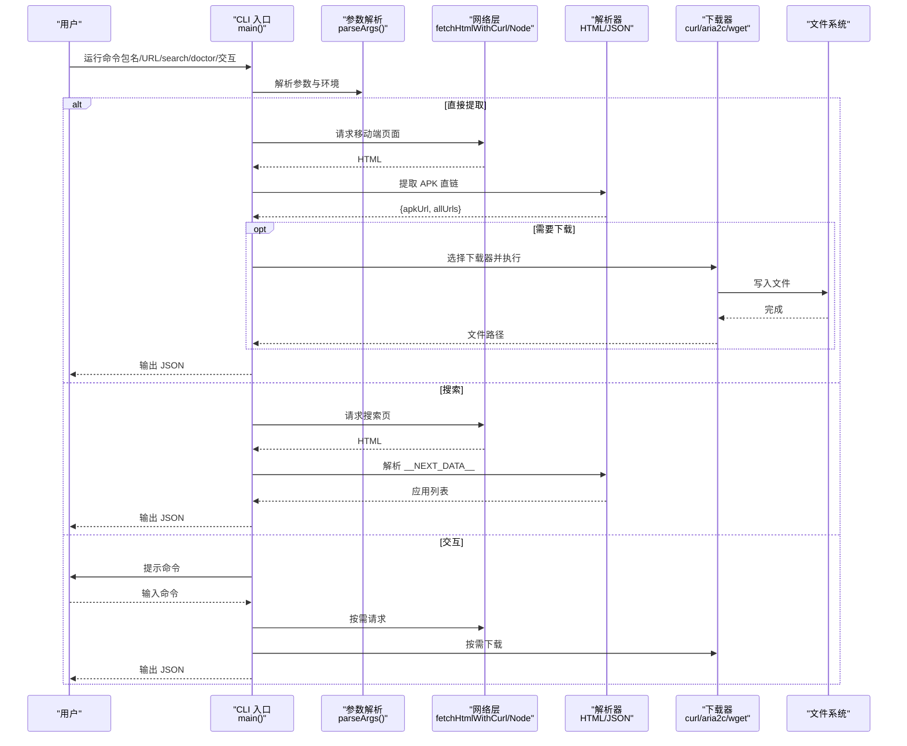
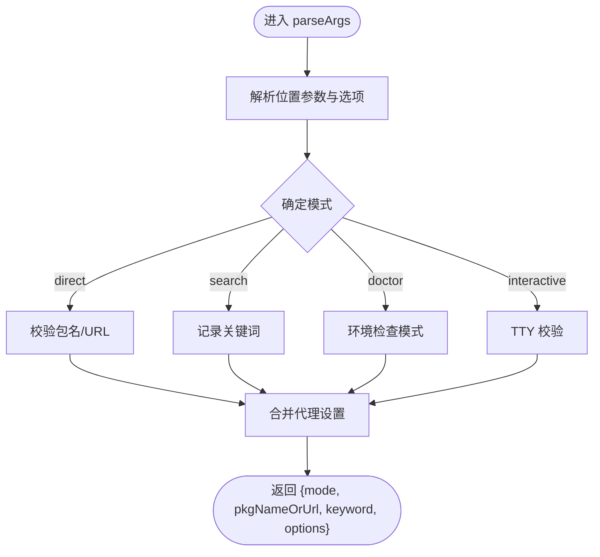
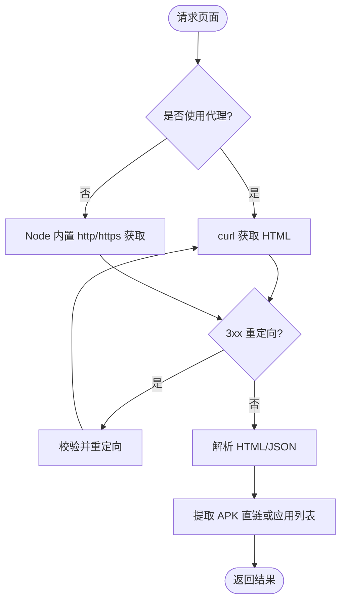
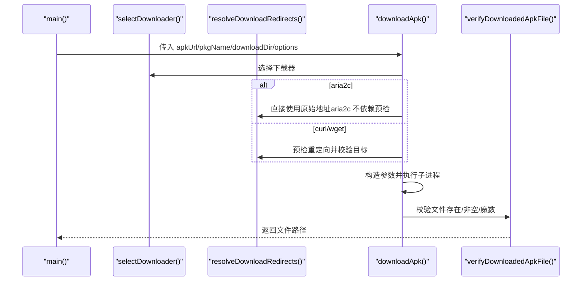
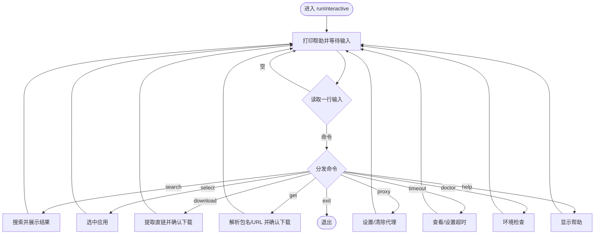
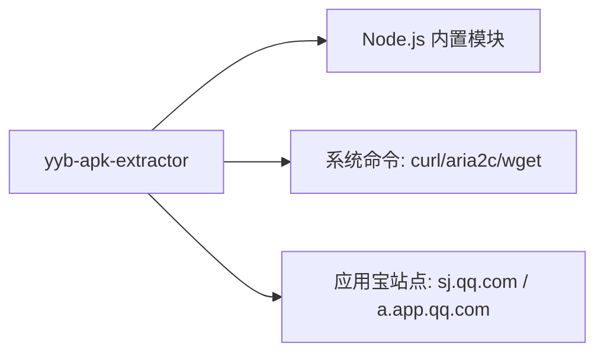

# 项目概述

<cite>
**本文引用的文件**
- [README.md](file://yyb-apk-extractor/README.md)
- [package.json](file://yyb-apk-extractor/package.json)
- [index.js](file://yyb-apk-extractor/index.js)
- [test/index.test.js](file://yyb-apk-extractor/test/index.test.js)
</cite>

## 目录
1. [简介](#简介)
2. [项目结构](#项目结构)
3. [核心组件](#核心组件)
4. [架构总览](#架构总览)
5. [详细组件分析](#详细组件分析)
6. [依赖关系分析](#依赖关系分析)
7. [性能与可靠性](#性能与可靠性)
8. [故障排查指南](#故障排查指南)
9. [结论](#结论)
10. [附录：快速开始与用法](#附录快速开始与用法)

## 简介
yyb-apk-extractor 是一个纯命令行工具，用于从腾讯应用宝官网提取安卓 APK 直链并支持自动下载。其设计目标是“零 npm 依赖、可脚本化、跨平台”，面向日常命令行使用、CI 流水线与自动化任务。它支持：
- 通过包名或详情页 URL 直接提取 APK 直链
- 关键词搜索应用宝结果（解析 Next.js SSR 数据）
- 交互式向导（搜索、选择、确认下载）
- HTTP/HTTPS/SOCKS 代理
- 多连接下载（需 aria2c）
- 成功输出 JSON，便于接入 jq 等工具

该工具基于 Node.js 实现，仅使用内置模块进行网络请求与进程管理，外部下载能力通过系统命令 curl/aria2c/wget 完成，从而避免引入第三方 npm 包。

**章节来源**
- [README.md:1-11](file://yyb-apk-extractor/README.md#L1-L11)
- [package.json:1-47](file://yyb-apk-extractor/package.json#L1-L47)

## 项目结构
仓库采用极简单入口结构，核心逻辑集中在 index.js；测试用例位于 test/index.test.js；元信息与使用说明在 README.md 与 package.json 中。

**图表来源**
- [index.js:44-84](file://yyb-apk-extractor/index.js#L44-L84)
- [index.js:2221-2229](file://yyb-apk-extractor/index.js#L2221-L2229)
- [README.md:12-43](file://yyb-apk-extractor/README.md#L12-L43)
- [package.json:15-20](file://yyb-apk-extractor/package.json#L15-L20)

**章节来源**
- [index.js:44-84](file://yyb-apk-extractor/index.js#L44-L84)
- [README.md:12-43](file://yyb-apk-extractor/README.md#L12-L43)
- [package.json:15-20](file://yyb-apk-extractor/package.json#L15-L20)

## 核心组件
- 参数与环境解析：统一解析 CLI 参数、环境变量代理、超时、下载器选择、颜色输出控制等。
- 网络请求层：优先使用 curl 获取页面，失败时回退到 Node.js 内置 http/https；支持重定向与安全域名校验。
- 页面解析层：从移动端 simple.jsp 页面提取 APK 链接；从搜索页的 __NEXT_DATA__ 解析应用列表。
- 下载器调度：根据可用性与配置选择 curl/aria2c/wget，构建参数并执行子进程下载。
- 交互模式：基于 readline 的命令循环，支持 search/select/download/get/proxy/timeout/doctor/help/exit。
- 安全与健壮性：输入白名单、SSRF 防护、URL 白名单、凭据脱敏、临时文件清理、全局异常捕获。

**章节来源**
- [index.js:209-338](file://yyb-apk-extractor/index.js#L209-L338)
- [index.js:1112-1280](file://yyb-apk-extractor/index.js#L1112-L1280)
- [index.js:1282-1385](file://yyb-apk-extractor/index.js#L1282-L1385)
- [index.js:1634-1767](file://yyb-apk-extractor/index.js#L1634-L1767)
- [index.js:1769-2163](file://yyb-apk-extractor/index.js#L1769-L2163)
- [index.js:2210-2229](file://yyb-apk-extractor/index.js#L2210-L2229)

## 架构总览
整体流程分为“请求—解析—下载”三段式，辅以“参数解析—安全校验—错误处理”横切关注点。

**图表来源**
- [index.js:2165-2208](file://yyb-apk-extractor/index.js#L2165-L2208)
- [index.js:1520-1606](file://yyb-apk-extractor/index.js#L1520-L1606)
- [index.js:1634-1767](file://yyb-apk-extractor/index.js#L1634-L1767)

## 详细组件分析

### 参数与环境解析
- 支持位置参数与选项混合解析，识别 direct/search/doctor/interactive 模式。
- 代理优先级：显式 --proxy > 环境变量 HTTPS_PROXY/HTTP_PROXY/ALL_PROXY 及其小写变体；--no-proxy 忽略环境变量。
- 超时支持毫秒整数或带单位（ms/s/m），并转换为秒级传递给子进程。
- 下载器选择策略：auto 默认 curl→aria2c→wget；--multi-thread 优先 aria2c；显式指定则仅尝试该工具。
- 颜色输出：非 TTY 或 NO_COLOR/--no-color 时禁用 ANSI。

**图表来源**
- [index.js:209-338](file://yyb-apk-extractor/index.js#L209-L338)

**章节来源**
- [index.js:209-338](file://yyb-apk-extractor/index.js#L209-L338)
- [index.js:340-384](file://yyb-apk-extractor/index.js#L340-L384)
- [index.js:458-493](file://yyb-apk-extractor/index.js#L458-L493)
- [index.js:88-117](file://yyb-apk-extractor/index.js#L88-L117)

### 网络请求与页面解析
- 页面获取：优先 curl（天然支持各类代理），失败时回退 Node.js 内置模块；限制重定向次数与响应体大小。
- 安全校验：强制 http/https，目标域名限定为 qq.com/myapp.com/qpic.cn/qlogo.cn 及允许通配符；搜索接口限定 sj.qq.com。
- 搜索结果解析：从 __NEXT_DATA__ 中提取 dynamicCardResponse 的应用条目，按包名去重。
- 直链提取：从移动端 simple.jsp 页面匹配 .apk 链接，优先 imtt 官方 CDN。

**图表来源**
- [index.js:1112-1280](file://yyb-apk-extractor/index.js#L1112-L1280)
- [index.js:1282-1385](file://yyb-apk-extractor/index.js#L1282-L1385)
- [index.js:1578-1606](file://yyb-apk-extractor/index.js#L1578-L1606)

**章节来源**
- [index.js:1112-1280](file://yyb-apk-extractor/index.js#L1112-L1280)
- [index.js:1282-1385](file://yyb-apk-extractor/index.js#L1282-L1385)
- [index.js:1578-1606](file://yyb-apk-extractor/index.js#L1578-L1606)

### 下载器调度与下载
- 下载器选择：根据 --downloader、--multi-thread 与可用性选择 curl/aria2c/wget；对不支持的代理协议做拒绝。
- 预检重定向：使用 curl GET + Range 0-0 探测真实下载地址，防止 HEAD 被拒绝或误判；严格校验重定向目标。
- 下载执行：构造参数并 spawnSync 调用外部工具；支持断点续传、最低速度检测、证书校验开关。
- 完整性校验：下载完成后检查文件存在、非空，并验证 ZIP/APK 魔数（504b0304）。

**图表来源**
- [index.js:458-493](file://yyb-apk-extractor/index.js#L458-L493)
- [index.js:1440-1518](file://yyb-apk-extractor/index.js#L1440-L1518)
- [index.js:1634-1767](file://yyb-apk-extractor/index.js#L1634-L1767)
- [index.js:1412-1438](file://yyb-apk-extractor/index.js#L1412-L1438)

**章节来源**
- [index.js:458-493](file://yyb-apk-extractor/index.js#L458-L493)
- [index.js:1440-1518](file://yyb-apk-extractor/index.js#L1440-L1518)
- [index.js:1634-1767](file://yyb-apk-extractor/index.js#L1634-L1767)
- [index.js:1412-1438](file://yyb-apk-extractor/index.js#L1412-L1438)

### 交互模式
- 命令集：search/list/select/download/get/proxy/timeout/doctor/help/exit。
- 输入安全：限制单行长度、超时控制、TTY 校验；所有用户输入均做长度、类型、范围校验。
- 下载确认：展示应用详情摘要，支持默认目录、自定义目录二次确认、取消。

**图表来源**
- [index.js:1769-1833](file://yyb-apk-extractor/index.js#L1769-L1833)
- [index.js:1882-2163](file://yyb-apk-extractor/index.js#L1882-L2163)

**章节来源**
- [index.js:1769-1833](file://yyb-apk-extractor/index.js#L1769-L1833)
- [index.js:1882-2163](file://yyb-apk-extractor/index.js#L1882-L2163)

### 安全设计要点
- 输入校验：包名白名单、URL 域名白名单、非法代理拒绝、未知选项报错、多余参数拦截。
- SSRF 防护：页面提取、搜索请求和下载预检都限制目标域名为 *.qq.com 等受控域名；搜索接口额外收敛到 sj.qq.com。
- 终端安全：过滤 ANSI 转义序列与控制字符，防止终端注入。
- 路径安全：文件名净化，去除 Windows 保留名与非法字符，防止路径遍历。
- 代理安全：代理 URL 校验协议/主机/端口；日志与错误信息中隐藏凭据；子进程参数与环境剥离密码。
- 下载安全：默认严格校验 HTTPS 证书；可选跳过（仅限测试）；下载前重定向预检；完成后校验魔数。
- 全局兜底：unhandledRejection/uncaughtException 统一捕获并友好退出。

**章节来源**
- [index.js:742-821](file://yyb-apk-extractor/index.js#L742-L821)
- [index.js:1075-1110](file://yyb-apk-extractor/index.js#L1075-L1110)
- [index.js:1387-1438](file://yyb-apk-extractor/index.js#L1387-L1438)
- [index.js:1668-1705](file://yyb-apk-extractor/index.js#L1668-L1705)
- [index.js:2210-2229](file://yyb-apk-extractor/index.js#L2210-L2229)

## 依赖关系分析
- 运行时依赖：无 npm 依赖；仅依赖 Node.js 内置模块。
- 外部工具：curl/aria2c/wget 作为可选下载器，未安装时会降级或报错提示。
- 平台兼容：macOS/Linux/Windows CI 覆盖；Windows 下对 cmd 脚本执行有额外安全处理。

**图表来源**
- [package.json:37-37](file://yyb-apk-extractor/package.json#L37-L37)
- [index.js:44-49](file://yyb-apk-extractor/index.js#L44-L49)
- [index.js:870-921](file://yyb-apk-extractor/index.js#L870-L921)

**章节来源**
- [package.json:37-37](file://yyb-apk-extractor/package.json#L37-L37)
- [index.js:870-921](file://yyb-apk-extractor/index.js#L870-L921)

## 性能与可靠性
- 重试机制：网络请求与下载具备重试逻辑，降低瞬时失败影响。
- 超时控制：fetch 阶段限制总时长；下载阶段以连接/断流检测为主，不限制大文件总时长，支持断点续传。
- 多连接下载：aria2c 模式下通过 -x/-s 控制连接数，提升大文件下载效率（取决于 CDN 分片支持）。
- 资源清理：临时配置文件与信号处理确保进程退出时清理临时文件。
- 输出稳定：成功输出 JSON 到 stdout，进度/调试信息到 stderr，便于管道集成。

**章节来源**
- [index.js:833-859](file://yyb-apk-extractor/index.js#L833-L859)
- [index.js:1440-1518](file://yyb-apk-extractor/index.js#L1440-L1518)
- [index.js:1634-1767](file://yyb-apk-extractor/index.js#L1634-L1767)
- [index.js:597-651](file://yyb-apk-extractor/index.js#L597-L651)

## 故障排查指南
- 无法进入交互模式：非 TTY 环境下会提前失败，需提供包名/URL 或 search/doctor 命令。
- 代理相关错误：
  - 未检测到 curl：在有代理时无法访问，请安装 curl 或移除 --proxy。
  - aria2c 不支持 socks5/socks5h：切换为 http/https 代理或改用 curl。
  - wget 不支持认证代理与不稳定 SOCKS：建议使用 curl 或 aria2c。
- 下载失败：
  - 预检被拒绝：服务器可能拒绝 Range 请求，将降级使用原始地址。
  - 证书校验失败：测试环境可使用 --insecure，生产环境不建议。
  - 文件不完整：工具会自动校验魔数并清理无效文件。
- 环境问题：使用 doctor 命令检查 Node.js 版本与工具可用性。

**章节来源**
- [index.js:295-315](file://yyb-apk-extractor/index.js#L295-L315)
- [index.js:458-493](file://yyb-apk-extractor/index.js#L458-L493)
- [index.js:1440-1518](file://yyb-apk-extractor/index.js#L1440-L1518)
- [index.js:1742-1758](file://yyb-apk-extractor/index.js#L1742-L1758)
- [index.js:1412-1438](file://yyb-apk-extractor/index.js#L1412-L1438)

## 结论
yyb-apk-extractor 以“零 npm 依赖、强安全、可脚本化”为核心设计理念，通过 Node.js 内置模块与系统命令组合，提供稳定可靠的 APK 直链提取与下载能力。其清晰的参数解析、严格的输入与域名白名单、完善的下载器选择与校验机制，使其非常适合在 CI、脚本与日常命令行中使用。对于初学者，可通过交互模式快速上手；对于有经验开发者，可通过 JSON 输出与丰富选项深度集成。

[无需来源：本节为总结性内容]

## 附录：快速开始与用法
- 环境要求：Node.js >= 16.3.0；建议安装 curl/aria2c/wget 以获得最佳体验。
- 基本用法：
  - 检查环境：node index.js doctor
  - 搜索应用：node index.js search 微信
  - 提取直链：node index.js com.tencent.mm
  - 解析并下载：node index.js https://sj.qq.com/appdetail/com.tencent.mm
  - 交互模式：node index.js
- 常用选项：
  - --proxy=地址：支持 http/https/socks5/socks5h
  - --download-dir=目录：指定下载目录
  - --downloader=工具：auto/curl/aria2c/wget
  - --multi-thread：优先 aria2c 多连接
  - --connections=数量：aria2c 连接数（1-16）
  - --timeout=时长：支持 ms/s/m
  - --insecure：跳过 HTTPS 证书校验（仅测试）
  - --verbose/-v：详细日志
  - --interactive/-i：交互模式
  - --version/-V：版本号
  - --no-color：禁用颜色
  - --help/-h：帮助

**章节来源**
- [README.md:12-43](file://yyb-apk-extractor/README.md#L12-L43)
- [README.md:95-135](file://yyb-apk-extractor/README.md#L95-L135)
- [README.md:145-259](file://yyb-apk-extractor/README.md#L145-L259)
- [package.json:15-20](file://yyb-apk-extractor/package.json#L15-L20)